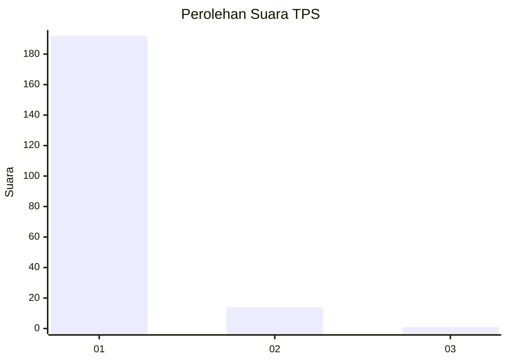
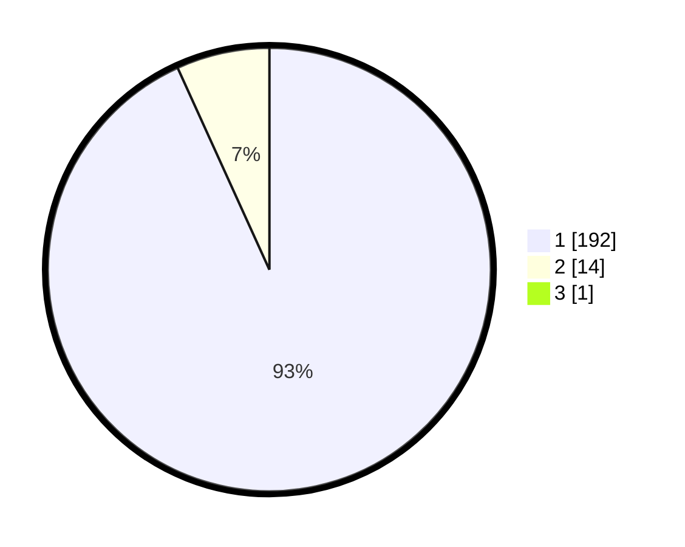

# Hasil

## Grafik

## Tabel

| No. | Nama Paslon    | Suara | Suara (raw) | Persentase |
|:--- |:-------------- | -----:| -----------:| ----------:|
| 1   | ANIES MUHAIMIN | 192   | [192][p-1]  | 92,75      |
| 2   | PRABOWO GIBRAN | 14    | [14][p-2]   | 6,76       |
| 3   | GANJAR MAHFUD  | 1     | [1][p-3]    | 0,48       |

[p-1]: https://github.com/gigit-pemilu/pemilu-2024-11-aceh/blob/main/pilpres/hitung-suara/sub/11-aceh/sub/11-bireuen/sub/02-jeunieb/sub/2046-lheu-simpang/sub/001-tps/sub/paslon-1.txt
[p-2]: https://github.com/gigit-pemilu/pemilu-2024-11-aceh/blob/main/pilpres/hitung-suara/sub/11-aceh/sub/11-bireuen/sub/02-jeunieb/sub/2046-lheu-simpang/sub/001-tps/sub/paslon-2.txt
[p-3]: https://github.com/gigit-pemilu/pemilu-2024-11-aceh/blob/main/pilpres/hitung-suara/sub/11-aceh/sub/11-bireuen/sub/02-jeunieb/sub/2046-lheu-simpang/sub/001-tps/sub/paslon-3.txt

## Foto C Plano

https://sirekap-obj-formc.kpu.go.id/80b2/pemilu/ppwp/11/11/02/20/46/1111022046001-20240215-055058--744083e3-4b50-4dce-8de2-fc645c2a2915.jpg

https://sirekap-obj-formc.kpu.go.id/80b2/pemilu/ppwp/11/11/02/20/46/1111022046001-20240215-055133--289cf0df-eebb-47dd-ba57-853754423f8f.jpg

https://sirekap-obj-formc.kpu.go.id/80b2/pemilu/ppwp/11/11/02/20/46/1111022046001-20240215-055228--111090b2-191a-4118-b23e-8e6d618f9fb6.jpg

## Metadata

| Key        | Value               |
| ---------- | ------------------- |
| Time Stamp | 2024-02-15 23:29:50 |

