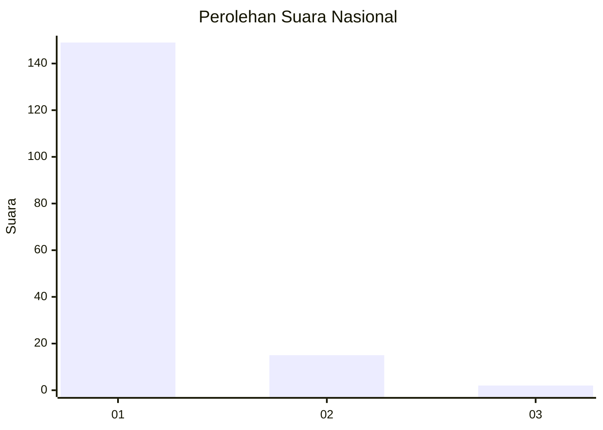
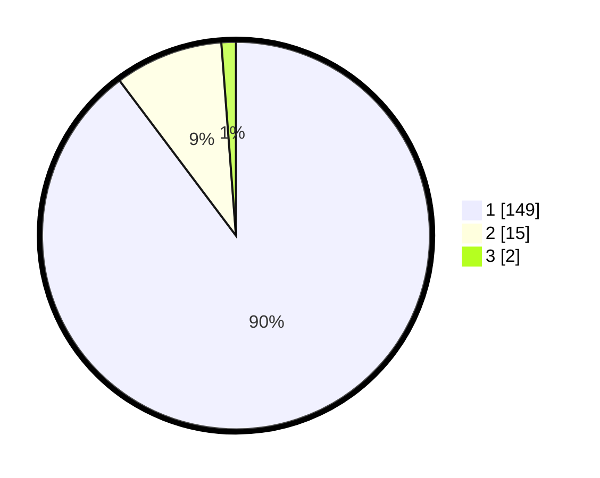

# Hasil

## Grafik

## Tabel

| No. | Nama Paslon    | Suara | Suara (raw) | Persentase |
|:--- |:-------------- | -----:| -----------:| ----------:|
| 1   | ANIES MUHAIMIN | 149   | [149][p-1]  | 89,76      |
| 2   | PRABOWO GIBRAN | 15    | [15][p-2]   | 9,04       |
| 3   | GANJAR MAHFUD  | 2     | [2][p-3]    | 1,20       |

[p-1]: https://github.com/gigit-pemilu/pemilu-2024/blob/main/pilpres/hitung-suara/sub/11-aceh/sub/11-bireuen/sub/02-jeunieb/sub/2047-lheu-barat/sub/002-tps/sub/paslon-1.txt
[p-2]: https://github.com/gigit-pemilu/pemilu-2024/blob/main/pilpres/hitung-suara/sub/11-aceh/sub/11-bireuen/sub/02-jeunieb/sub/2047-lheu-barat/sub/002-tps/sub/paslon-2.txt
[p-3]: https://github.com/gigit-pemilu/pemilu-2024/blob/main/pilpres/hitung-suara/sub/11-aceh/sub/11-bireuen/sub/02-jeunieb/sub/2047-lheu-barat/sub/002-tps/sub/paslon-3.txt

## Foto C Plano

https://sirekap-obj-formc.kpu.go.id/bc61/pemilu/ppwp/11/11/02/20/47/1111022047002-20240219-223849--abf03aea-4d3d-4965-b612-1b721c0f9a37.jpg

https://sirekap-obj-formc.kpu.go.id/bc61/pemilu/ppwp/11/11/02/20/47/1111022047002-20240215-042127--bc10895f-1304-4f00-9677-34620049dc7e.jpg

https://sirekap-obj-formc.kpu.go.id/bc61/pemilu/ppwp/11/11/02/20/47/1111022047002-20240215-042222--748cad0d-e8c7-47b1-8790-3f69d865d727.jpg

## Metadata

| Key        | Value               |
| ---------- | ------------------- |
| Time Stamp | 2024-02-19 23:00:00 |

