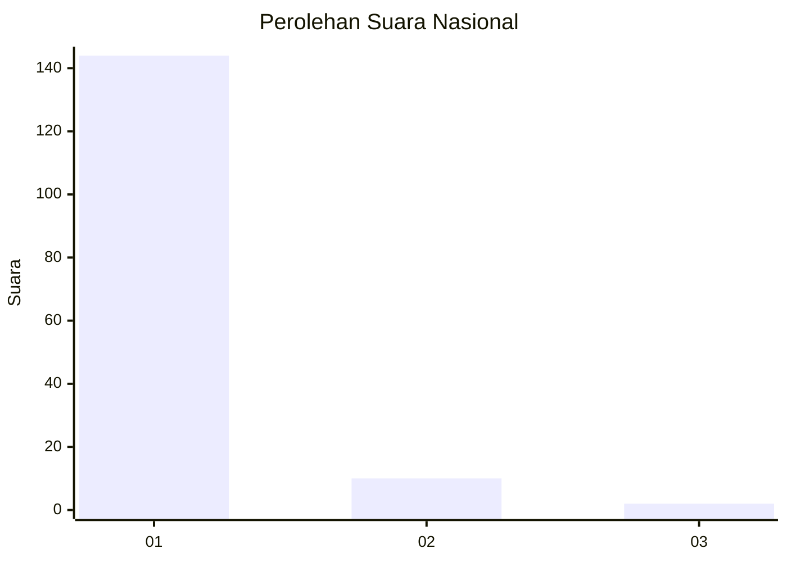
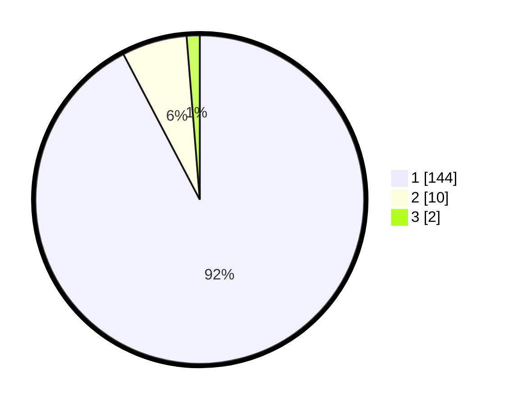

# Hasil

## Grafik

## Tabel

| No. | Nama Paslon    | Suara | Suara (raw) | Persentase |
|:--- |:-------------- | -----:| -----------:| ----------:|
| 1   | ANIES MUHAIMIN | 144   | [144][p-1]  | 92,31      |
| 2   | PRABOWO GIBRAN | 10    | [10][p-2]   | 6,41       |
| 3   | GANJAR MAHFUD  | 2     | [2][p-3]    | 1,28       |

[p-1]: https://github.com/gigit-pemilu/pemilu-2024/blob/main/pilpres/hitung-suara/sub/11-aceh/sub/11-bireuen/sub/02-jeunieb/sub/2051-meunasah-keupula/sub/002-tps/sub/paslon-1.txt
[p-2]: https://github.com/gigit-pemilu/pemilu-2024/blob/main/pilpres/hitung-suara/sub/11-aceh/sub/11-bireuen/sub/02-jeunieb/sub/2051-meunasah-keupula/sub/002-tps/sub/paslon-2.txt
[p-3]: https://github.com/gigit-pemilu/pemilu-2024/blob/main/pilpres/hitung-suara/sub/11-aceh/sub/11-bireuen/sub/02-jeunieb/sub/2051-meunasah-keupula/sub/002-tps/sub/paslon-3.txt

## Foto C Plano

https://sirekap-obj-formc.kpu.go.id/aa89/pemilu/ppwp/11/11/02/20/51/1111022051002-20240215-024006--81278aba-a6ba-4964-8a03-4e7dfaeb955c.jpg

https://sirekap-obj-formc.kpu.go.id/aa89/pemilu/ppwp/11/11/02/20/51/1111022051002-20240214-222221--bdb3d7b7-602d-4577-91ba-6e61d6e83ca5.jpg

https://sirekap-obj-formc.kpu.go.id/aa89/pemilu/ppwp/11/11/02/20/51/1111022051002-20240215-102337--aa6c6f53-6694-4eb4-a69e-c90e6813eda4.jpg

## Metadata

| Key        | Value               |
| ---------- | ------------------- |
| Time Stamp | 2024-02-15 12:00:28 |

