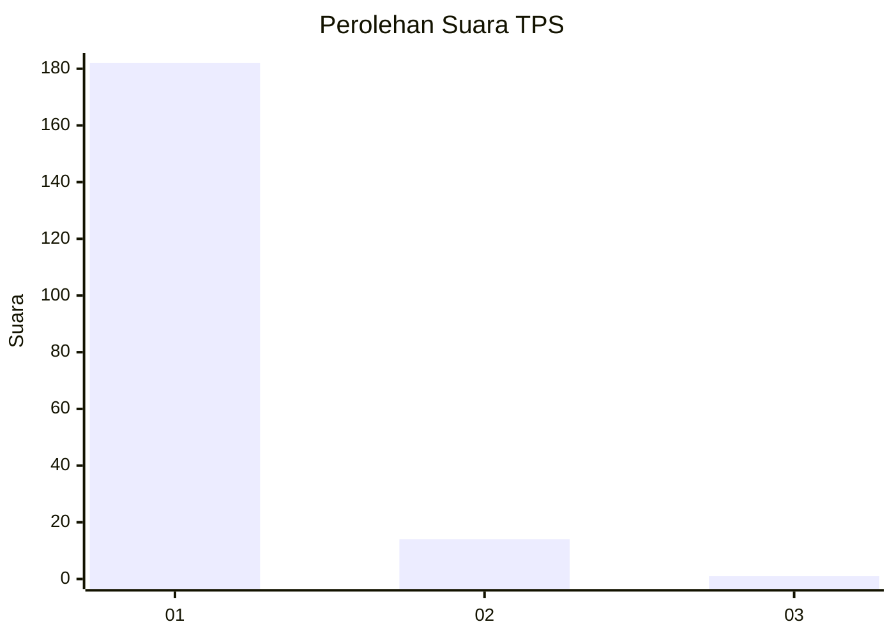
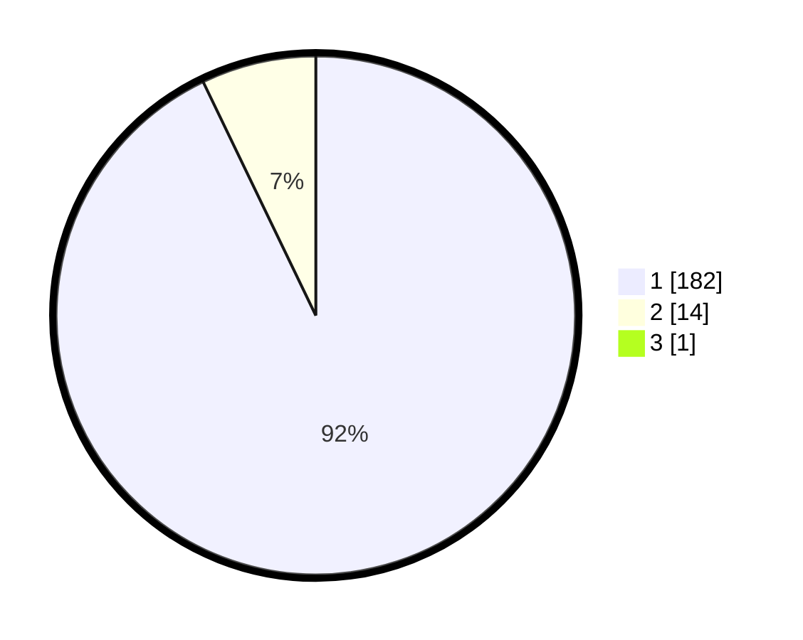

# Hasil

## Grafik

## Tabel

| No. | Nama Paslon    | Suara | Suara (raw) | Persentase |
|:--- |:-------------- | -----:| -----------:| ----------:|
| 1   | ANIES MUHAIMIN | 182   | [182][p-1]  | 92,39      |
| 2   | PRABOWO GIBRAN | 14    | [14][p-2]   | 7,11       |
| 3   | GANJAR MAHFUD  | 1     | [1][p-3]    | 0,51       |

[p-1]: https://github.com/gigit-pemilu/pemilu-2024-11-aceh/blob/main/pilpres/hitung-suara/sub/11-aceh/sub/11-bireuen/sub/03-peudada/sub/2002-matang-reuleut/sub/001-tps/sub/paslon-1.txt
[p-2]: https://github.com/gigit-pemilu/pemilu-2024-11-aceh/blob/main/pilpres/hitung-suara/sub/11-aceh/sub/11-bireuen/sub/03-peudada/sub/2002-matang-reuleut/sub/001-tps/sub/paslon-2.txt
[p-3]: https://github.com/gigit-pemilu/pemilu-2024-11-aceh/blob/main/pilpres/hitung-suara/sub/11-aceh/sub/11-bireuen/sub/03-peudada/sub/2002-matang-reuleut/sub/001-tps/sub/paslon-3.txt

## Foto C Plano

https://sirekap-obj-formc.kpu.go.id/62e9/pemilu/ppwp/11/11/03/20/02/1111032002001-20240218-135738--d2a01816-f2a8-40d0-bbe0-dcbbab69220a.jpg

https://sirekap-obj-formc.kpu.go.id/62e9/pemilu/ppwp/11/11/03/20/02/1111032002001-20240218-135928--822d1f09-dc0f-4045-96bd-11b0416cc38b.jpg

https://sirekap-obj-formc.kpu.go.id/62e9/pemilu/ppwp/11/11/03/20/02/1111032002001-20240218-135834--ba9de7eb-f521-4f28-945c-ef33136c7488.jpg

## Metadata

| Key        | Value               |
| ---------- | ------------------- |
| Time Stamp | 2024-02-19 06:16:00 |

