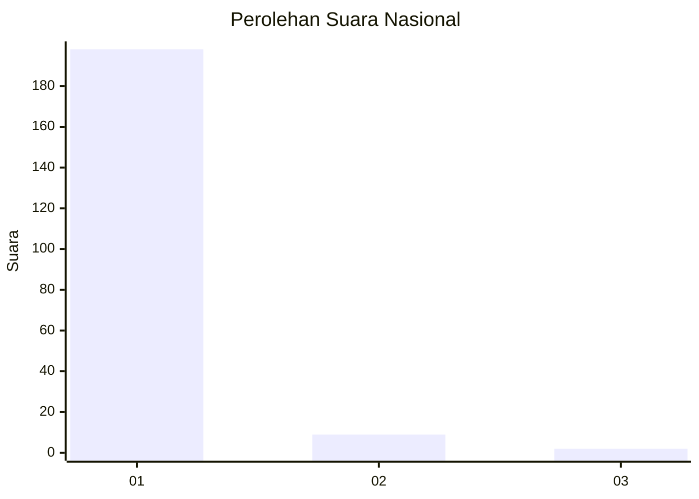
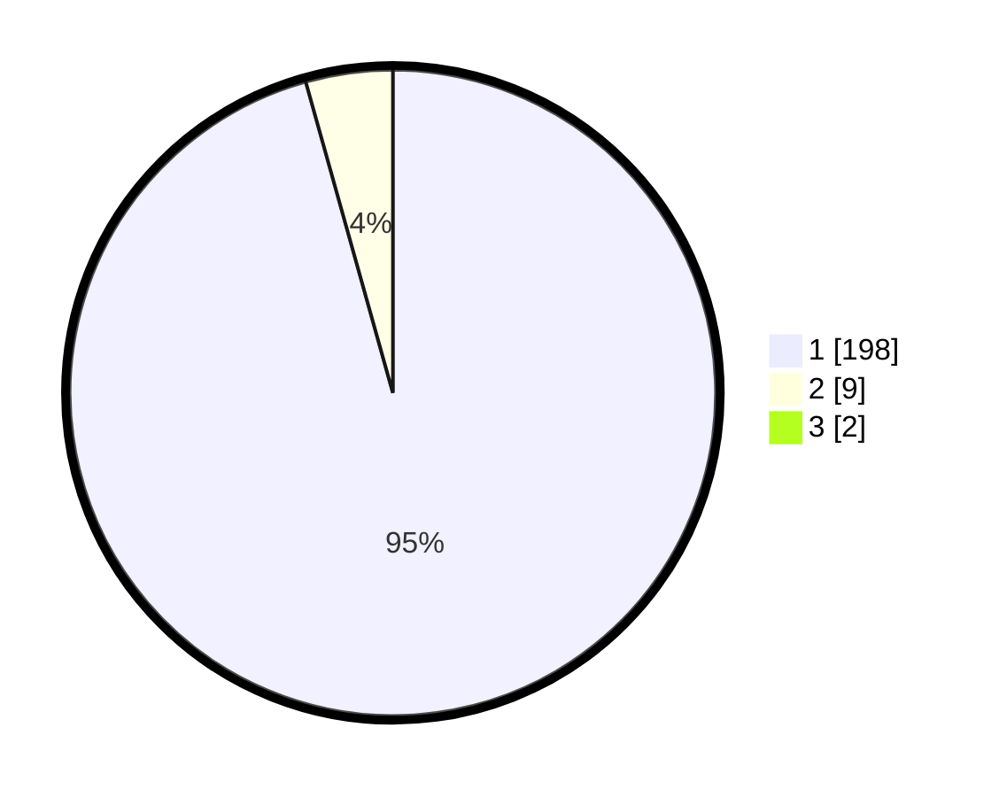

# Hasil

## Grafik

## Tabel

| No. | Nama Paslon    | Suara | Suara (raw) | Persentase |
|:--- |:-------------- | -----:| -----------:| ----------:|
| 1   | ANIES MUHAIMIN | 198   | [198][p-1]  | 94,74      |
| 2   | PRABOWO GIBRAN | 9     | [9][p-2]    | 4,31       |
| 3   | GANJAR MAHFUD  | 2     | [2][p-3]    | 0,96       |

[p-1]: https://github.com/gigit-pemilu/pemilu-2024/blob/main/pilpres/hitung-suara/sub/11-aceh/sub/11-bireuen/sub/03-peudada/sub/2002-matang-reuleut/sub/002-tps/sub/paslon-1.txt
[p-2]: https://github.com/gigit-pemilu/pemilu-2024/blob/main/pilpres/hitung-suara/sub/11-aceh/sub/11-bireuen/sub/03-peudada/sub/2002-matang-reuleut/sub/002-tps/sub/paslon-2.txt
[p-3]: https://github.com/gigit-pemilu/pemilu-2024/blob/main/pilpres/hitung-suara/sub/11-aceh/sub/11-bireuen/sub/03-peudada/sub/2002-matang-reuleut/sub/002-tps/sub/paslon-3.txt

## Foto C Plano

https://sirekap-obj-formc.kpu.go.id/499d/pemilu/ppwp/11/11/03/20/02/1111032002002-20240218-140924--a2e62f3e-f799-49e5-8dfd-2a698b12f0ab.jpg

https://sirekap-obj-formc.kpu.go.id/499d/pemilu/ppwp/11/11/03/20/02/1111032002002-20240218-141110--1781b71c-3848-4c3b-ab4e-aa3e140d00dc.jpg

https://sirekap-obj-formc.kpu.go.id/499d/pemilu/ppwp/11/11/03/20/02/1111032002002-20240218-141020--d4154804-ef1e-44cd-a282-1732ceca7b99.jpg

## Metadata

| Key        | Value               |
| ---------- | ------------------- |
| Time Stamp | 2024-02-19 06:16:00 |

