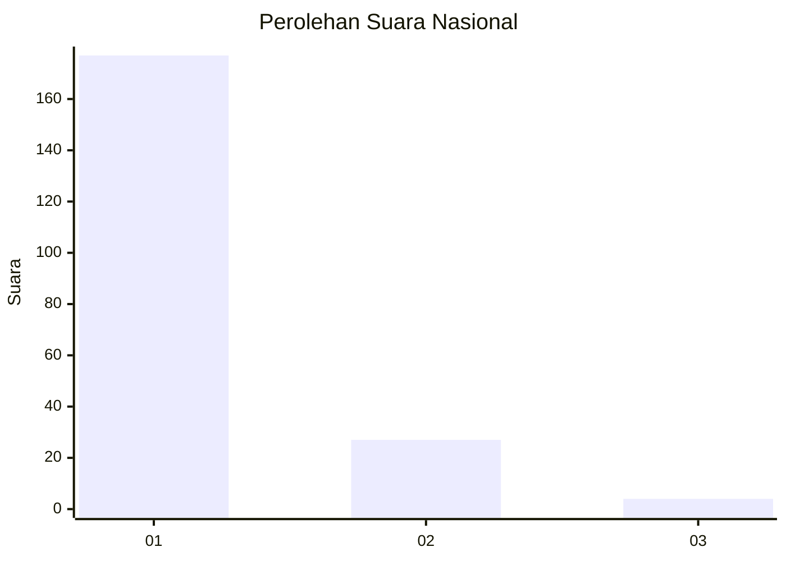
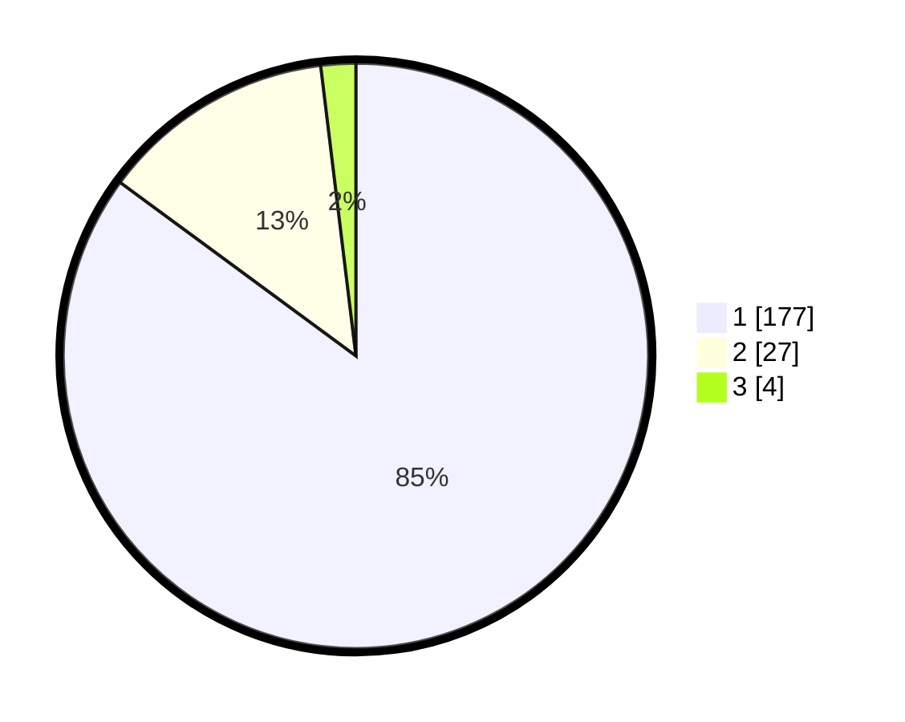

# Hasil

## Grafik

## Tabel

| No. | Nama Paslon    | Suara | Suara (raw) | Persentase |
|:--- |:-------------- | -----:| -----------:| ----------:|
| 1   | ANIES MUHAIMIN | 177   | [177][p-1]  | 85,10      |
| 2   | PRABOWO GIBRAN | 27    | [27][p-2]   | 12,98      |
| 3   | GANJAR MAHFUD  | 4     | [4][p-3]    | 1,92       |

[p-1]: https://github.com/gigit-pemilu/pemilu-2024/blob/main/pilpres/hitung-suara/sub/11-aceh/sub/11-bireuen/sub/03-peudada/sub/2004-cot-keutapang/sub/001-tps/sub/paslon-1.txt
[p-2]: https://github.com/gigit-pemilu/pemilu-2024/blob/main/pilpres/hitung-suara/sub/11-aceh/sub/11-bireuen/sub/03-peudada/sub/2004-cot-keutapang/sub/001-tps/sub/paslon-2.txt
[p-3]: https://github.com/gigit-pemilu/pemilu-2024/blob/main/pilpres/hitung-suara/sub/11-aceh/sub/11-bireuen/sub/03-peudada/sub/2004-cot-keutapang/sub/001-tps/sub/paslon-3.txt

## Foto C Plano

https://sirekap-obj-formc.kpu.go.id/03f8/pemilu/ppwp/11/11/03/20/04/1111032004001-20240215-052901--4239b5d1-a7dc-466d-89d9-ed4a487317be.jpg

https://sirekap-obj-formc.kpu.go.id/03f8/pemilu/ppwp/11/11/03/20/04/1111032004001-20240215-052922--14951477-1a19-4be9-a8da-73a882a6b6ad.jpg

https://sirekap-obj-formc.kpu.go.id/03f8/pemilu/ppwp/11/11/03/20/04/1111032004001-20240215-052939--a5b8c21d-7fca-4088-b8dd-b4a8c8c7c50f.jpg

## Metadata

| Key        | Value               |
| ---------- | ------------------- |
| Time Stamp | 2024-02-15 21:01:18 |

