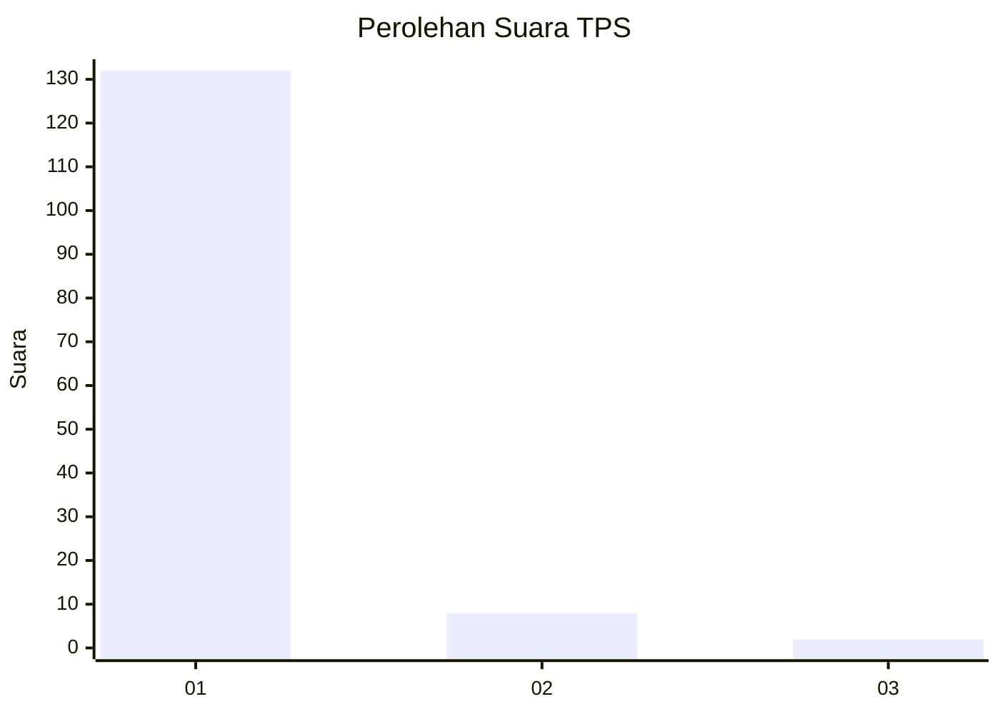
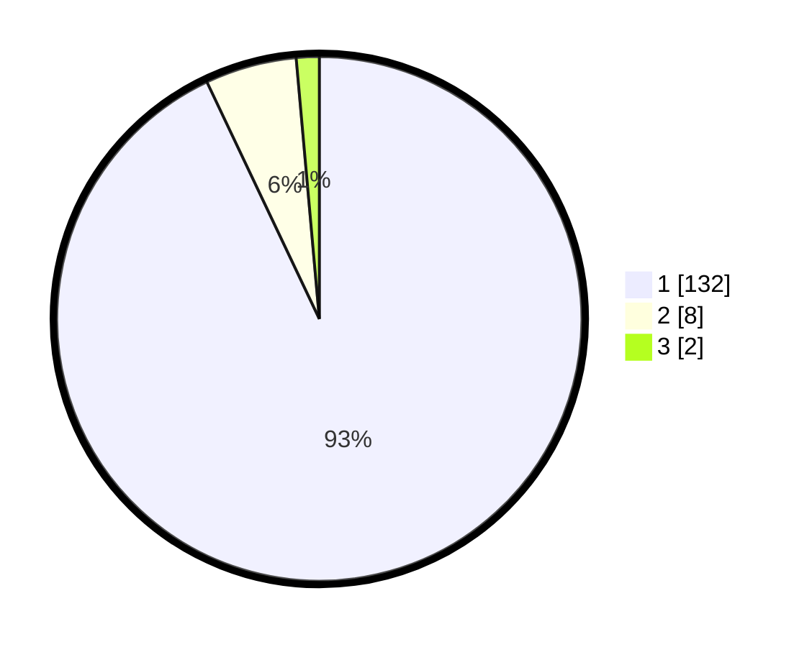

# Hasil

## Grafik

## Tabel

| No. | Nama Paslon    | Suara | Suara (raw) | Persentase |
|:--- |:-------------- | -----:| -----------:| ----------:|
| 1   | ANIES MUHAIMIN | 132   | [132][p-1]  | 92,96      |
| 2   | PRABOWO GIBRAN | 8     | [8][p-2]    | 5,63       |
| 3   | GANJAR MAHFUD  | 2     | [2][p-3]    | 1,41       |

[p-1]: https://github.com/gigit-pemilu/pemilu-2024-11-aceh/blob/main/pilpres/hitung-suara/sub/11-aceh/sub/11-bireuen/sub/03-peudada/sub/2005-meunasah-rabo/sub/002-tps/sub/paslon-1.txt
[p-2]: https://github.com/gigit-pemilu/pemilu-2024-11-aceh/blob/main/pilpres/hitung-suara/sub/11-aceh/sub/11-bireuen/sub/03-peudada/sub/2005-meunasah-rabo/sub/002-tps/sub/paslon-2.txt
[p-3]: https://github.com/gigit-pemilu/pemilu-2024-11-aceh/blob/main/pilpres/hitung-suara/sub/11-aceh/sub/11-bireuen/sub/03-peudada/sub/2005-meunasah-rabo/sub/002-tps/sub/paslon-3.txt

## Foto C Plano

https://sirekap-obj-formc.kpu.go.id/d8a2/pemilu/ppwp/11/11/03/20/05/1111032005002-20240219-214932--80fed942-b888-40bc-9e1b-66d41bdb8b36.jpg

https://sirekap-obj-formc.kpu.go.id/d8a2/pemilu/ppwp/11/11/03/20/05/1111032005002-20240219-214958--7f25a35b-b400-4f89-88ca-b2b6984ea7cb.jpg

https://sirekap-obj-formc.kpu.go.id/d8a2/pemilu/ppwp/11/11/03/20/05/1111032005002-20240219-215007--6204e573-149e-4bb4-a970-ae5c3a655341.jpg

## Metadata

| Key        | Value               |
| ---------- | ------------------- |
| Time Stamp | 2024-02-24 22:31:28 |

