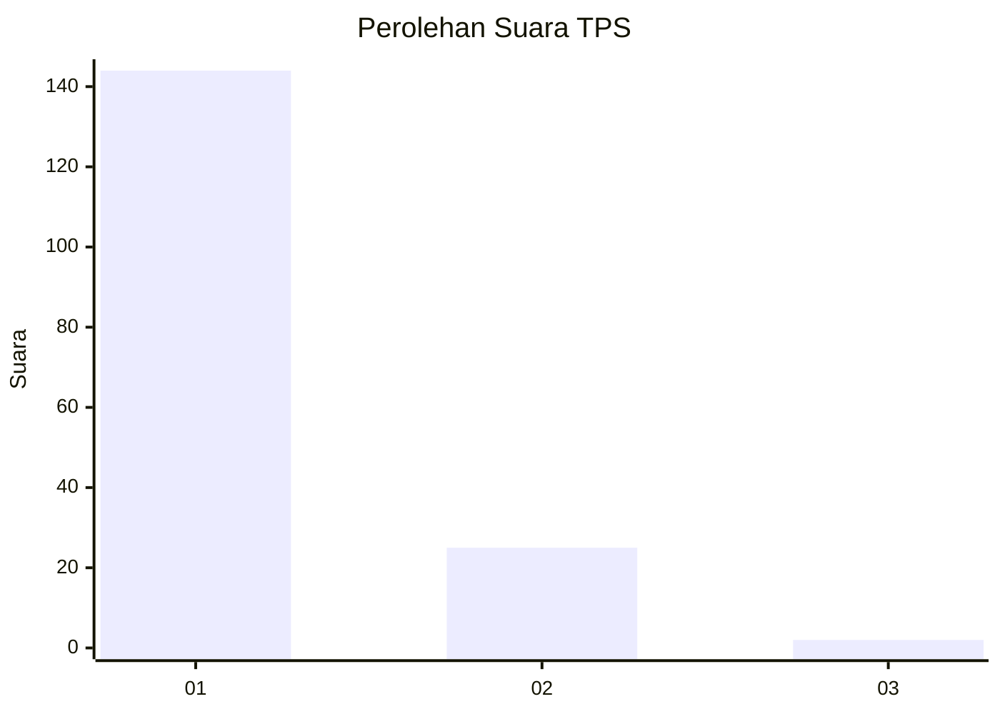
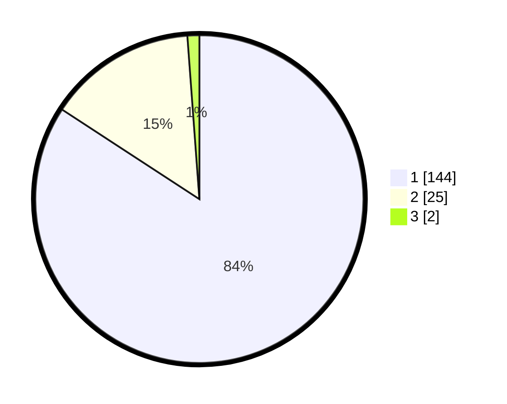

# Hasil

## Grafik

## Tabel

| No. | Nama Paslon    | Suara | Suara (raw) | Persentase |
|:--- |:-------------- | -----:| -----------:| ----------:|
| 1   | ANIES MUHAIMIN | 144   | [144][p-1]  | 84,21      |
| 2   | PRABOWO GIBRAN | 25    | [25][p-2]   | 14,62      |
| 3   | GANJAR MAHFUD  | 2     | [2][p-3]    | 1,17       |

[p-1]: https://github.com/gigit-pemilu/pemilu-2024-11-aceh/blob/main/pilpres/hitung-suara/sub/11-aceh/sub/11-bireuen/sub/03-peudada/sub/2008-meunasah-pulo/sub/001-tps/sub/paslon-1.txt
[p-2]: https://github.com/gigit-pemilu/pemilu-2024-11-aceh/blob/main/pilpres/hitung-suara/sub/11-aceh/sub/11-bireuen/sub/03-peudada/sub/2008-meunasah-pulo/sub/001-tps/sub/paslon-2.txt
[p-3]: https://github.com/gigit-pemilu/pemilu-2024-11-aceh/blob/main/pilpres/hitung-suara/sub/11-aceh/sub/11-bireuen/sub/03-peudada/sub/2008-meunasah-pulo/sub/001-tps/sub/paslon-3.txt

## Foto C Plano

https://sirekap-obj-formc.kpu.go.id/e5da/pemilu/ppwp/11/11/03/20/08/1111032008001-20240214-202510--78957ff2-766d-4062-a422-97ec9b02e716.jpg

https://sirekap-obj-formc.kpu.go.id/e5da/pemilu/ppwp/11/11/03/20/08/1111032008001-20240214-202645--a7430250-a850-4f78-b15d-56c05e4122ae.jpg

https://sirekap-obj-formc.kpu.go.id/e5da/pemilu/ppwp/11/11/03/20/08/1111032008001-20240215-114015--d7a6f1a9-7836-4be2-a299-60d1cc3d790a.jpg

## Metadata

| Key        | Value               |
| ---------- | ------------------- |
| Time Stamp | 2024-02-16 00:30:27 |

