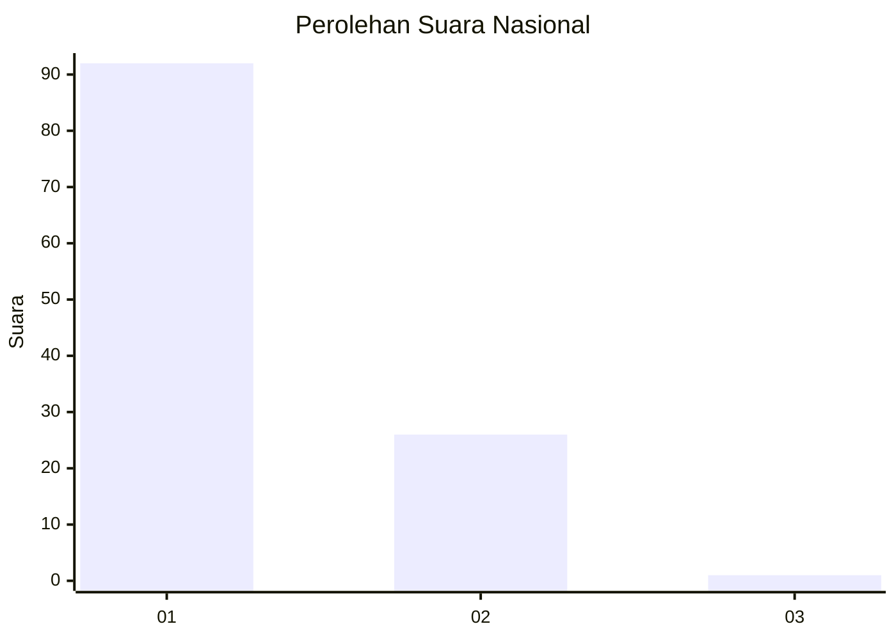
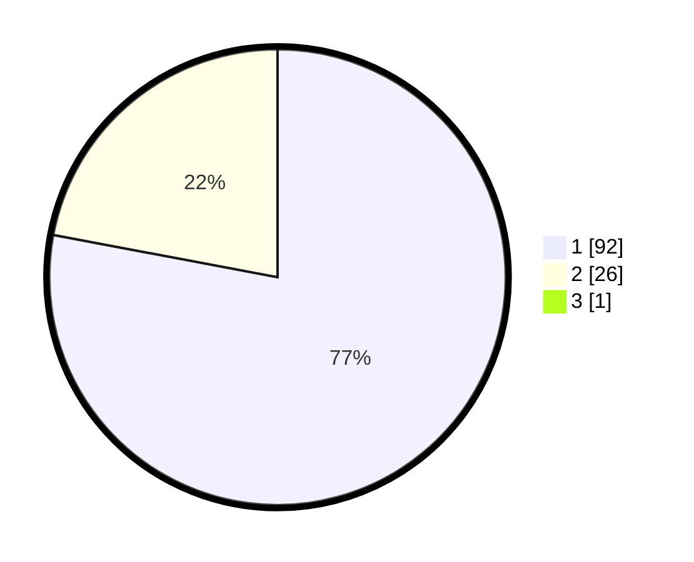

# Hasil

## Grafik

## Tabel

| No. | Nama Paslon    | Suara | Suara (raw) | Persentase |
|:--- |:-------------- | -----:| -----------:| ----------:|
| 1   | ANIES MUHAIMIN | 92    | [92][p-1]   | 77,31      |
| 2   | PRABOWO GIBRAN | 26    | [26][p-2]   | 21,85      |
| 3   | GANJAR MAHFUD  | 1     | [1][p-3]    | 0,84       |

[p-1]: https://github.com/gigit-pemilu/pemilu-2024/blob/main/pilpres/hitung-suara/sub/11-aceh/sub/11-bireuen/sub/03-peudada/sub/2013-jabet/sub/001-tps/sub/paslon-1.txt
[p-2]: https://github.com/gigit-pemilu/pemilu-2024/blob/main/pilpres/hitung-suara/sub/11-aceh/sub/11-bireuen/sub/03-peudada/sub/2013-jabet/sub/001-tps/sub/paslon-2.txt
[p-3]: https://github.com/gigit-pemilu/pemilu-2024/blob/main/pilpres/hitung-suara/sub/11-aceh/sub/11-bireuen/sub/03-peudada/sub/2013-jabet/sub/001-tps/sub/paslon-3.txt

## Foto C Plano

https://sirekap-obj-formc.kpu.go.id/92fe/pemilu/ppwp/11/11/03/20/13/1111032013001-20240215-001955--b21a5ae6-3abf-4861-8dc0-889e04c238d1.jpg

https://sirekap-obj-formc.kpu.go.id/92fe/pemilu/ppwp/11/11/03/20/13/1111032013001-20240215-002318--5a95e9e0-a086-4706-82d5-9d54bbe84252.jpg

https://sirekap-obj-formc.kpu.go.id/92fe/pemilu/ppwp/11/11/03/20/13/1111032013001-20240215-002507--c00f338f-d445-475e-9cd8-03a8eb7b3cac.jpg

## Metadata

| Key        | Value               |
| ---------- | ------------------- |
| Time Stamp | 2024-02-16 01:00:27 |

