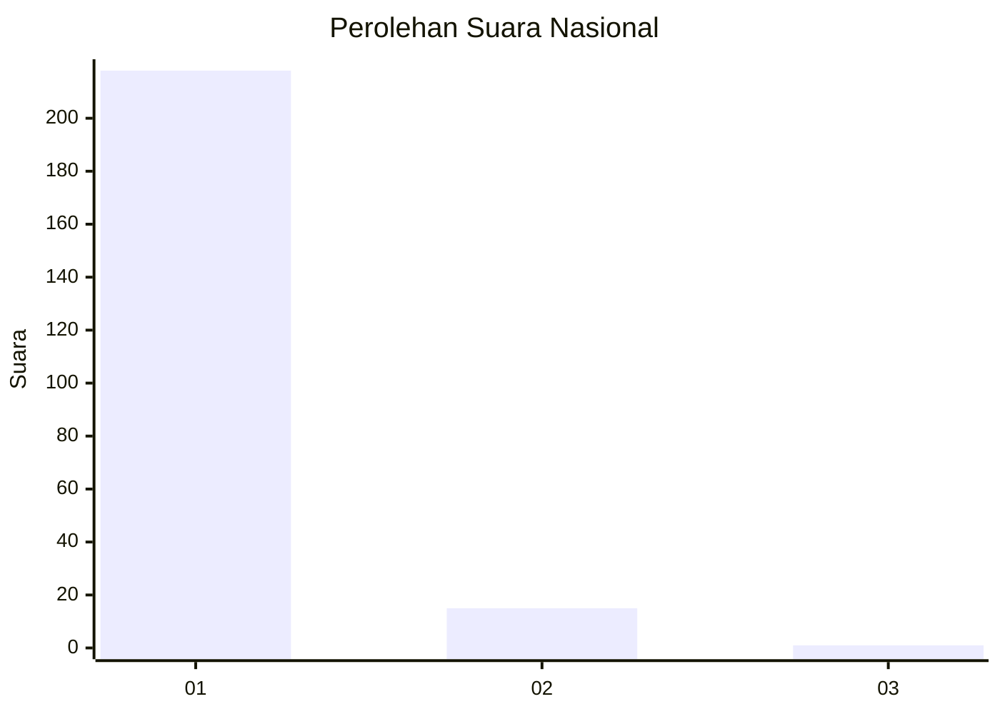
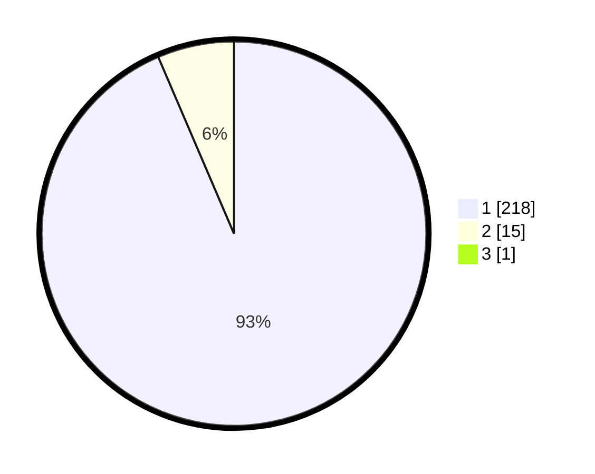

# Hasil

## Grafik

## Tabel

| No. | Nama Paslon    | Suara | Suara (raw) | Persentase |
|:--- |:-------------- | -----:| -----------:| ----------:|
| 1   | ANIES MUHAIMIN | 218   | [218][p-1]  | 93,16      |
| 2   | PRABOWO GIBRAN | 15    | [15][p-2]   | 6,41       |
| 3   | GANJAR MAHFUD  | 1     | [1][p-3]    | 0,43       |

[p-1]: https://github.com/gigit-pemilu/pemilu-2024/blob/main/pilpres/hitung-suara/sub/11-aceh/sub/11-bireuen/sub/03-peudada/sub/2017-blang-rangkuluh/sub/002-tps/sub/paslon-1.txt
[p-2]: https://github.com/gigit-pemilu/pemilu-2024/blob/main/pilpres/hitung-suara/sub/11-aceh/sub/11-bireuen/sub/03-peudada/sub/2017-blang-rangkuluh/sub/002-tps/sub/paslon-2.txt
[p-3]: https://github.com/gigit-pemilu/pemilu-2024/blob/main/pilpres/hitung-suara/sub/11-aceh/sub/11-bireuen/sub/03-peudada/sub/2017-blang-rangkuluh/sub/002-tps/sub/paslon-3.txt

## Foto C Plano

https://sirekap-obj-formc.kpu.go.id/f169/pemilu/ppwp/11/11/03/20/17/1111032017002-20240215-053645--d53f6ba9-9531-4c5a-9f59-1d4fef5b107f.jpg

https://sirekap-obj-formc.kpu.go.id/f169/pemilu/ppwp/11/11/03/20/17/1111032017002-20240215-065553--56a901a3-9614-401f-babc-43010c74fea7.jpg

https://sirekap-obj-formc.kpu.go.id/f169/pemilu/ppwp/11/11/03/20/17/1111032017002-20240215-053750--adc7a7c4-48f0-4b3f-a17d-18e31bfebe15.jpg

## Metadata

| Key        | Value               |
| ---------- | ------------------- |
| Time Stamp | 2024-02-16 01:00:27 |

