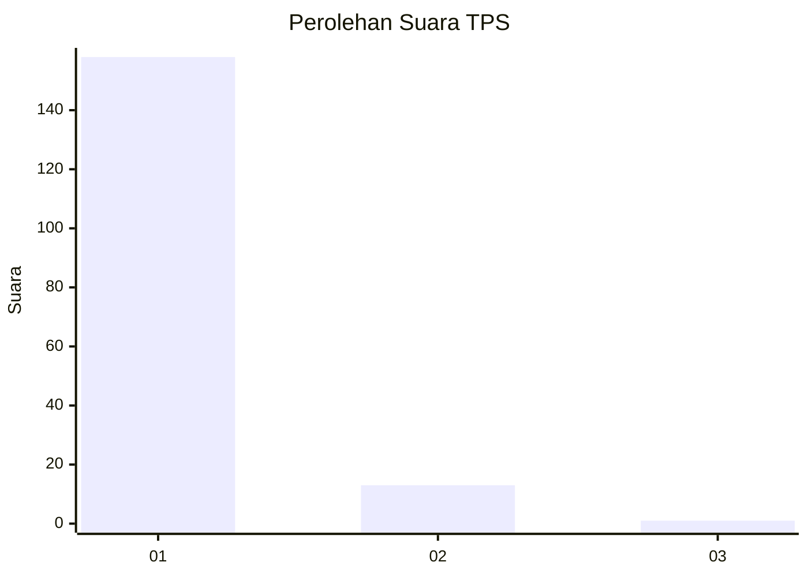
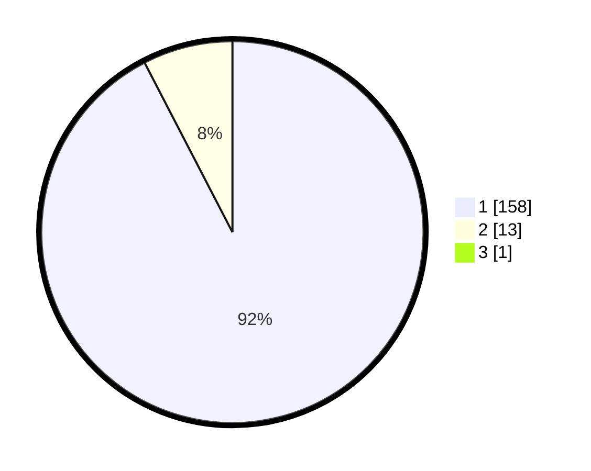

# Hasil

## Grafik

## Tabel

| No. | Nama Paslon    | Suara | Suara (raw) | Persentase |
|:--- |:-------------- | -----:| -----------:| ----------:|
| 1   | ANIES MUHAIMIN | 158   | [158][p-1]  | 91,86      |
| 2   | PRABOWO GIBRAN | 13    | [13][p-2]   | 7,56       |
| 3   | GANJAR MAHFUD  | 1     | [1][p-3]    | 0,58       |

[p-1]: https://github.com/gigit-pemilu/pemilu-2024-11-aceh/blob/main/pilpres/hitung-suara/sub/11-aceh/sub/11-bireuen/sub/03-peudada/sub/2024-meunasah-teungoh/sub/002-tps/sub/paslon-1.txt
[p-2]: https://github.com/gigit-pemilu/pemilu-2024-11-aceh/blob/main/pilpres/hitung-suara/sub/11-aceh/sub/11-bireuen/sub/03-peudada/sub/2024-meunasah-teungoh/sub/002-tps/sub/paslon-2.txt
[p-3]: https://github.com/gigit-pemilu/pemilu-2024-11-aceh/blob/main/pilpres/hitung-suara/sub/11-aceh/sub/11-bireuen/sub/03-peudada/sub/2024-meunasah-teungoh/sub/002-tps/sub/paslon-3.txt

## Foto C Plano

https://sirekap-obj-formc.kpu.go.id/f527/pemilu/ppwp/11/11/03/20/24/1111032024002-20240218-170059--9caa9ce7-2206-4a6c-a66b-0375f0e293dd.jpg

https://sirekap-obj-formc.kpu.go.id/f527/pemilu/ppwp/11/11/03/20/24/1111032024002-20240218-170122--c0ecd943-309e-45b6-8443-45306f0bc0bf.jpg

https://sirekap-obj-formc.kpu.go.id/f527/pemilu/ppwp/11/11/03/20/24/1111032024002-20240218-170132--eeaa067f-44a3-4d4b-a16f-8ae25b429bb6.jpg

## Metadata

| Key        | Value               |
| ---------- | ------------------- |
| Time Stamp | 2024-02-24 22:31:28 |

