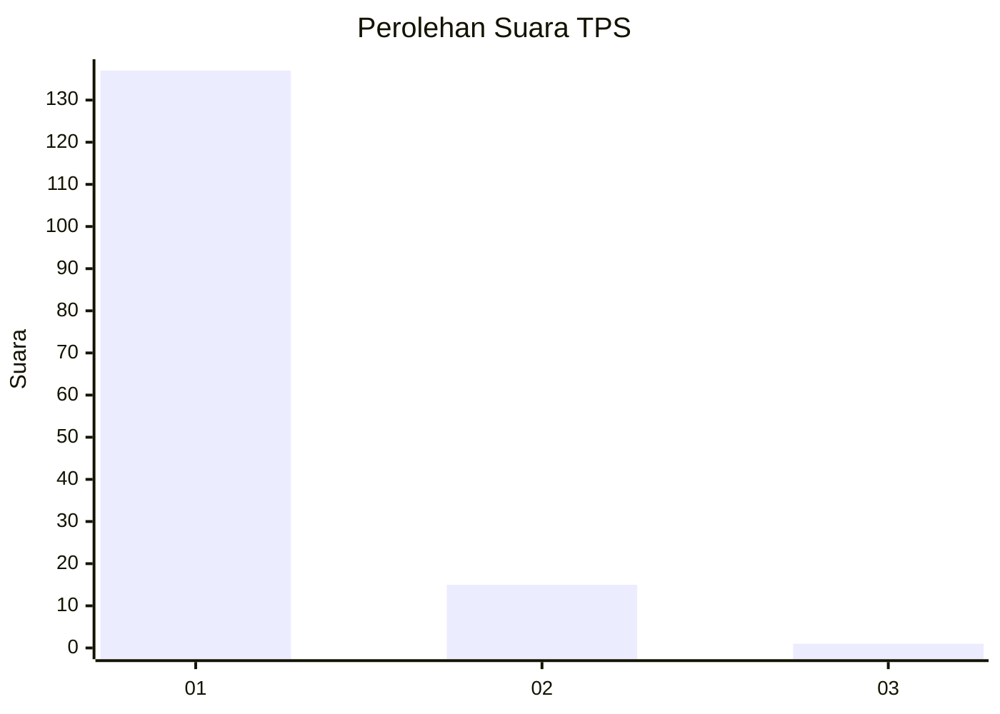
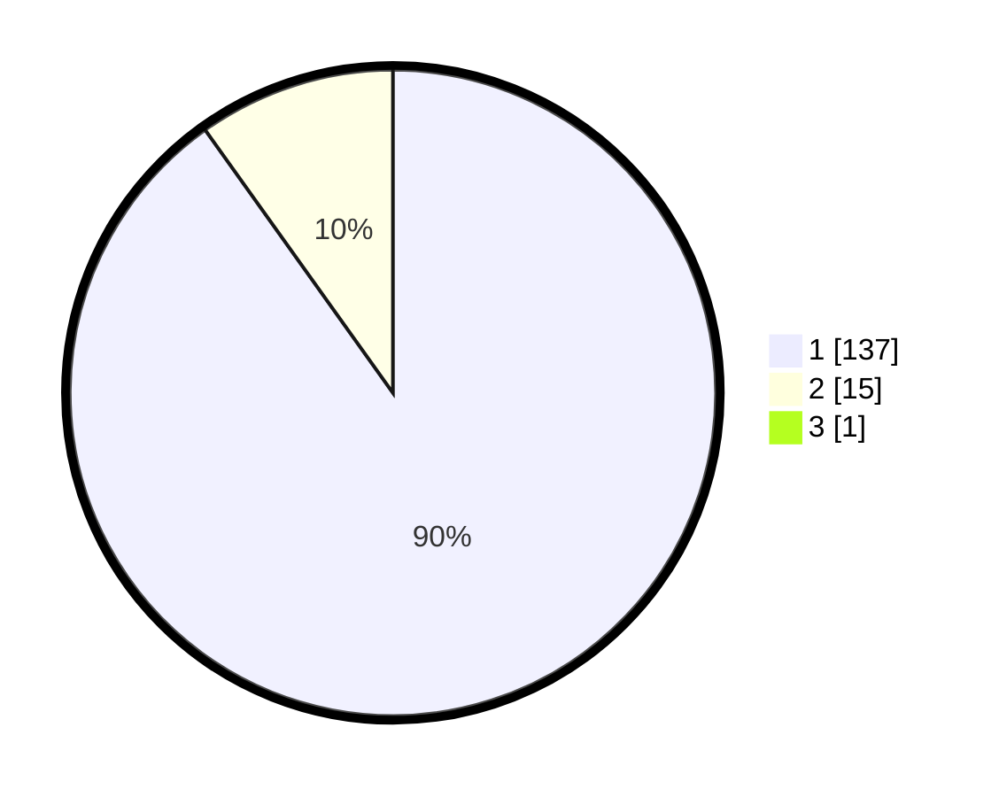

# Hasil

## Grafik

## Tabel

| No. | Nama Paslon    | Suara | Suara (raw) | Persentase |
|:--- |:-------------- | -----:| -----------:| ----------:|
| 1   | ANIES MUHAIMIN | 137   | [137][p-1]  | 89,54      |
| 2   | PRABOWO GIBRAN | 15    | [15][p-2]   | 9,80       |
| 3   | GANJAR MAHFUD  | 1     | [1][p-3]    | 0,65       |

[p-1]: https://github.com/gigit-pemilu/pemilu-2024-11-aceh/blob/main/pilpres/hitung-suara/sub/11-aceh/sub/11-bireuen/sub/03-peudada/sub/2026-kukue/sub/002-tps/sub/paslon-1.txt
[p-2]: https://github.com/gigit-pemilu/pemilu-2024-11-aceh/blob/main/pilpres/hitung-suara/sub/11-aceh/sub/11-bireuen/sub/03-peudada/sub/2026-kukue/sub/002-tps/sub/paslon-2.txt
[p-3]: https://github.com/gigit-pemilu/pemilu-2024-11-aceh/blob/main/pilpres/hitung-suara/sub/11-aceh/sub/11-bireuen/sub/03-peudada/sub/2026-kukue/sub/002-tps/sub/paslon-3.txt

## Foto C Plano

https://sirekap-obj-formc.kpu.go.id/b810/pemilu/ppwp/11/11/03/20/26/1111032026002-20240216-131839--8804e1f4-d40b-4fd3-91fd-0d5ed301c393.jpg

https://sirekap-obj-formc.kpu.go.id/b810/pemilu/ppwp/11/11/03/20/26/1111032026002-20240216-131910--9ac84c8f-dd25-47fc-aa2a-0ca47d0a26af.jpg

https://sirekap-obj-formc.kpu.go.id/b810/pemilu/ppwp/11/11/03/20/26/1111032026002-20240216-131928--e2458048-792e-4f83-8976-2e2d5c4a8bbb.jpg

## Metadata

| Key        | Value               |
| ---------- | ------------------- |
| Time Stamp | 2024-02-19 06:16:00 |

