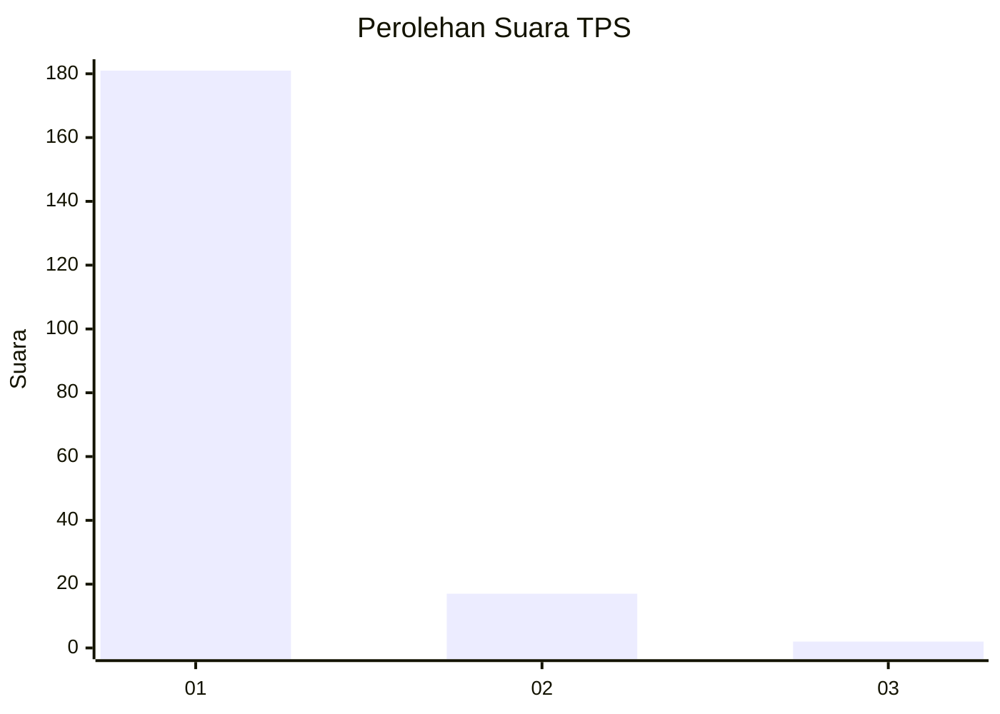
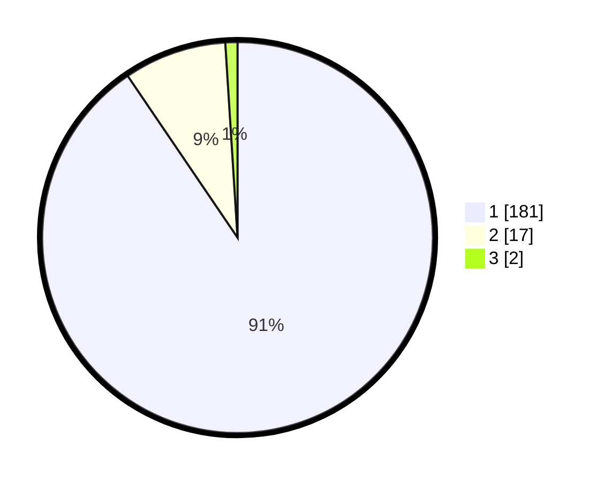

# Hasil

## Grafik

## Tabel

| No. | Nama Paslon    | Suara | Suara (raw) | Persentase |
|:--- |:-------------- | -----:| -----------:| ----------:|
| 1   | ANIES MUHAIMIN | 181   | [181][p-1]  | 90,50      |
| 2   | PRABOWO GIBRAN | 17    | [17][p-2]   | 8,50       |
| 3   | GANJAR MAHFUD  | 2     | [2][p-3]    | 1,00       |

[p-1]: https://github.com/gigit-pemilu/pemilu-2024-11-aceh/blob/main/pilpres/hitung-suara/sub/11-aceh/sub/11-bireuen/sub/03-peudada/sub/2042-cot-kruet/sub/001-tps/sub/paslon-1.txt
[p-2]: https://github.com/gigit-pemilu/pemilu-2024-11-aceh/blob/main/pilpres/hitung-suara/sub/11-aceh/sub/11-bireuen/sub/03-peudada/sub/2042-cot-kruet/sub/001-tps/sub/paslon-2.txt
[p-3]: https://github.com/gigit-pemilu/pemilu-2024-11-aceh/blob/main/pilpres/hitung-suara/sub/11-aceh/sub/11-bireuen/sub/03-peudada/sub/2042-cot-kruet/sub/001-tps/sub/paslon-3.txt

## Foto C Plano

https://sirekap-obj-formc.kpu.go.id/1c72/pemilu/ppwp/11/11/03/20/42/1111032042001-20240215-043608--491ed501-95d2-47b2-bc87-b152c52b38a5.jpg

https://sirekap-obj-formc.kpu.go.id/1c72/pemilu/ppwp/11/11/03/20/42/1111032042001-20240215-043812--432ea9f6-2094-4101-9a0a-bb5625f18c75.jpg

https://sirekap-obj-formc.kpu.go.id/1c72/pemilu/ppwp/11/11/03/20/42/1111032042001-20240215-044008--c2d1255d-3a24-418f-a0d4-a2e2af32de49.jpg

## Metadata

| Key        | Value               |
| ---------- | ------------------- |
| Time Stamp | 2024-02-16 01:00:27 |

