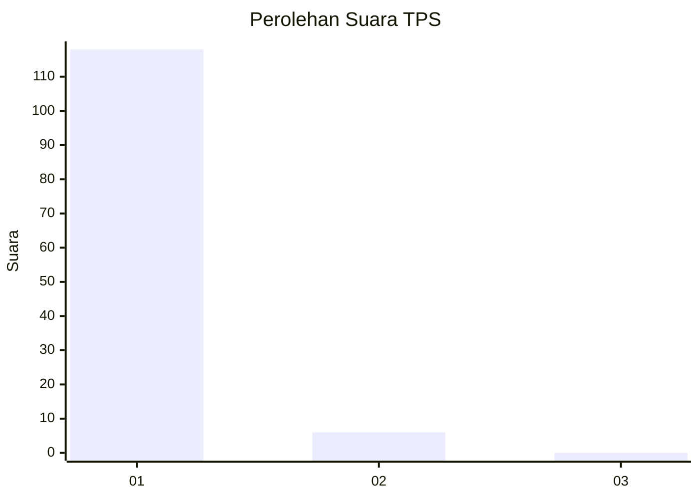
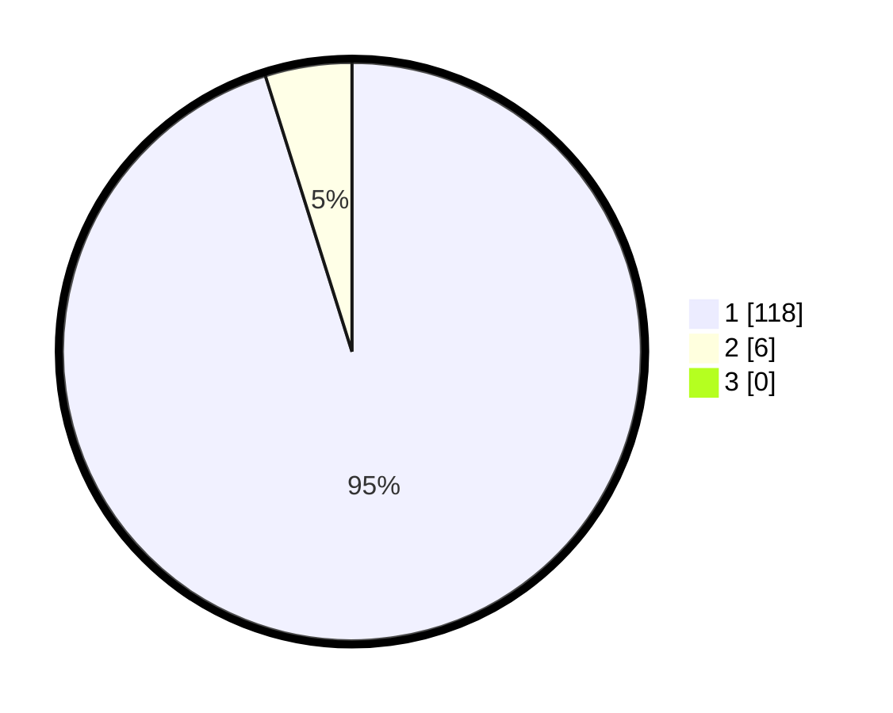

# Hasil

## Grafik

## Tabel

| No. | Nama Paslon    | Suara | Suara (raw) | Persentase |
|:--- |:-------------- | -----:| -----------:| ----------:|
| 1   | ANIES MUHAIMIN | 118   | [118][p-1]  | 95,16      |
| 2   | PRABOWO GIBRAN | 6     | [6][p-2]    | 4,84       |
| 3   | GANJAR MAHFUD  | 0     | [0][p-3]    | 0,00       |

[p-1]: https://github.com/gigit-pemilu/pemilu-2024-11-aceh/blob/main/pilpres/hitung-suara/sub/11-aceh/sub/11-bireuen/sub/03-peudada/sub/2044-jaba/sub/002-tps/sub/paslon-1.txt
[p-2]: https://github.com/gigit-pemilu/pemilu-2024-11-aceh/blob/main/pilpres/hitung-suara/sub/11-aceh/sub/11-bireuen/sub/03-peudada/sub/2044-jaba/sub/002-tps/sub/paslon-2.txt
[p-3]: https://github.com/gigit-pemilu/pemilu-2024-11-aceh/blob/main/pilpres/hitung-suara/sub/11-aceh/sub/11-bireuen/sub/03-peudada/sub/2044-jaba/sub/002-tps/sub/paslon-3.txt

## Foto C Plano

https://sirekap-obj-formc.kpu.go.id/3e50/pemilu/ppwp/11/11/03/20/44/1111032044002-20240215-044615--60fe353d-7557-4560-8ad9-f96a5d9bbda0.jpg

https://sirekap-obj-formc.kpu.go.id/3e50/pemilu/ppwp/11/11/03/20/44/1111032044002-20240215-044402--518f07b1-2e67-4a02-b571-fbfeef7387d7.jpg

https://sirekap-obj-formc.kpu.go.id/3e50/pemilu/ppwp/11/11/03/20/44/1111032044002-20240215-044139--6951dd9d-b40c-4eda-96ff-ab92bf110e77.jpg

## Metadata

| Key        | Value               |
| ---------- | ------------------- |
| Time Stamp | 2024-02-16 01:00:27 |

