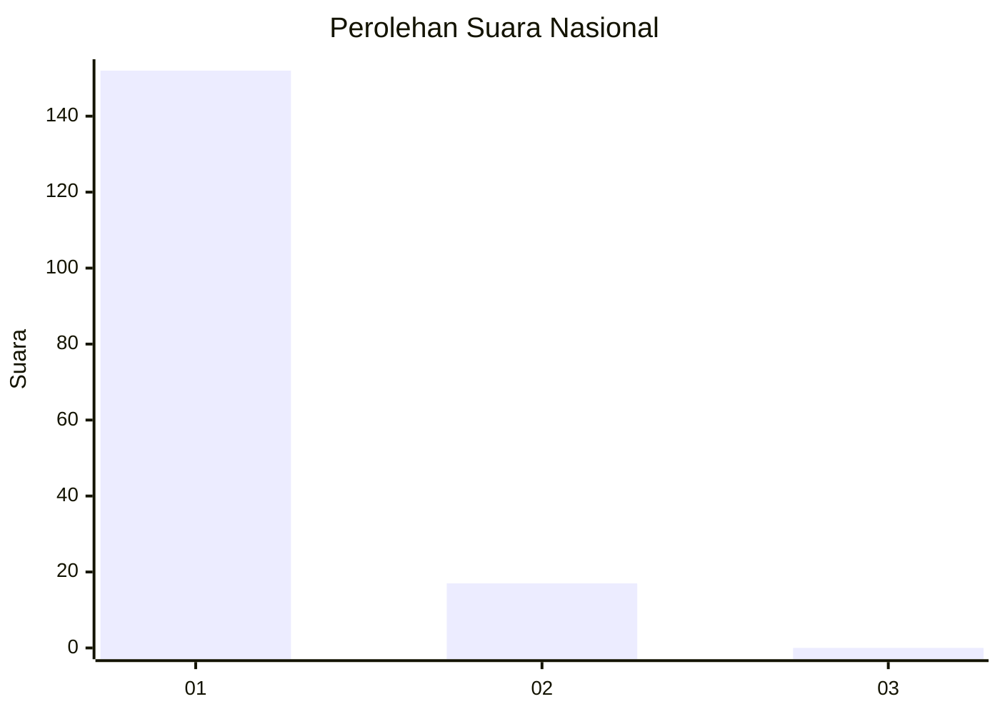
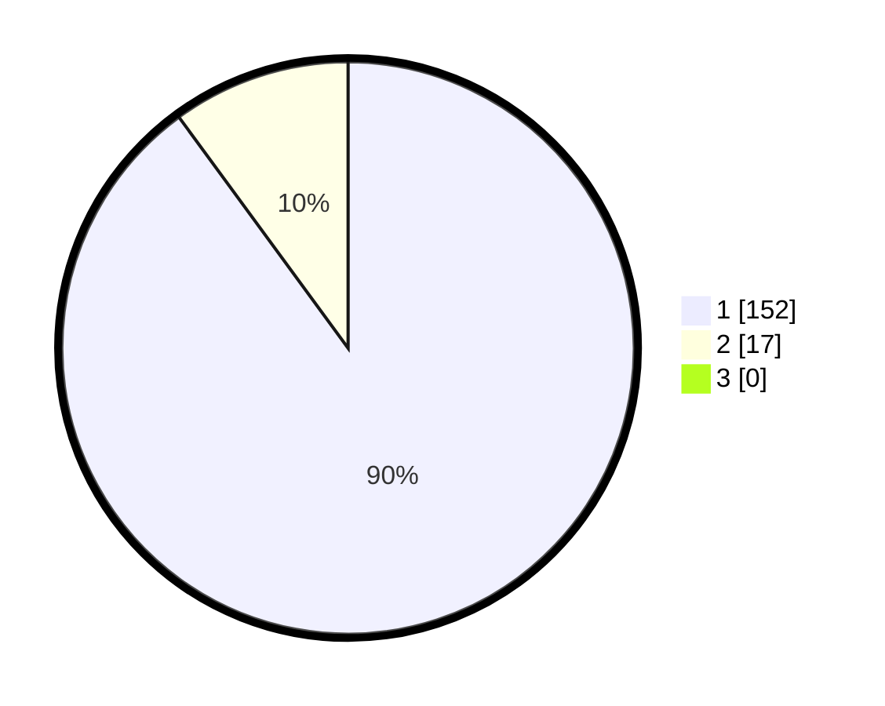

# Hasil

## Grafik

## Tabel

| No. | Nama Paslon    | Suara | Suara (raw) | Persentase |
|:--- |:-------------- | -----:| -----------:| ----------:|
| 1   | ANIES MUHAIMIN | 152   | [152][p-1]  | 89,94      |
| 2   | PRABOWO GIBRAN | 17    | [17][p-2]   | 10,06      |
| 3   | GANJAR MAHFUD  | 0     | [0][p-3]    | 0,00       |

[p-1]: https://github.com/gigit-pemilu/pemilu-2024/blob/main/pilpres/hitung-suara/sub/11-aceh/sub/11-bireuen/sub/03-peudada/sub/2052-paya-barat/sub/001-tps/sub/paslon-1.txt
[p-2]: https://github.com/gigit-pemilu/pemilu-2024/blob/main/pilpres/hitung-suara/sub/11-aceh/sub/11-bireuen/sub/03-peudada/sub/2052-paya-barat/sub/001-tps/sub/paslon-2.txt
[p-3]: https://github.com/gigit-pemilu/pemilu-2024/blob/main/pilpres/hitung-suara/sub/11-aceh/sub/11-bireuen/sub/03-peudada/sub/2052-paya-barat/sub/001-tps/sub/paslon-3.txt

## Foto C Plano

https://sirekap-obj-formc.kpu.go.id/401f/pemilu/ppwp/11/11/03/20/52/1111032052001-20240215-041818--1cb255e4-7bba-4a41-bf8b-7105a03f4a8c.jpg

https://sirekap-obj-formc.kpu.go.id/401f/pemilu/ppwp/11/11/03/20/52/1111032052001-20240218-180334--4a232c78-36c0-45b3-8b38-3b523c6368f3.jpg

https://sirekap-obj-formc.kpu.go.id/401f/pemilu/ppwp/11/11/03/20/52/1111032052001-20240215-042102--93061912-a9f4-4b0e-bab5-3b11e72f3585.jpg

## Metadata

| Key        | Value               |
| ---------- | ------------------- |
| Time Stamp | 2024-02-19 06:16:00 |

