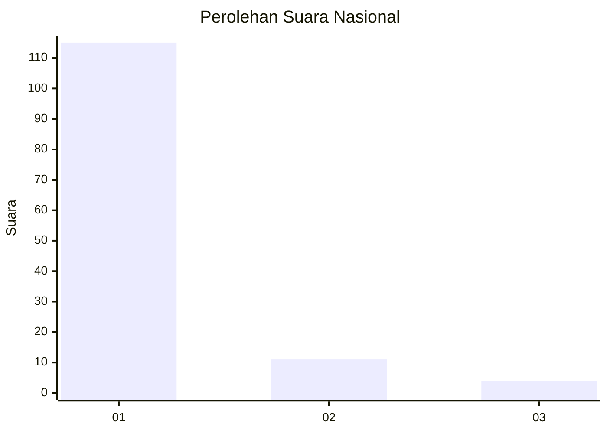
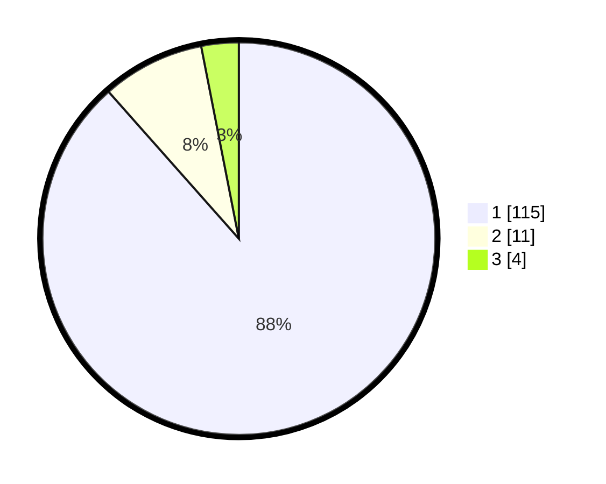

# Hasil

## Grafik

## Tabel

| No. | Nama Paslon    | Suara | Suara (raw) | Persentase |
|:--- |:-------------- | -----:| -----------:| ----------:|
| 1   | ANIES MUHAIMIN | 115   | [115][p-1]  | 88,46      |
| 2   | PRABOWO GIBRAN | 11    | [11][p-2]   | 8,46       |
| 3   | GANJAR MAHFUD  | 4     | [4][p-3]    | 3,08       |

[p-1]: https://github.com/gigit-pemilu/pemilu-2024/blob/main/pilpres/hitung-suara/sub/11-aceh/sub/11-bireuen/sub/04-jeumpa/sub/2034-cot-leusong/sub/002-tps/sub/paslon-1.txt
[p-2]: https://github.com/gigit-pemilu/pemilu-2024/blob/main/pilpres/hitung-suara/sub/11-aceh/sub/11-bireuen/sub/04-jeumpa/sub/2034-cot-leusong/sub/002-tps/sub/paslon-2.txt
[p-3]: https://github.com/gigit-pemilu/pemilu-2024/blob/main/pilpres/hitung-suara/sub/11-aceh/sub/11-bireuen/sub/04-jeumpa/sub/2034-cot-leusong/sub/002-tps/sub/paslon-3.txt

## Foto C Plano

https://sirekap-obj-formc.kpu.go.id/e460/pemilu/ppwp/11/11/04/20/34/1111042034002-20240215-070519--2a950670-36be-4bcf-84d2-fdf3017a7cba.jpg

https://sirekap-obj-formc.kpu.go.id/e460/pemilu/ppwp/11/11/04/20/34/1111042034002-20240215-004852--50874646-716f-4cbf-bf49-29443d348a0e.jpg

https://sirekap-obj-formc.kpu.go.id/e460/pemilu/ppwp/11/11/04/20/34/1111042034002-20240215-005142--8ede019a-ea82-4dc2-86c0-6e6df5fd59d9.jpg

## Metadata

| Key        | Value               |
| ---------- | ------------------- |
| Time Stamp | 2024-02-19 06:16:00 |

