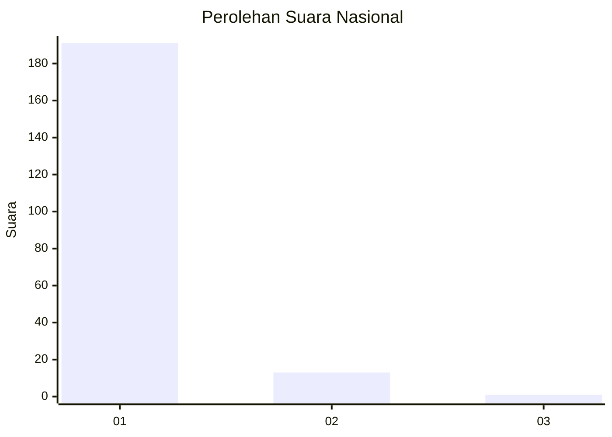
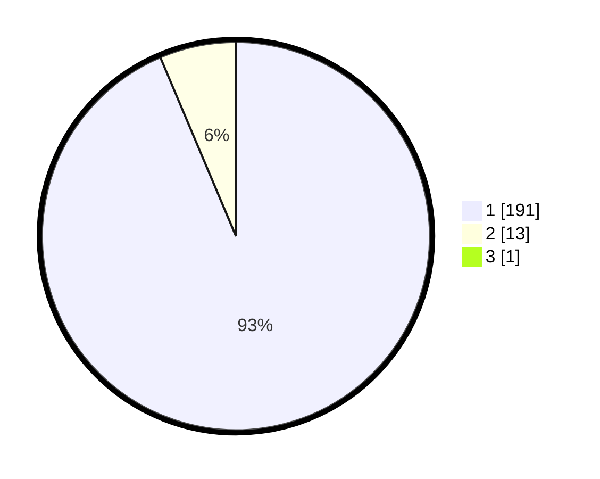

# Hasil

## Grafik

## Tabel

| No. | Nama Paslon    | Suara | Suara (raw) | Persentase |
|:--- |:-------------- | -----:| -----------:| ----------:|
| 1   | ANIES MUHAIMIN | 191   | [191][p-1]  | 93,17      |
| 2   | PRABOWO GIBRAN | 13    | [13][p-2]   | 6,34       |
| 3   | GANJAR MAHFUD  | 1     | [1][p-3]    | 0,49       |

[p-1]: https://github.com/gigit-pemilu/pemilu-2024/blob/main/pilpres/hitung-suara/sub/11-aceh/sub/11-bireuen/sub/04-jeumpa/sub/2048-cot-tarom-tunong/sub/002-tps/sub/paslon-1.txt
[p-2]: https://github.com/gigit-pemilu/pemilu-2024/blob/main/pilpres/hitung-suara/sub/11-aceh/sub/11-bireuen/sub/04-jeumpa/sub/2048-cot-tarom-tunong/sub/002-tps/sub/paslon-2.txt
[p-3]: https://github.com/gigit-pemilu/pemilu-2024/blob/main/pilpres/hitung-suara/sub/11-aceh/sub/11-bireuen/sub/04-jeumpa/sub/2048-cot-tarom-tunong/sub/002-tps/sub/paslon-3.txt

## Foto C Plano

https://sirekap-obj-formc.kpu.go.id/7735/pemilu/ppwp/11/11/04/20/48/1111042048002-20240214-213522--0c32f5b8-7bcd-4aa8-87f7-0711dbe501b0.jpg

https://sirekap-obj-formc.kpu.go.id/7735/pemilu/ppwp/11/11/04/20/48/1111042048002-20240214-213705--5f606788-7adc-4f2c-9bbc-e68cd3d686c0.jpg

https://sirekap-obj-formc.kpu.go.id/7735/pemilu/ppwp/11/11/04/20/48/1111042048002-20240214-213804--dbc3862f-36bb-429d-8ccd-865fa0ad3498.jpg

## Metadata

| Key        | Value               |
| ---------- | ------------------- |
| Time Stamp | 2024-02-15 15:00:29 |

