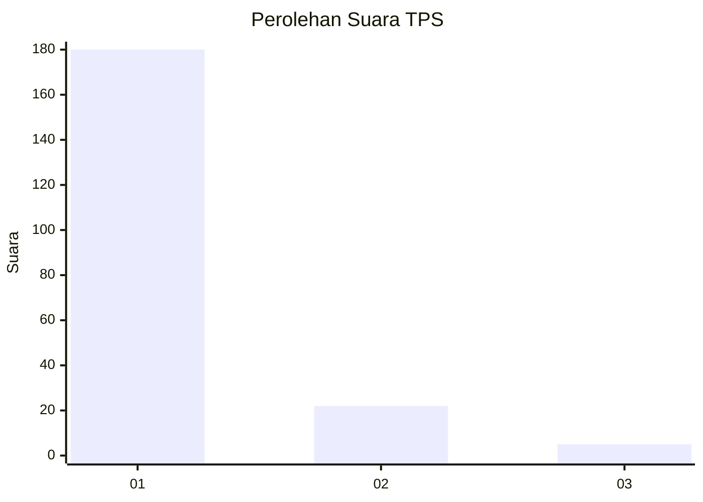
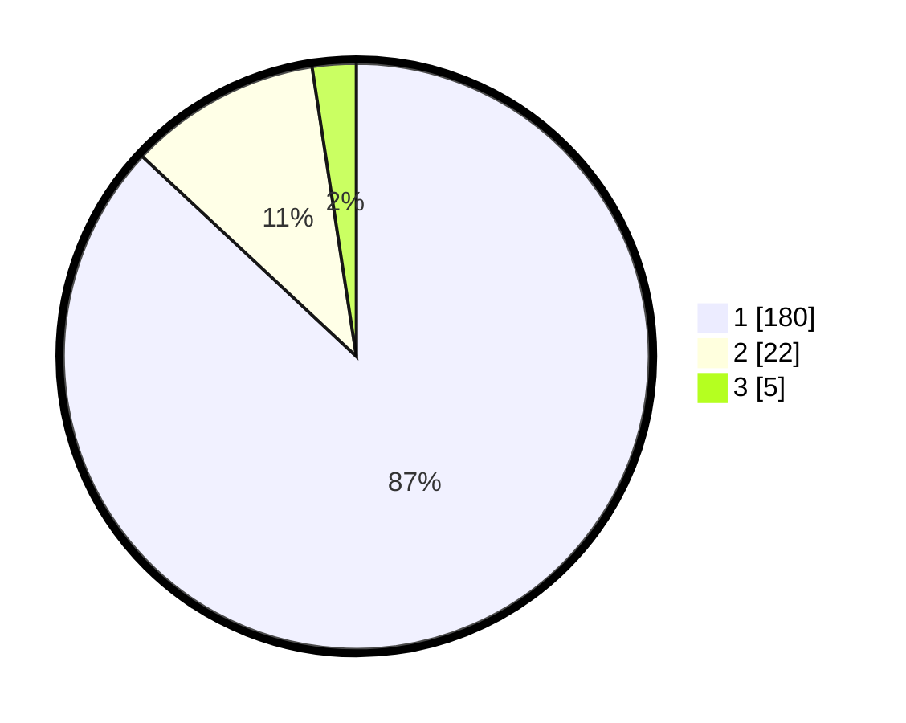

# Hasil

## Grafik

## Tabel

| No. | Nama Paslon    | Suara | Suara (raw) | Persentase |
|:--- |:-------------- | -----:| -----------:| ----------:|
| 1   | ANIES MUHAIMIN | 180   | [180][p-1]  | 86,96      |
| 2   | PRABOWO GIBRAN | 22    | [22][p-2]   | 10,63      |
| 3   | GANJAR MAHFUD  | 5     | [5][p-3]    | 2,42       |

[p-1]: https://github.com/gigit-pemilu/pemilu-2024-11-aceh/blob/main/pilpres/hitung-suara/sub/11-aceh/sub/11-bireuen/sub/04-jeumpa/sub/2052-kuala-jeumpa/sub/002-tps/sub/paslon-1.txt
[p-2]: https://github.com/gigit-pemilu/pemilu-2024-11-aceh/blob/main/pilpres/hitung-suara/sub/11-aceh/sub/11-bireuen/sub/04-jeumpa/sub/2052-kuala-jeumpa/sub/002-tps/sub/paslon-2.txt
[p-3]: https://github.com/gigit-pemilu/pemilu-2024-11-aceh/blob/main/pilpres/hitung-suara/sub/11-aceh/sub/11-bireuen/sub/04-jeumpa/sub/2052-kuala-jeumpa/sub/002-tps/sub/paslon-3.txt

## Foto C Plano

https://sirekap-obj-formc.kpu.go.id/daaa/pemilu/ppwp/11/11/04/20/52/1111042052002-20240214-195324--4f13fe0f-a1bd-401e-8c41-902066392950.jpg

https://sirekap-obj-formc.kpu.go.id/daaa/pemilu/ppwp/11/11/04/20/52/1111042052002-20240214-195435--0a1e5c6b-81a9-4b9d-a3e0-ce818abc39cc.jpg

https://sirekap-obj-formc.kpu.go.id/daaa/pemilu/ppwp/11/11/04/20/52/1111042052002-20240214-213539--dfb45d1e-dbdd-4a51-b175-207427b27d4d.jpg

## Metadata

| Key        | Value               |
| ---------- | ------------------- |
| Time Stamp | 2024-02-15 03:06:03 |

