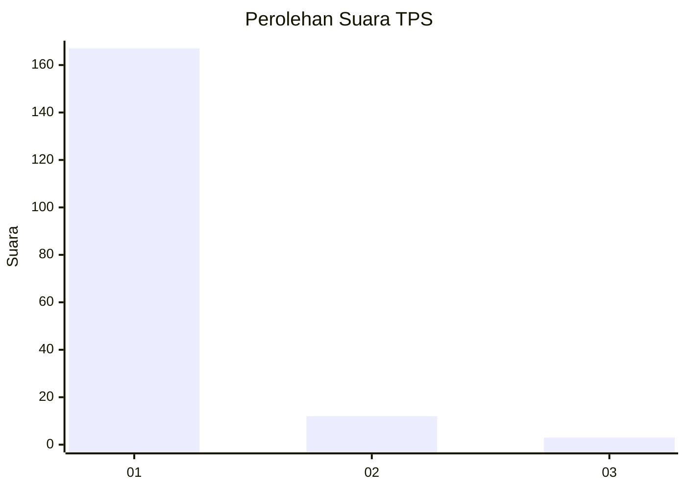
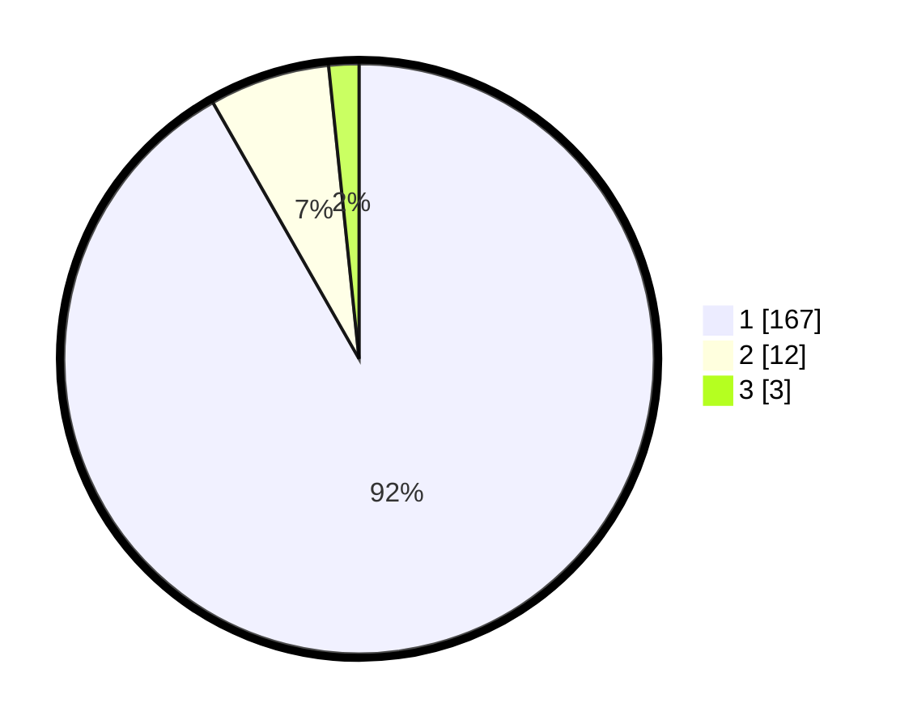

# Hasil

## Grafik

## Tabel

| No. | Nama Paslon    | Suara | Suara (raw) | Persentase |
|:--- |:-------------- | -----:| -----------:| ----------:|
| 1   | ANIES MUHAIMIN | 167   | [167][p-1]  | 91,76      |
| 2   | PRABOWO GIBRAN | 12    | [12][p-2]   | 6,59       |
| 3   | GANJAR MAHFUD  | 3     | [3][p-3]    | 1,65       |

[p-1]: https://github.com/gigit-pemilu/pemilu-2024-11-aceh/blob/main/pilpres/hitung-suara/sub/11-aceh/sub/11-bireuen/sub/04-jeumpa/sub/2057-pulo-lawang/sub/001-tps/sub/paslon-1.txt
[p-2]: https://github.com/gigit-pemilu/pemilu-2024-11-aceh/blob/main/pilpres/hitung-suara/sub/11-aceh/sub/11-bireuen/sub/04-jeumpa/sub/2057-pulo-lawang/sub/001-tps/sub/paslon-2.txt
[p-3]: https://github.com/gigit-pemilu/pemilu-2024-11-aceh/blob/main/pilpres/hitung-suara/sub/11-aceh/sub/11-bireuen/sub/04-jeumpa/sub/2057-pulo-lawang/sub/001-tps/sub/paslon-3.txt

## Foto C Plano

https://sirekap-obj-formc.kpu.go.id/bab6/pemilu/ppwp/11/11/04/20/57/1111042057001-20240215-010229--8bd745c0-f432-4612-b418-f03fa21117b3.jpg

https://sirekap-obj-formc.kpu.go.id/bab6/pemilu/ppwp/11/11/04/20/57/1111042057001-20240215-025738--0a998e25-3e29-450e-b567-b2b2510a95bd.jpg

https://sirekap-obj-formc.kpu.go.id/bab6/pemilu/ppwp/11/11/04/20/57/1111042057001-20240214-222358--589e8896-b8c1-499a-badd-cf2b9318d351.jpg

## Metadata

| Key        | Value               |
| ---------- | ------------------- |
| Time Stamp | 2024-02-15 12:00:28 |

