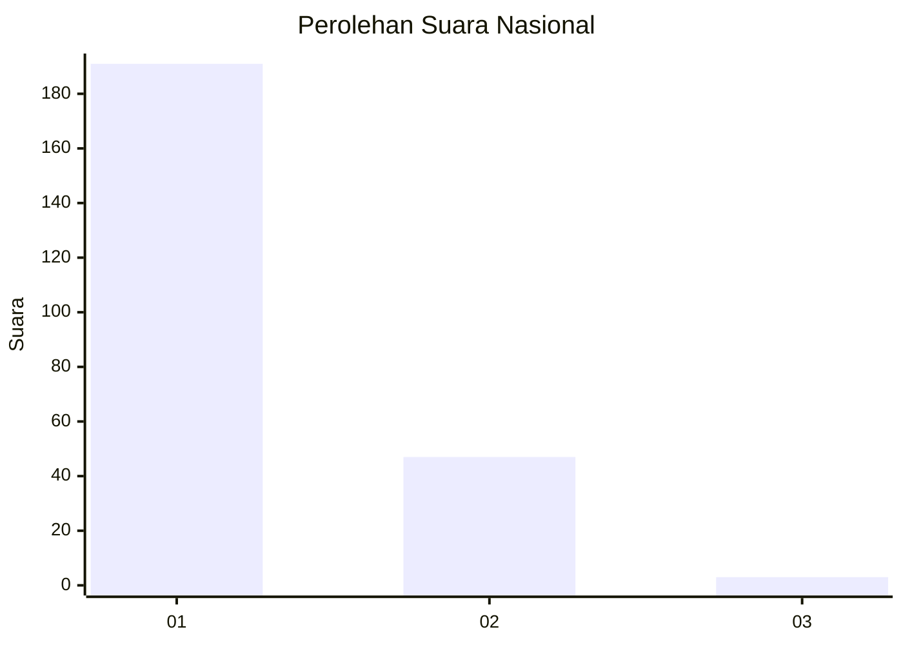
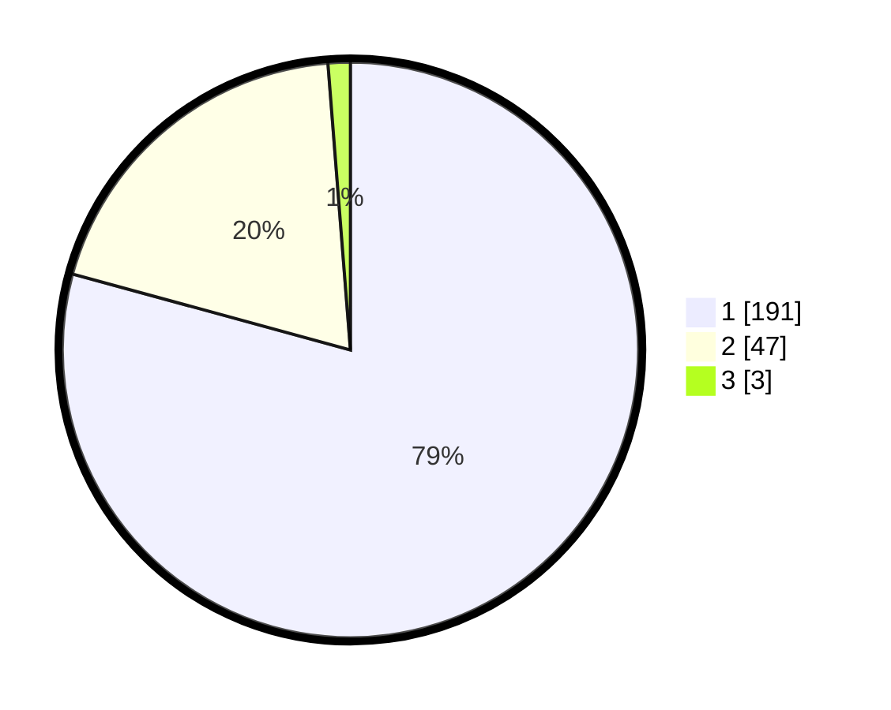

# Hasil

## Grafik

## Tabel

| No. | Nama Paslon    | Suara | Suara (raw) | Persentase |
|:--- |:-------------- | -----:| -----------:| ----------:|
| 1   | ANIES MUHAIMIN | 191   | [191][p-1]  | 79,25      |
| 2   | PRABOWO GIBRAN | 47    | [47][p-2]   | 19,50      |
| 3   | GANJAR MAHFUD  | 3     | [3][p-3]    | 1,24       |

[p-1]: https://github.com/gigit-pemilu/pemilu-2024/blob/main/pilpres/hitung-suara/sub/11-aceh/sub/11-bireuen/sub/04-jeumpa/sub/2063-blang-gandai/sub/002-tps/sub/paslon-1.txt
[p-2]: https://github.com/gigit-pemilu/pemilu-2024/blob/main/pilpres/hitung-suara/sub/11-aceh/sub/11-bireuen/sub/04-jeumpa/sub/2063-blang-gandai/sub/002-tps/sub/paslon-2.txt
[p-3]: https://github.com/gigit-pemilu/pemilu-2024/blob/main/pilpres/hitung-suara/sub/11-aceh/sub/11-bireuen/sub/04-jeumpa/sub/2063-blang-gandai/sub/002-tps/sub/paslon-3.txt

## Foto C Plano

https://sirekap-obj-formc.kpu.go.id/238d/pemilu/ppwp/11/11/04/20/63/1111042063002-20240215-060241--381ca9c8-8555-4e22-b204-e4a496814e74.jpg

https://sirekap-obj-formc.kpu.go.id/238d/pemilu/ppwp/11/11/04/20/63/1111042063002-20240215-060324--793c28f1-7688-4732-9969-2dfb23ee432f.jpg

https://sirekap-obj-formc.kpu.go.id/238d/pemilu/ppwp/11/11/04/20/63/1111042063002-20240215-060641--038ad512-7aa0-4124-851d-fc0f34bdc44c.jpg

## Metadata

| Key        | Value               |
| ---------- | ------------------- |
| Time Stamp | 2024-02-19 06:16:00 |

