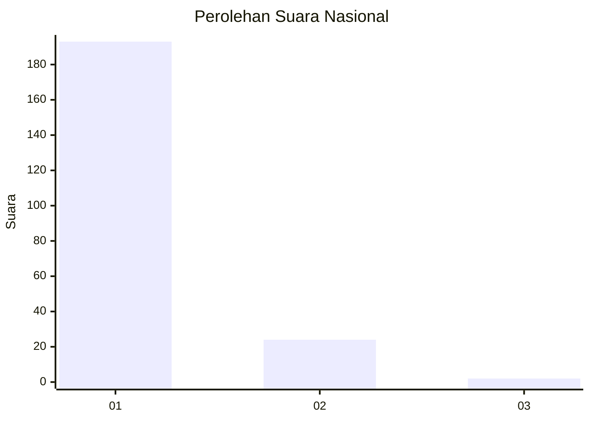
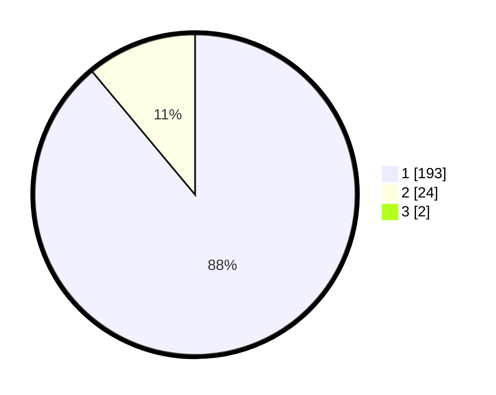

# Hasil

## Grafik

## Tabel

| No. | Nama Paslon    | Suara | Suara (raw) | Persentase |
|:--- |:-------------- | -----:| -----------:| ----------:|
| 1   | ANIES MUHAIMIN | 193   | [193][p-1]  | 88,13      |
| 2   | PRABOWO GIBRAN | 24    | [24][p-2]   | 10,96      |
| 3   | GANJAR MAHFUD  | 2     | [2][p-3]    | 0,91       |

[p-1]: https://github.com/gigit-pemilu/pemilu-2024/blob/main/pilpres/hitung-suara/sub/11-aceh/sub/11-bireuen/sub/04-jeumpa/sub/2071-blang-rheum/sub/001-tps/sub/paslon-1.txt
[p-2]: https://github.com/gigit-pemilu/pemilu-2024/blob/main/pilpres/hitung-suara/sub/11-aceh/sub/11-bireuen/sub/04-jeumpa/sub/2071-blang-rheum/sub/001-tps/sub/paslon-2.txt
[p-3]: https://github.com/gigit-pemilu/pemilu-2024/blob/main/pilpres/hitung-suara/sub/11-aceh/sub/11-bireuen/sub/04-jeumpa/sub/2071-blang-rheum/sub/001-tps/sub/paslon-3.txt

## Foto C Plano

https://sirekap-obj-formc.kpu.go.id/ebc8/pemilu/ppwp/11/11/04/20/71/1111042071001-20240214-175321--439e9f6c-033e-4254-9eeb-74c1c5cc6d3d.jpg

https://sirekap-obj-formc.kpu.go.id/ebc8/pemilu/ppwp/11/11/04/20/71/1111042071001-20240214-175448--921af8c4-556f-426f-9c73-e7e32b8dd714.jpg

https://sirekap-obj-formc.kpu.go.id/ebc8/pemilu/ppwp/11/11/04/20/71/1111042071001-20240214-215928--bd398214-81a8-44bb-96b8-95ac4fef45e4.jpg

## Metadata

| Key        | Value               |
| ---------- | ------------------- |
| Time Stamp | 2024-02-15 02:10:27 |

