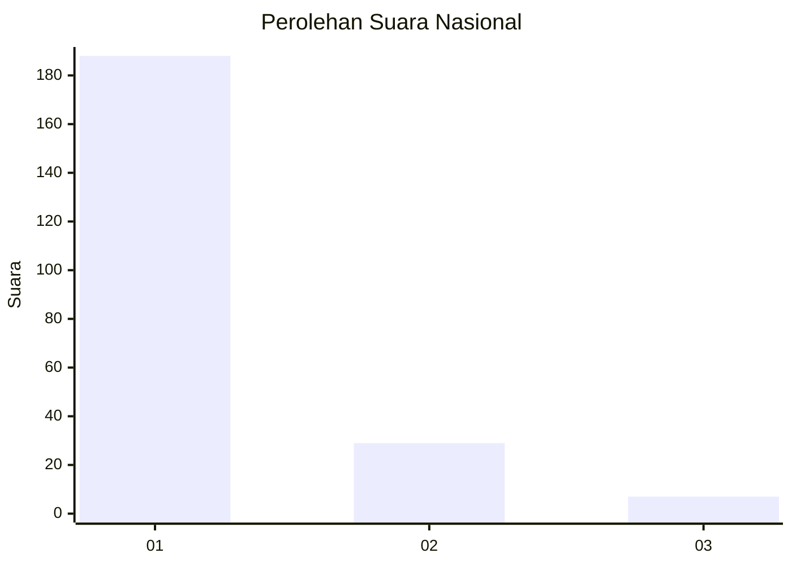
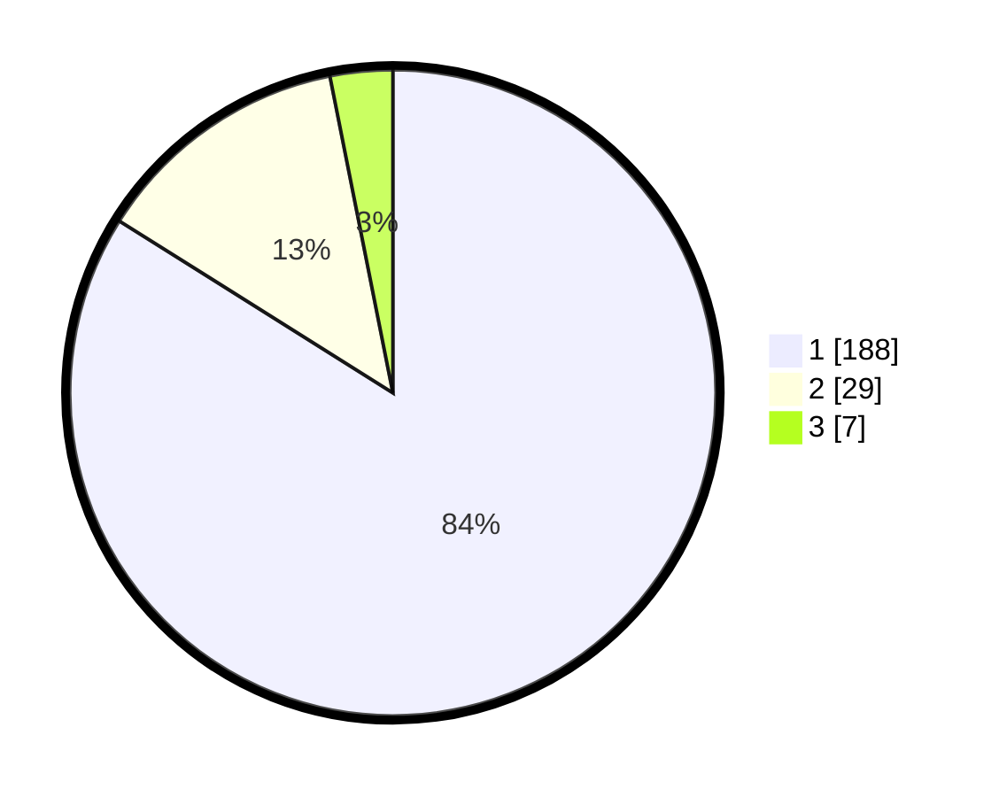

# Hasil

## Grafik

## Tabel

| No. | Nama Paslon    | Suara | Suara (raw) | Persentase |
|:--- |:-------------- | -----:| -----------:| ----------:|
| 1   | ANIES MUHAIMIN | 188   | [188][p-1]  | 83,93      |
| 2   | PRABOWO GIBRAN | 29    | [29][p-2]   | 12,95      |
| 3   | GANJAR MAHFUD  | 7     | [7][p-3]    | 3,13       |

[p-1]: https://github.com/gigit-pemilu/pemilu-2024/blob/main/pilpres/hitung-suara/sub/11-aceh/sub/11-bireuen/sub/05-peusangan/sub/2003-matang-glumpang-dua-mns-timur/sub/002-tps/sub/paslon-1.txt
[p-2]: https://github.com/gigit-pemilu/pemilu-2024/blob/main/pilpres/hitung-suara/sub/11-aceh/sub/11-bireuen/sub/05-peusangan/sub/2003-matang-glumpang-dua-mns-timur/sub/002-tps/sub/paslon-2.txt
[p-3]: https://github.com/gigit-pemilu/pemilu-2024/blob/main/pilpres/hitung-suara/sub/11-aceh/sub/11-bireuen/sub/05-peusangan/sub/2003-matang-glumpang-dua-mns-timur/sub/002-tps/sub/paslon-3.txt

## Foto C Plano

https://sirekap-obj-formc.kpu.go.id/8171/pemilu/ppwp/11/11/05/20/03/1111052003002-20240214-224150--633fafe5-7f89-43ce-aa57-5c1f94e55960.jpg

https://sirekap-obj-formc.kpu.go.id/8171/pemilu/ppwp/11/11/05/20/03/1111052003002-20240215-000105--f41d29d6-b905-413b-9c45-5c7833aad118.jpg

https://sirekap-obj-formc.kpu.go.id/8171/pemilu/ppwp/11/11/05/20/03/1111052003002-20240214-224602--6d16ee36-8696-4904-90c8-0ab91a3d7cdf.jpg

## Metadata

| Key        | Value               |
| ---------- | ------------------- |
| Time Stamp | 2024-02-15 21:01:18 |

## DATA PEMILIH TETAP

Jumlah pemilih dalam DPT: **281**.
 * L: **136**.
 * P: **145**.

## DATA PENGGUNA HAK PILIH

Jumlah pengguna hak pilih dalam DPT: **223**.
 * L: **100**.
 * P: **123**.

Jumlah pengguna hak pilih dalam DPTb: **0**.
 * L: **0**.
 * P: **0**.

Jumlah pengguna hak pilih dalam DPK: **3**.
 * L: **2**.
 * P: **1**.

Jumlah pengguna hak pilih: **226**.
 * L: **102**.
 * P: **124**.

## JUMLAH SUARA SAH DAN TIDAK SAH

JUMLAH SELURUH SUARA SAH: **224**.

JUMLAH SUARA TIDAK SAH: **2**.

JUMLAH SELURUH SUARA SAH DAN SUARA TIDAK SAH: **226**.

