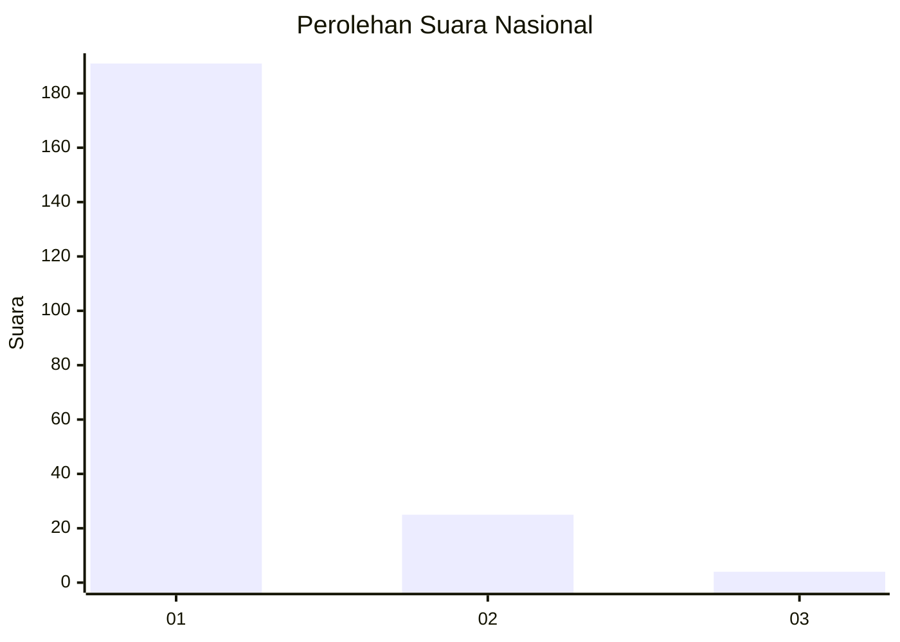
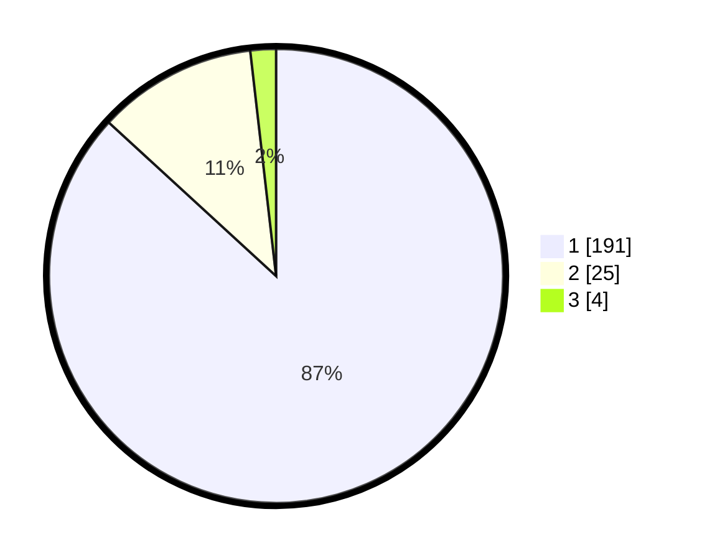

# Hasil

## Grafik

## Tabel

| No. | Nama Paslon    | Suara | Suara (raw) | Persentase |
|:--- |:-------------- | -----:| -----------:| ----------:|
| 1   | ANIES MUHAIMIN | 191   | [191][p-1]  | 86,82      |
| 2   | PRABOWO GIBRAN | 25    | [25][p-2]   | 11,36      |
| 3   | GANJAR MAHFUD  | 4     | [4][p-3]    | 1,82       |

[p-1]: https://github.com/gigit-pemilu/pemilu-2024/blob/main/pilpres/hitung-suara/sub/11-aceh/sub/11-bireuen/sub/05-peusangan/sub/2003-matang-glumpang-dua-mns-timur/sub/004-tps/sub/paslon-1.txt
[p-2]: https://github.com/gigit-pemilu/pemilu-2024/blob/main/pilpres/hitung-suara/sub/11-aceh/sub/11-bireuen/sub/05-peusangan/sub/2003-matang-glumpang-dua-mns-timur/sub/004-tps/sub/paslon-2.txt
[p-3]: https://github.com/gigit-pemilu/pemilu-2024/blob/main/pilpres/hitung-suara/sub/11-aceh/sub/11-bireuen/sub/05-peusangan/sub/2003-matang-glumpang-dua-mns-timur/sub/004-tps/sub/paslon-3.txt

## Foto C Plano

https://sirekap-obj-formc.kpu.go.id/1c4e/pemilu/ppwp/11/11/05/20/03/1111052003004-20240218-113547--b4566365-e9df-469d-88d2-fad1dd13f4e9.jpg

https://sirekap-obj-formc.kpu.go.id/1c4e/pemilu/ppwp/11/11/05/20/03/1111052003004-20240218-113649--182ec790-be69-4408-b034-a4871ad1c6e1.jpg

https://sirekap-obj-formc.kpu.go.id/1c4e/pemilu/ppwp/11/11/05/20/03/1111052003004-20240218-113442--7cce14d4-6aa4-4c5d-84be-74af6afa0ca2.jpg

## Metadata

| Key        | Value               |
| ---------- | ------------------- |
| Time Stamp | 2024-02-24 22:31:28 |

