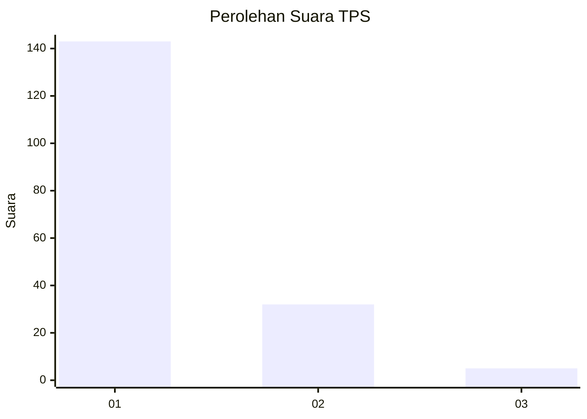
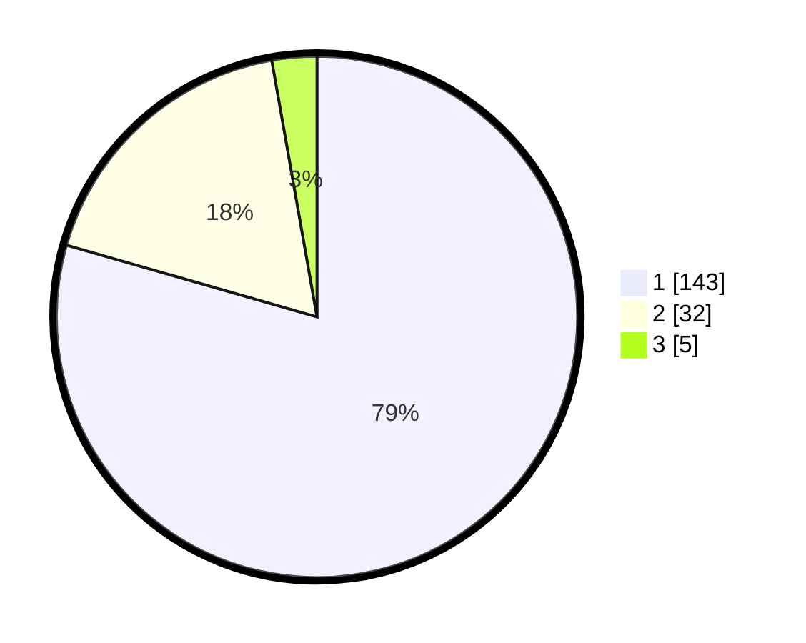

# Hasil

## Grafik

## Tabel

| No. | Nama Paslon    | Suara | Suara (raw) | Persentase |
|:--- |:-------------- | -----:| -----------:| ----------:|
| 1   | ANIES MUHAIMIN | 143   | [143][p-1]  | 79,44      |
| 2   | PRABOWO GIBRAN | 32    | [32][p-2]   | 17,78      |
| 3   | GANJAR MAHFUD  | 5     | [5][p-3]    | 2,78       |

[p-1]: https://github.com/gigit-pemilu/pemilu-2024-11-aceh/blob/main/pilpres/hitung-suara/sub/11-aceh/sub/11-bireuen/sub/05-peusangan/sub/2004-keude-matang-glumpang-dua/sub/001-tps/sub/paslon-1.txt
[p-2]: https://github.com/gigit-pemilu/pemilu-2024-11-aceh/blob/main/pilpres/hitung-suara/sub/11-aceh/sub/11-bireuen/sub/05-peusangan/sub/2004-keude-matang-glumpang-dua/sub/001-tps/sub/paslon-2.txt
[p-3]: https://github.com/gigit-pemilu/pemilu-2024-11-aceh/blob/main/pilpres/hitung-suara/sub/11-aceh/sub/11-bireuen/sub/05-peusangan/sub/2004-keude-matang-glumpang-dua/sub/001-tps/sub/paslon-3.txt

## Foto C Plano

https://sirekap-obj-formc.kpu.go.id/a6d2/pemilu/ppwp/11/11/05/20/04/1111052004001-20240216-041642--3bd366cc-9d8e-4246-b707-2f315dafa84b.jpg

https://sirekap-obj-formc.kpu.go.id/a6d2/pemilu/ppwp/11/11/05/20/04/1111052004001-20240216-041644--894af0bc-2801-4274-9818-41a494214f36.jpg

https://sirekap-obj-formc.kpu.go.id/a6d2/pemilu/ppwp/11/11/05/20/04/1111052004001-20240216-041643--a65687e5-0914-4077-95cf-d673742b8e69.jpg

## Metadata

| Key        | Value               |
| ---------- | ------------------- |
| Time Stamp | 2024-02-16 12:51:22 |

## DATA PEMILIH TETAP

Jumlah pemilih dalam DPT: **236**.
 * L: **103**.
 * P: **133**.

## DATA PENGGUNA HAK PILIH

Jumlah pengguna hak pilih dalam DPT: **177**.
 * L: **71**.
 * P: **106**.

Jumlah pengguna hak pilih dalam DPTb: **4**.
 * L: **2**.
 * P: **2**.

Jumlah pengguna hak pilih dalam DPK: **1**.
 * L: **0**.
 * P: **1**.

Jumlah pengguna hak pilih: **182**.
 * L: **73**.
 * P: **109**.

## JUMLAH SUARA SAH DAN TIDAK SAH

JUMLAH SELURUH SUARA SAH: **180**.

JUMLAH SUARA TIDAK SAH: **2**.

JUMLAH SELURUH SUARA SAH DAN SUARA TIDAK SAH: **182**.

