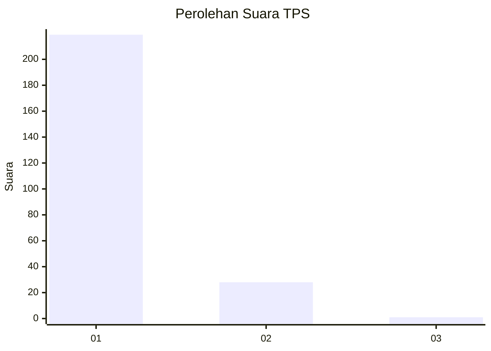
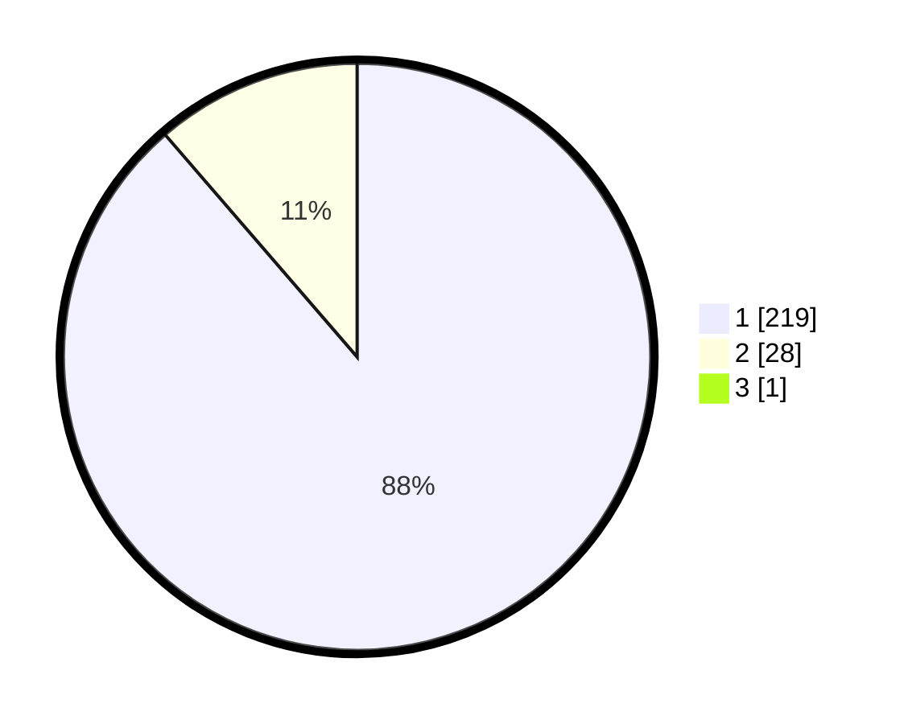

# Hasil

## Grafik

## Tabel

| No. | Nama Paslon    | Suara | Suara (raw) | Persentase |
|:--- |:-------------- | -----:| -----------:| ----------:|
| 1   | ANIES MUHAIMIN | 219   | [219][p-1]  | 88,31      |
| 2   | PRABOWO GIBRAN | 28    | [28][p-2]   | 11,29      |
| 3   | GANJAR MAHFUD  | 1     | [1][p-3]    | 0,40       |

[p-1]: https://github.com/gigit-pemilu/pemilu-2024-11-aceh/blob/main/pilpres/hitung-suara/sub/11-aceh/sub/11-bireuen/sub/05-peusangan/sub/2005-matang-glumpang-dua-meunasah-dayah/sub/002-tps/sub/paslon-1.txt
[p-2]: https://github.com/gigit-pemilu/pemilu-2024-11-aceh/blob/main/pilpres/hitung-suara/sub/11-aceh/sub/11-bireuen/sub/05-peusangan/sub/2005-matang-glumpang-dua-meunasah-dayah/sub/002-tps/sub/paslon-2.txt
[p-3]: https://github.com/gigit-pemilu/pemilu-2024-11-aceh/blob/main/pilpres/hitung-suara/sub/11-aceh/sub/11-bireuen/sub/05-peusangan/sub/2005-matang-glumpang-dua-meunasah-dayah/sub/002-tps/sub/paslon-3.txt

## Foto C Plano

https://sirekap-obj-formc.kpu.go.id/a36e/pemilu/ppwp/11/11/05/20/05/1111052005002-20240216-152102--1b706e18-f19e-4b43-b1dd-010efb959535.jpg

https://sirekap-obj-formc.kpu.go.id/a36e/pemilu/ppwp/11/11/05/20/05/1111052005002-20240216-152103--59ba8945-ea9e-4b3d-9195-b3f9b4dd3759.jpg

https://sirekap-obj-formc.kpu.go.id/a36e/pemilu/ppwp/11/11/05/20/05/1111052005002-20240216-152103--d2ebf520-8f6a-474c-9912-e0c304bedcae.jpg

## Metadata

| Key        | Value               |
| ---------- | ------------------- |
| Time Stamp | 2024-02-16 16:25:10 |

## DATA PEMILIH TETAP

Jumlah pemilih dalam DPT: **294**.
 * L: **135**.
 * P: **159**.

## DATA PENGGUNA HAK PILIH

Jumlah pengguna hak pilih dalam DPT: **232**.
 * L: **100**.
 * P: **132**.

Jumlah pengguna hak pilih dalam DPTb: **0**.
 * L: **0**.
 * P: **0**.

Jumlah pengguna hak pilih dalam DPK: **19**.
 * L: **12**.
 * P: **7**.

Jumlah pengguna hak pilih: **251**.
 * L: **112**.
 * P: **139**.

## JUMLAH SUARA SAH DAN TIDAK SAH

JUMLAH SELURUH SUARA SAH: **248**.

JUMLAH SUARA TIDAK SAH: **3**.

JUMLAH SELURUH SUARA SAH DAN SUARA TIDAK SAH: **251**.

