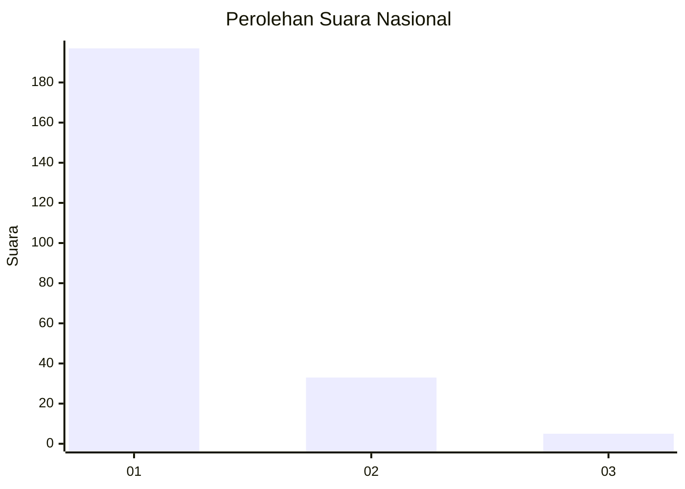
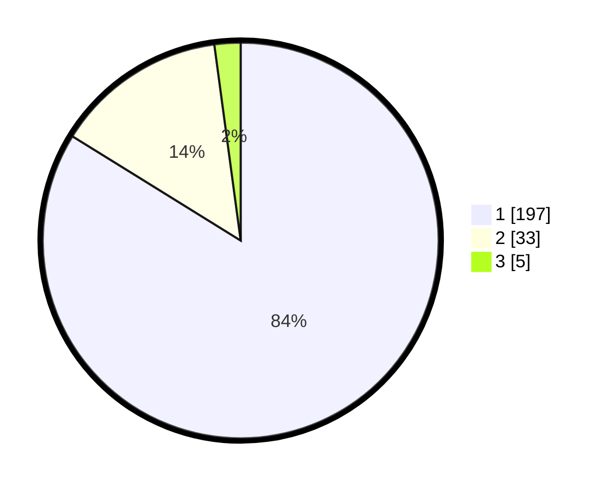

# Hasil

## Grafik

## Tabel

| No. | Nama Paslon    | Suara | Suara (raw) | Persentase |
|:--- |:-------------- | -----:| -----------:| ----------:|
| 1   | ANIES MUHAIMIN | 197   | [197][p-1]  | 83,83      |
| 2   | PRABOWO GIBRAN | 33    | [33][p-2]   | 14,04      |
| 3   | GANJAR MAHFUD  | 5     | [5][p-3]    | 2,13       |

[p-1]: https://github.com/gigit-pemilu/pemilu-2024/blob/main/pilpres/hitung-suara/sub/11-aceh/sub/11-bireuen/sub/05-peusangan/sub/2006-pante-gajah/sub/002-tps/sub/paslon-1.txt
[p-2]: https://github.com/gigit-pemilu/pemilu-2024/blob/main/pilpres/hitung-suara/sub/11-aceh/sub/11-bireuen/sub/05-peusangan/sub/2006-pante-gajah/sub/002-tps/sub/paslon-2.txt
[p-3]: https://github.com/gigit-pemilu/pemilu-2024/blob/main/pilpres/hitung-suara/sub/11-aceh/sub/11-bireuen/sub/05-peusangan/sub/2006-pante-gajah/sub/002-tps/sub/paslon-3.txt

## Foto C Plano

https://sirekap-obj-formc.kpu.go.id/3cff/pemilu/ppwp/11/11/05/20/06/1111052006002-20240215-160359--61961af7-2aed-41a6-b8df-64241fe80ae9.jpg

https://sirekap-obj-formc.kpu.go.id/3cff/pemilu/ppwp/11/11/05/20/06/1111052006002-20240215-161559--3bbb213c-af5b-43a6-aeb1-ce2d913b0c1b.jpg

## Metadata

| Key        | Value               |
| ---------- | ------------------- |
| Time Stamp | 2024-02-24 22:31:28 |

