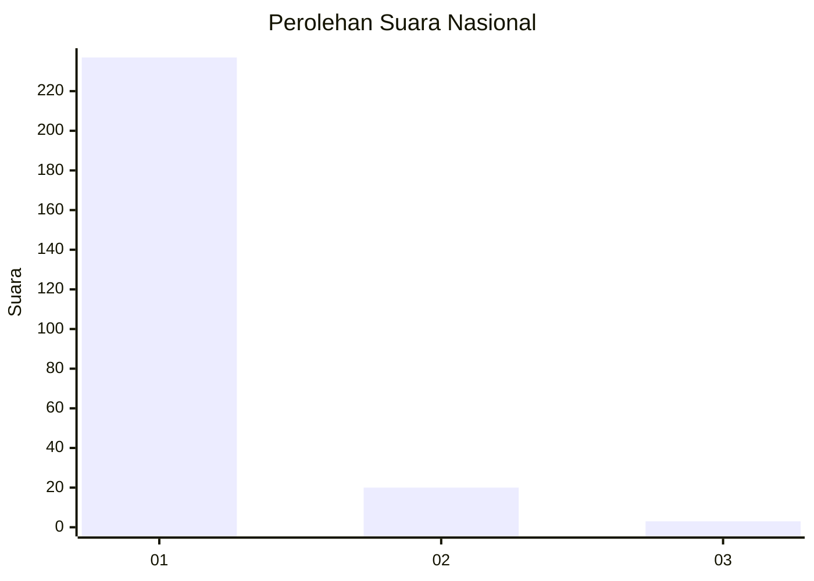
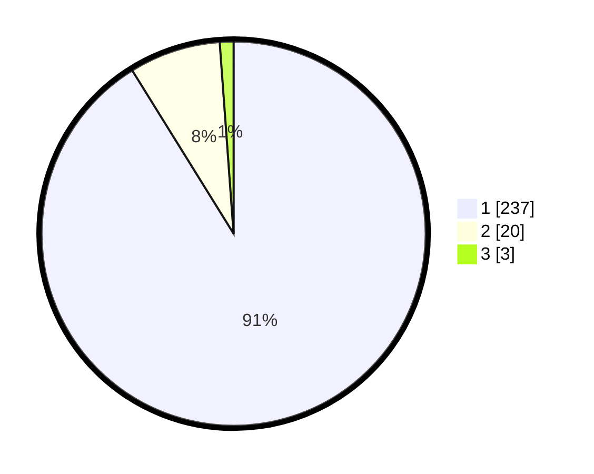

# Hasil

## Grafik

## Tabel

| No. | Nama Paslon    | Suara | Suara (raw) | Persentase |
|:--- |:-------------- | -----:| -----------:| ----------:|
| 1   | ANIES MUHAIMIN | 237   | [237][p-1]  | 91,15      |
| 2   | PRABOWO GIBRAN | 20    | [20][p-2]   | 7,69       |
| 3   | GANJAR MAHFUD  | 3     | [3][p-3]    | 1,15       |

[p-1]: https://github.com/gigit-pemilu/pemilu-2024/blob/main/pilpres/hitung-suara/sub/11-aceh/sub/11-bireuen/sub/05-peusangan/sub/2008-paya-cut/sub/001-tps/sub/paslon-1.txt
[p-2]: https://github.com/gigit-pemilu/pemilu-2024/blob/main/pilpres/hitung-suara/sub/11-aceh/sub/11-bireuen/sub/05-peusangan/sub/2008-paya-cut/sub/001-tps/sub/paslon-2.txt
[p-3]: https://github.com/gigit-pemilu/pemilu-2024/blob/main/pilpres/hitung-suara/sub/11-aceh/sub/11-bireuen/sub/05-peusangan/sub/2008-paya-cut/sub/001-tps/sub/paslon-3.txt

## Foto C Plano

https://sirekap-obj-formc.kpu.go.id/e511/pemilu/ppwp/11/11/05/20/08/1111052008001-20240215-135117--cf602032-a290-4813-b362-fc1be92ea126.jpg

https://sirekap-obj-formc.kpu.go.id/e511/pemilu/ppwp/11/11/05/20/08/1111052008001-20240215-135124--5498dd31-34a2-42f2-bb07-6dbb325130c6.jpg

https://sirekap-obj-formc.kpu.go.id/e511/pemilu/ppwp/11/11/05/20/08/1111052008001-20240215-135127--9d99df7b-daa1-495b-a2bd-698e587efc19.jpg

## Metadata

| Key        | Value               |
| ---------- | ------------------- |
| Time Stamp | 2024-02-15 18:30:25 |

