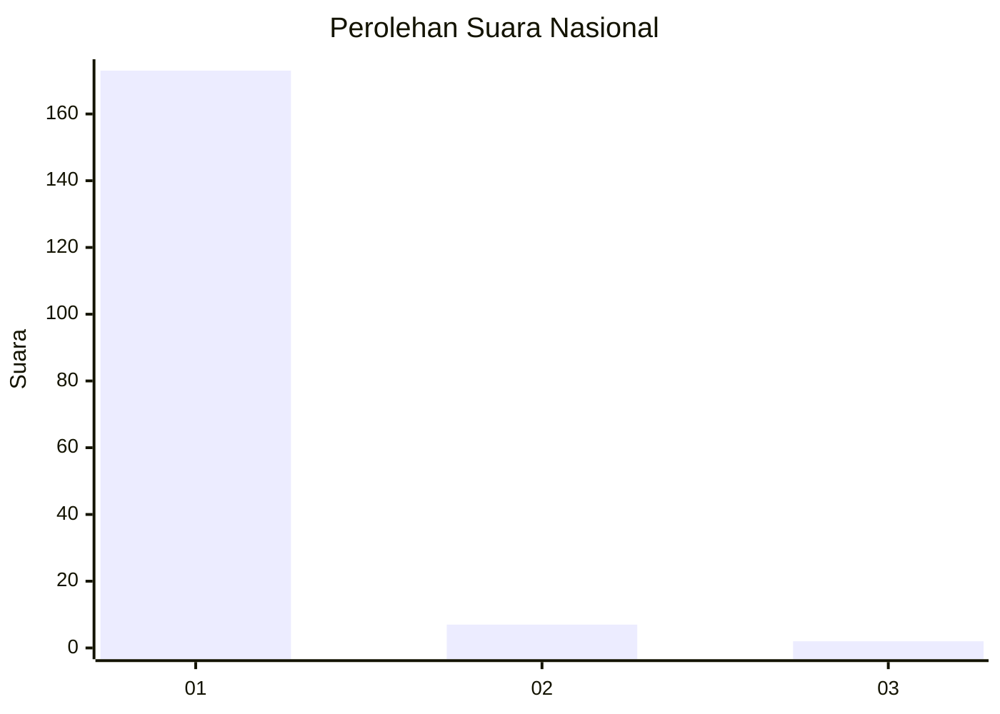
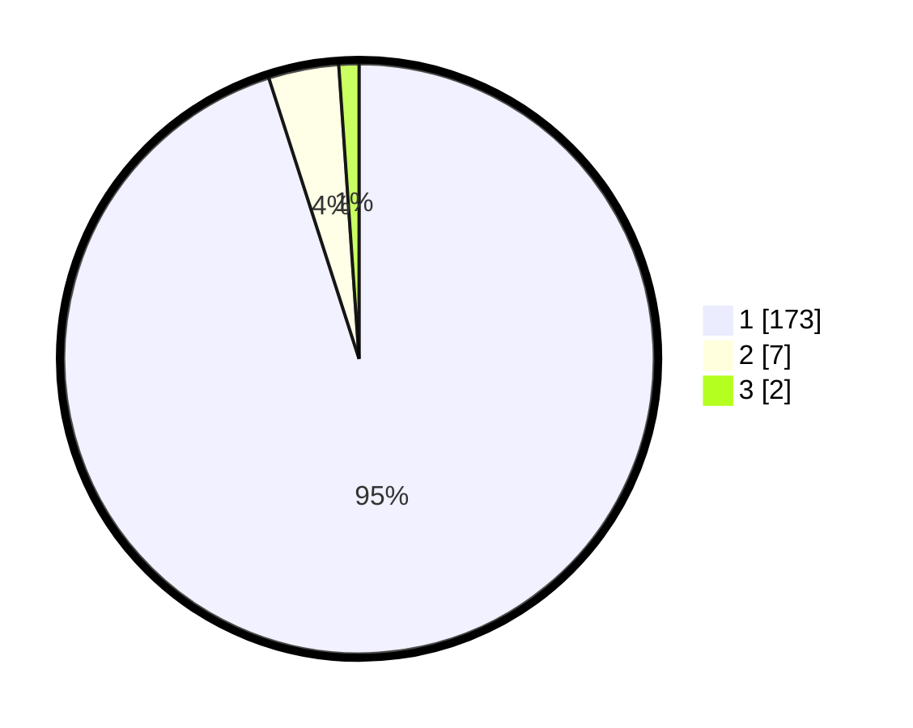

# Hasil

## Grafik

## Tabel

| No. | Nama Paslon    | Suara | Suara (raw) | Persentase |
|:--- |:-------------- | -----:| -----------:| ----------:|
| 1   | ANIES MUHAIMIN | 173   | [173][p-1]  | 95,05      |
| 2   | PRABOWO GIBRAN | 7     | [7][p-2]    | 3,85       |
| 3   | GANJAR MAHFUD  | 2     | [2][p-3]    | 1,10       |

[p-1]: https://github.com/gigit-pemilu/pemilu-2024/blob/main/pilpres/hitung-suara/sub/11-aceh/sub/11-bireuen/sub/05-peusangan/sub/2013-matang-mesjid/sub/002-tps/sub/paslon-1.txt
[p-2]: https://github.com/gigit-pemilu/pemilu-2024/blob/main/pilpres/hitung-suara/sub/11-aceh/sub/11-bireuen/sub/05-peusangan/sub/2013-matang-mesjid/sub/002-tps/sub/paslon-2.txt
[p-3]: https://github.com/gigit-pemilu/pemilu-2024/blob/main/pilpres/hitung-suara/sub/11-aceh/sub/11-bireuen/sub/05-peusangan/sub/2013-matang-mesjid/sub/002-tps/sub/paslon-3.txt

## Foto C Plano

https://sirekap-obj-formc.kpu.go.id/fcc2/pemilu/ppwp/11/11/05/20/13/1111052013002-20240215-002957--88e20dda-1764-43f8-a963-d1b59d204db0.jpg

https://sirekap-obj-formc.kpu.go.id/fcc2/pemilu/ppwp/11/11/05/20/13/1111052013002-20240215-003448--30c038f4-6af2-41c2-8fb2-8873275b3536.jpg

https://sirekap-obj-formc.kpu.go.id/fcc2/pemilu/ppwp/11/11/05/20/13/1111052013002-20240215-003616--33611e88-cdf3-4d26-a2d6-cb60bc5a7725.jpg

## Metadata

| Key        | Value               |
| ---------- | ------------------- |
| Time Stamp | 2024-02-15 03:06:03 |

