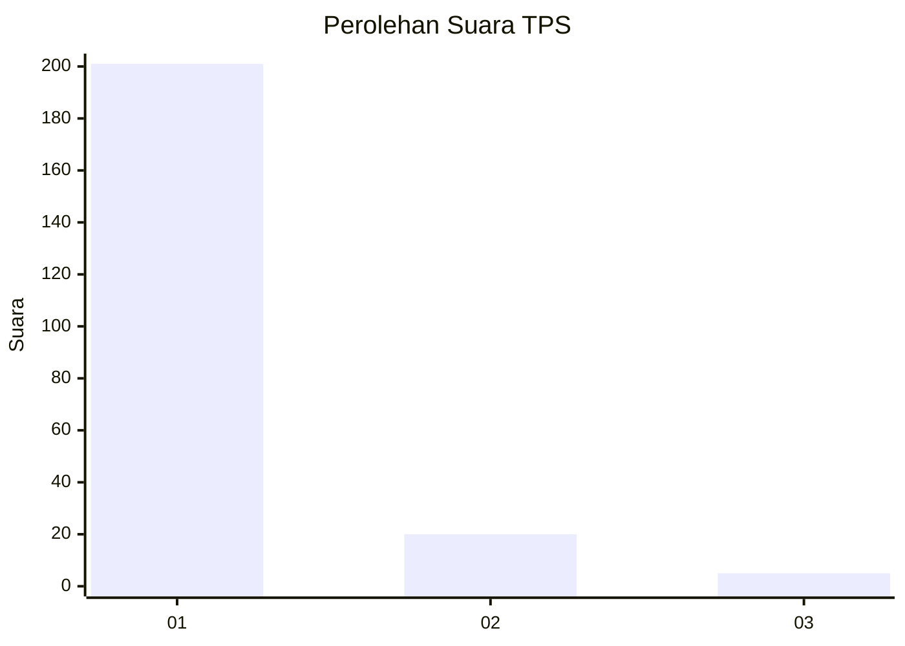
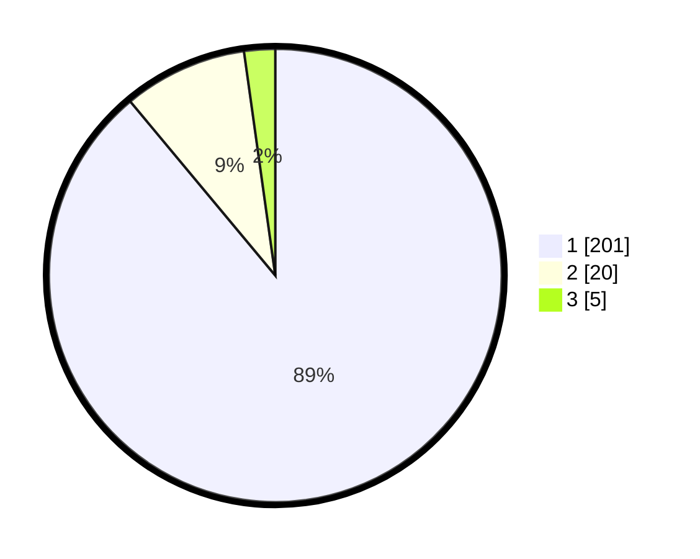

# Hasil

## Grafik

## Tabel

| No. | Nama Paslon    | Suara | Suara (raw) | Persentase |
|:--- |:-------------- | -----:| -----------:| ----------:|
| 1   | ANIES MUHAIMIN | 201   | [201][p-1]  | 88,94      |
| 2   | PRABOWO GIBRAN | 20    | [20][p-2]   | 8,85       |
| 3   | GANJAR MAHFUD  | 5     | [5][p-3]    | 2,21       |

[p-1]: https://github.com/gigit-pemilu/pemilu-2024-11-aceh/blob/main/pilpres/hitung-suara/sub/11-aceh/sub/11-bireuen/sub/05-peusangan/sub/2017-paya-meuneng/sub/002-tps/sub/paslon-1.txt
[p-2]: https://github.com/gigit-pemilu/pemilu-2024-11-aceh/blob/main/pilpres/hitung-suara/sub/11-aceh/sub/11-bireuen/sub/05-peusangan/sub/2017-paya-meuneng/sub/002-tps/sub/paslon-2.txt
[p-3]: https://github.com/gigit-pemilu/pemilu-2024-11-aceh/blob/main/pilpres/hitung-suara/sub/11-aceh/sub/11-bireuen/sub/05-peusangan/sub/2017-paya-meuneng/sub/002-tps/sub/paslon-3.txt

## Foto C Plano

https://sirekap-obj-formc.kpu.go.id/946d/pemilu/ppwp/11/11/05/20/17/1111052017002-20240215-041953--76bd8270-1a2d-452b-acef-882a762e00c7.jpg

https://sirekap-obj-formc.kpu.go.id/946d/pemilu/ppwp/11/11/05/20/17/1111052017002-20240215-042200--4cd89c61-c6de-48b7-b64f-22b74ddb3755.jpg

https://sirekap-obj-formc.kpu.go.id/946d/pemilu/ppwp/11/11/05/20/17/1111052017002-20240215-042353--34c89d12-376e-475f-aa44-7fcd0cb01536.jpg

## Metadata

| Key        | Value               |
| ---------- | ------------------- |
| Time Stamp | 2024-02-19 06:16:00 |

