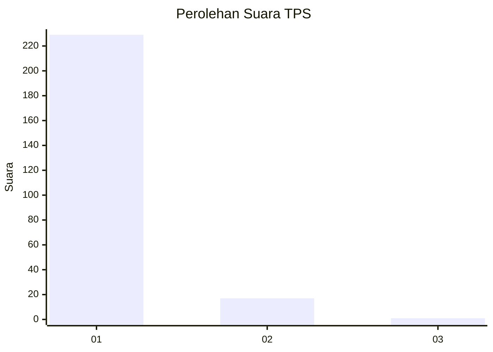
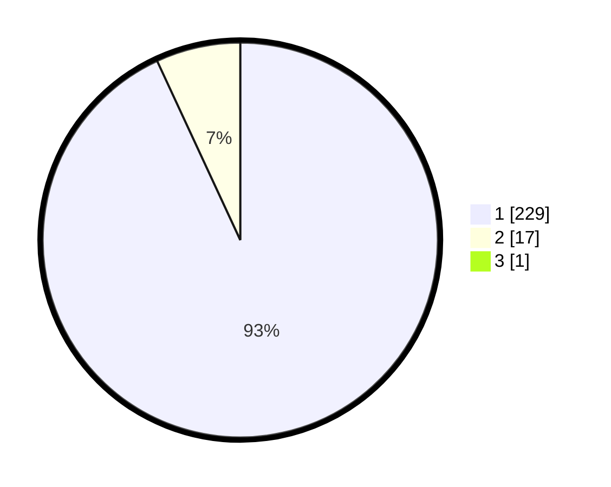

# Hasil

## Grafik

## Tabel

| No. | Nama Paslon    | Suara | Suara (raw) | Persentase |
|:--- |:-------------- | -----:| -----------:| ----------:|
| 1   | ANIES MUHAIMIN | 229   | [229][p-1]  | 92,71      |
| 2   | PRABOWO GIBRAN | 17    | [17][p-2]   | 6,88       |
| 3   | GANJAR MAHFUD  | 1     | [1][p-3]    | 0,40       |

[p-1]: https://github.com/gigit-pemilu/pemilu-2024-11-aceh/blob/main/pilpres/hitung-suara/sub/11-aceh/sub/11-bireuen/sub/05-peusangan/sub/2027-krueng-baro-babah-krueng/sub/001-tps/sub/paslon-1.txt
[p-2]: https://github.com/gigit-pemilu/pemilu-2024-11-aceh/blob/main/pilpres/hitung-suara/sub/11-aceh/sub/11-bireuen/sub/05-peusangan/sub/2027-krueng-baro-babah-krueng/sub/001-tps/sub/paslon-2.txt
[p-3]: https://github.com/gigit-pemilu/pemilu-2024-11-aceh/blob/main/pilpres/hitung-suara/sub/11-aceh/sub/11-bireuen/sub/05-peusangan/sub/2027-krueng-baro-babah-krueng/sub/001-tps/sub/paslon-3.txt

## Foto C Plano

https://sirekap-obj-formc.kpu.go.id/ab71/pemilu/ppwp/11/11/05/20/27/1111052027001-20240215-075546--47c01cbd-1673-444e-b762-ff21f33ddba8.jpg

https://sirekap-obj-formc.kpu.go.id/ab71/pemilu/ppwp/11/11/05/20/27/1111052027001-20240215-080246--2fd74032-b67a-4188-8821-7a115fc6f307.jpg

https://sirekap-obj-formc.kpu.go.id/ab71/pemilu/ppwp/11/11/05/20/27/1111052027001-20240215-080531--6d7b17ce-2c80-4784-86e8-8001aa913467.jpg

## Metadata

| Key        | Value               |
| ---------- | ------------------- |
| Time Stamp | 2024-02-19 06:16:00 |

