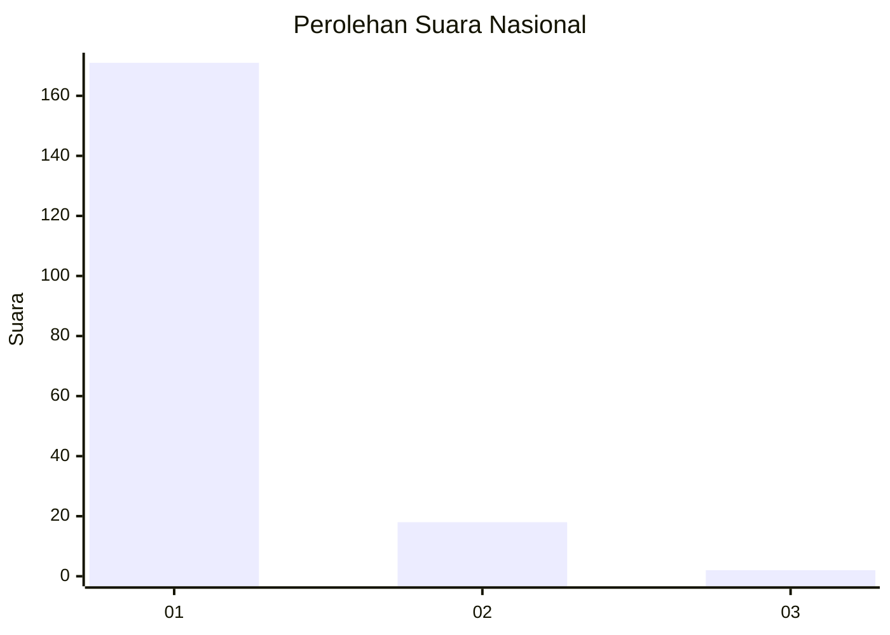
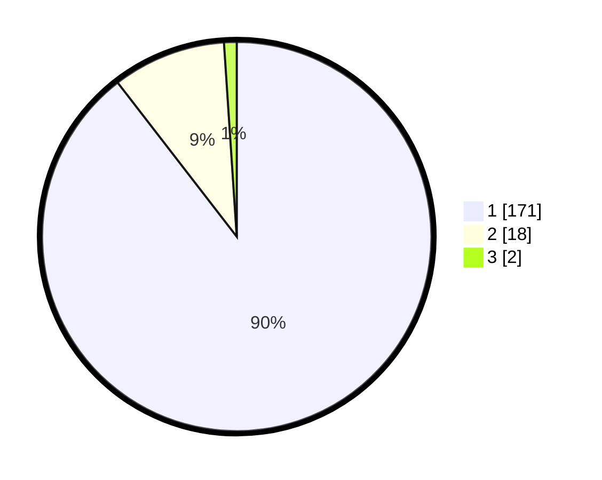

# Hasil

## Grafik

## Tabel

| No. | Nama Paslon    | Suara | Suara (raw) | Persentase |
|:--- |:-------------- | -----:| -----------:| ----------:|
| 1   | ANIES MUHAIMIN | 171   | [171][p-1]  | 89,53      |
| 2   | PRABOWO GIBRAN | 18    | [18][p-2]   | 9,42       |
| 3   | GANJAR MAHFUD  | 2     | [2][p-3]    | 1,05       |

[p-1]: https://github.com/gigit-pemilu/pemilu-2024/blob/main/pilpres/hitung-suara/sub/11-aceh/sub/11-bireuen/sub/05-peusangan/sub/2028-krueng-baro-mesjid/sub/001-tps/sub/paslon-1.txt
[p-2]: https://github.com/gigit-pemilu/pemilu-2024/blob/main/pilpres/hitung-suara/sub/11-aceh/sub/11-bireuen/sub/05-peusangan/sub/2028-krueng-baro-mesjid/sub/001-tps/sub/paslon-2.txt
[p-3]: https://github.com/gigit-pemilu/pemilu-2024/blob/main/pilpres/hitung-suara/sub/11-aceh/sub/11-bireuen/sub/05-peusangan/sub/2028-krueng-baro-mesjid/sub/001-tps/sub/paslon-3.txt

## Foto C Plano

https://sirekap-obj-formc.kpu.go.id/1f98/pemilu/ppwp/11/11/05/20/28/1111052028001-20240215-004503--0fa2f565-43f8-4b91-a1b4-f0b7c37161fa.jpg

https://sirekap-obj-formc.kpu.go.id/1f98/pemilu/ppwp/11/11/05/20/28/1111052028001-20240215-004654--d17d64dd-5abd-4dc7-bee2-57a11a6777a7.jpg

https://sirekap-obj-formc.kpu.go.id/1f98/pemilu/ppwp/11/11/05/20/28/1111052028001-20240215-004823--d84a4d01-b197-49b3-9c5b-a66f871954b3.jpg

## Metadata

| Key        | Value               |
| ---------- | ------------------- |
| Time Stamp | 2024-02-15 17:00:25 |

