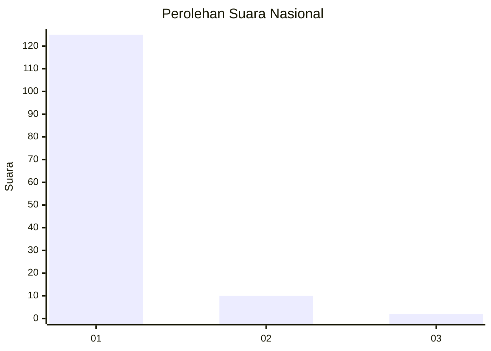
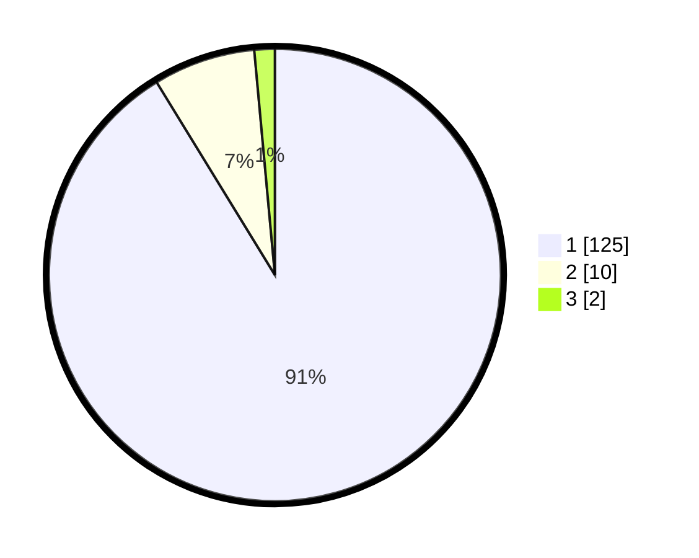

# Hasil

## Grafik

## Tabel

| No. | Nama Paslon    | Suara | Suara (raw) | Persentase |
|:--- |:-------------- | -----:| -----------:| ----------:|
| 1   | ANIES MUHAIMIN | 125   | [125][p-1]  | 91,24      |
| 2   | PRABOWO GIBRAN | 10    | [10][p-2]   | 7,30       |
| 3   | GANJAR MAHFUD  | 2     | [2][p-3]    | 1,46       |

[p-1]: https://github.com/gigit-pemilu/pemilu-2024/blob/main/pilpres/hitung-suara/sub/11-aceh/sub/11-bireuen/sub/05-peusangan/sub/2031-meunasah-meucap/sub/002-tps/sub/paslon-1.txt
[p-2]: https://github.com/gigit-pemilu/pemilu-2024/blob/main/pilpres/hitung-suara/sub/11-aceh/sub/11-bireuen/sub/05-peusangan/sub/2031-meunasah-meucap/sub/002-tps/sub/paslon-2.txt
[p-3]: https://github.com/gigit-pemilu/pemilu-2024/blob/main/pilpres/hitung-suara/sub/11-aceh/sub/11-bireuen/sub/05-peusangan/sub/2031-meunasah-meucap/sub/002-tps/sub/paslon-3.txt

## Foto C Plano

https://sirekap-obj-formc.kpu.go.id/a36a/pemilu/ppwp/11/11/05/20/31/1111052031002-20240214-190105--9dd7303b-1b29-4f4e-9caa-40198fab7f1d.jpg

https://sirekap-obj-formc.kpu.go.id/a36a/pemilu/ppwp/11/11/05/20/31/1111052031002-20240214-203909--a220fd85-963a-492b-a436-9eb20fd12ec0.jpg

https://sirekap-obj-formc.kpu.go.id/a36a/pemilu/ppwp/11/11/05/20/31/1111052031002-20240214-220740--bffbc27d-21fa-4719-a27d-144f5b4e72c3.jpg

## Metadata

| Key        | Value               |
| ---------- | ------------------- |
| Time Stamp | 2024-02-15 00:41:44 |

