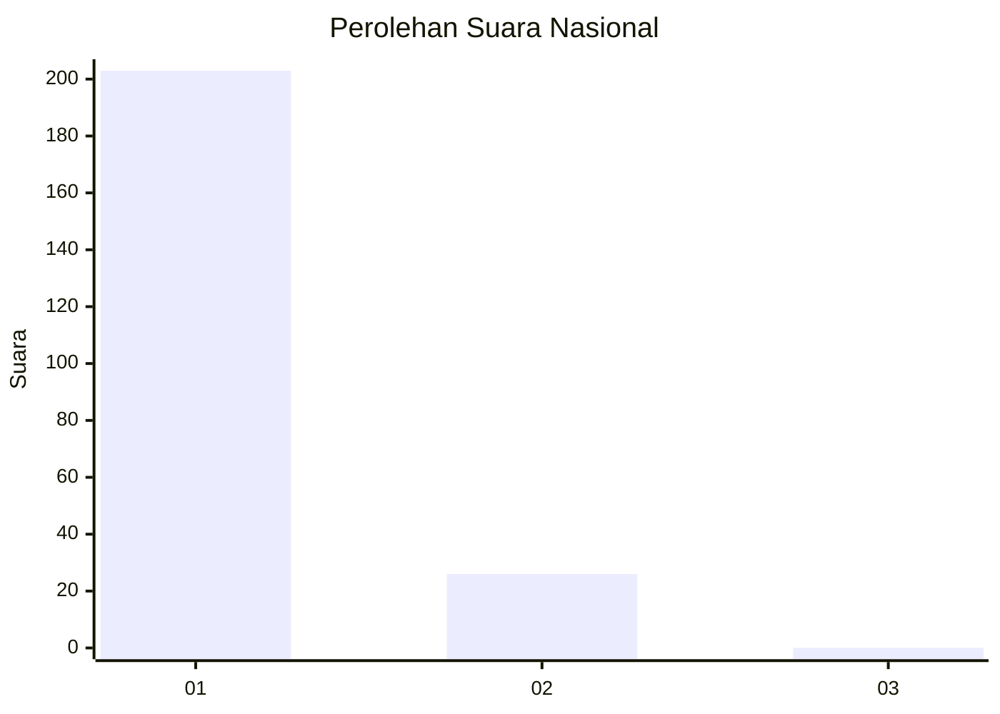
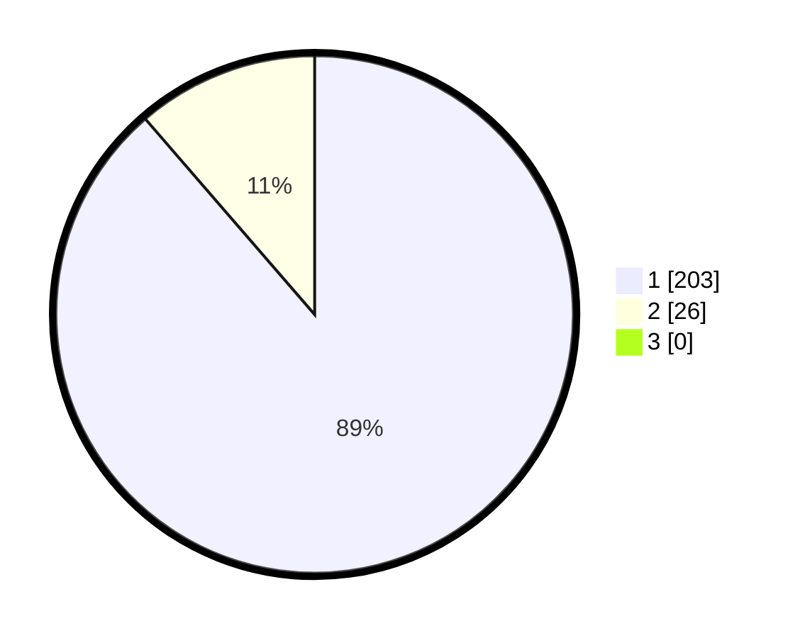

# Hasil

## Grafik

## Tabel

| No. | Nama Paslon    | Suara | Suara (raw) | Persentase |
|:--- |:-------------- | -----:| -----------:| ----------:|
| 1   | ANIES MUHAIMIN | 203   | [203][p-1]  | 88,65      |
| 2   | PRABOWO GIBRAN | 26    | [26][p-2]   | 11,35      |
| 3   | GANJAR MAHFUD  | 0     | [0][p-3]    | 0,00       |

[p-1]: https://github.com/gigit-pemilu/pemilu-2024/blob/main/pilpres/hitung-suara/sub/11-aceh/sub/11-bireuen/sub/05-peusangan/sub/2037-pantee-lhong/sub/001-tps/sub/paslon-1.txt
[p-2]: https://github.com/gigit-pemilu/pemilu-2024/blob/main/pilpres/hitung-suara/sub/11-aceh/sub/11-bireuen/sub/05-peusangan/sub/2037-pantee-lhong/sub/001-tps/sub/paslon-2.txt
[p-3]: https://github.com/gigit-pemilu/pemilu-2024/blob/main/pilpres/hitung-suara/sub/11-aceh/sub/11-bireuen/sub/05-peusangan/sub/2037-pantee-lhong/sub/001-tps/sub/paslon-3.txt

## Foto C Plano

https://sirekap-obj-formc.kpu.go.id/b612/pemilu/ppwp/11/11/05/20/37/1111052037001-20240215-110331--2b4a7cf6-61c4-48cc-8338-16cd8d9c9a3c.jpg

https://sirekap-obj-formc.kpu.go.id/b612/pemilu/ppwp/11/11/05/20/37/1111052037001-20240217-220936--eb3a37c3-be03-4242-81a9-172033307050.jpg

https://sirekap-obj-formc.kpu.go.id/b612/pemilu/ppwp/11/11/05/20/37/1111052037001-20240217-235325--37bf11bf-800e-479b-a1a5-5e88c7cd2d74.jpg

## Metadata

| Key        | Value               |
| ---------- | ------------------- |
| Time Stamp | 2024-02-19 06:16:00 |

