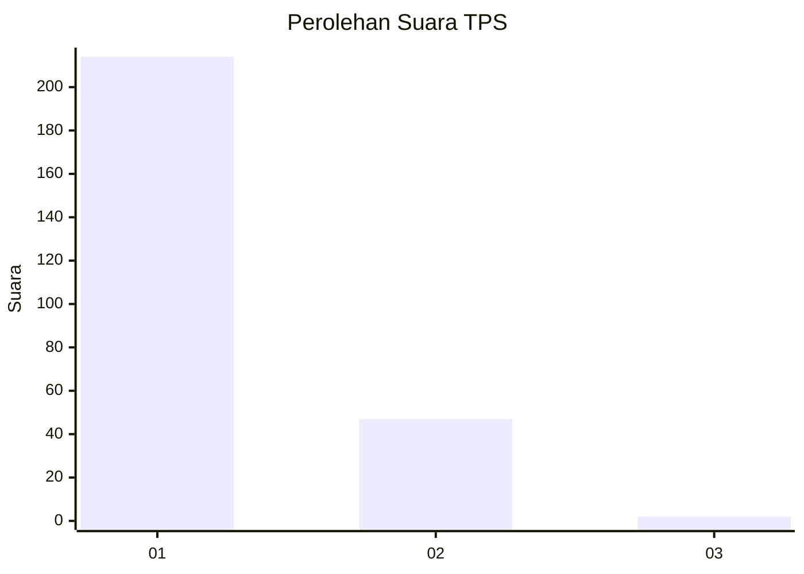
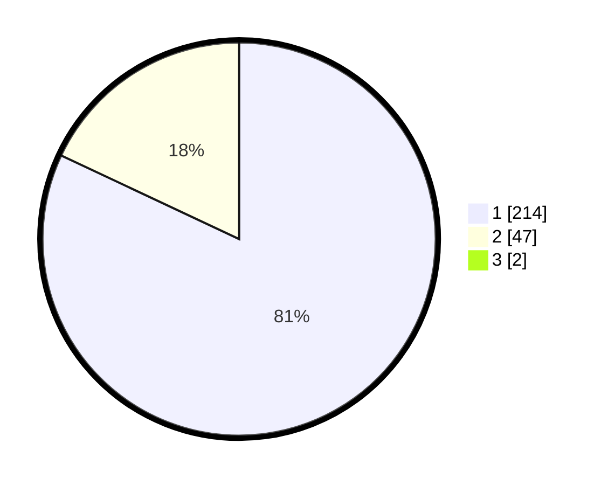

# Hasil

## Grafik

## Tabel

| No. | Nama Paslon    | Suara | Suara (raw) | Persentase |
|:--- |:-------------- | -----:| -----------:| ----------:|
| 1   | ANIES MUHAIMIN | 214   | [214][p-1]  | 81,37      |
| 2   | PRABOWO GIBRAN | 47    | [47][p-2]   | 17,87      |
| 3   | GANJAR MAHFUD  | 2     | [2][p-3]    | 0,76       |

[p-1]: https://github.com/gigit-pemilu/pemilu-2024-11-aceh/blob/main/pilpres/hitung-suara/sub/11-aceh/sub/11-bireuen/sub/05-peusangan/sub/2049-cot-buket/sub/001-tps/sub/paslon-1.txt
[p-2]: https://github.com/gigit-pemilu/pemilu-2024-11-aceh/blob/main/pilpres/hitung-suara/sub/11-aceh/sub/11-bireuen/sub/05-peusangan/sub/2049-cot-buket/sub/001-tps/sub/paslon-2.txt
[p-3]: https://github.com/gigit-pemilu/pemilu-2024-11-aceh/blob/main/pilpres/hitung-suara/sub/11-aceh/sub/11-bireuen/sub/05-peusangan/sub/2049-cot-buket/sub/001-tps/sub/paslon-3.txt

## Foto C Plano

https://sirekap-obj-formc.kpu.go.id/4eaa/pemilu/ppwp/11/11/05/20/49/1111052049001-20240215-155857--9d03cb9c-7d5d-40cc-b862-9b1e45883d33.jpg

https://sirekap-obj-formc.kpu.go.id/4eaa/pemilu/ppwp/11/11/05/20/49/1111052049001-20240215-160244--1c96615a-251b-40e0-a851-27f2b2d02a25.jpg

https://sirekap-obj-formc.kpu.go.id/4eaa/pemilu/ppwp/11/11/05/20/49/1111052049001-20240215-160722--ee0d0f13-875d-40f7-b932-79330c63ca28.jpg

## Metadata

| Key        | Value               |
| ---------- | ------------------- |
| Time Stamp | 2024-02-19 06:16:00 |

