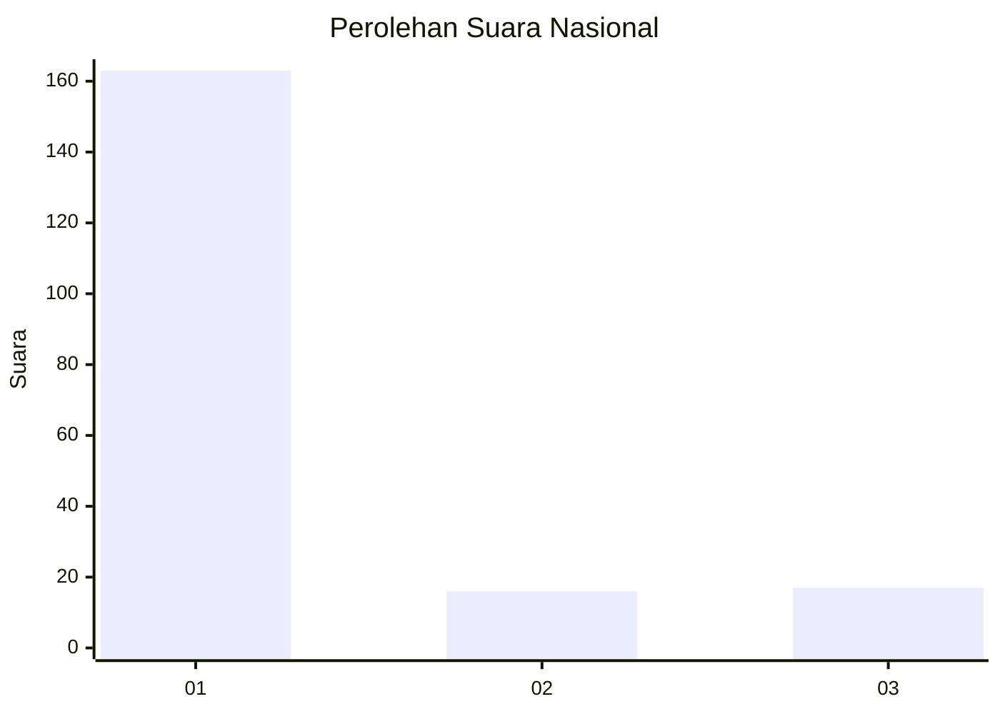
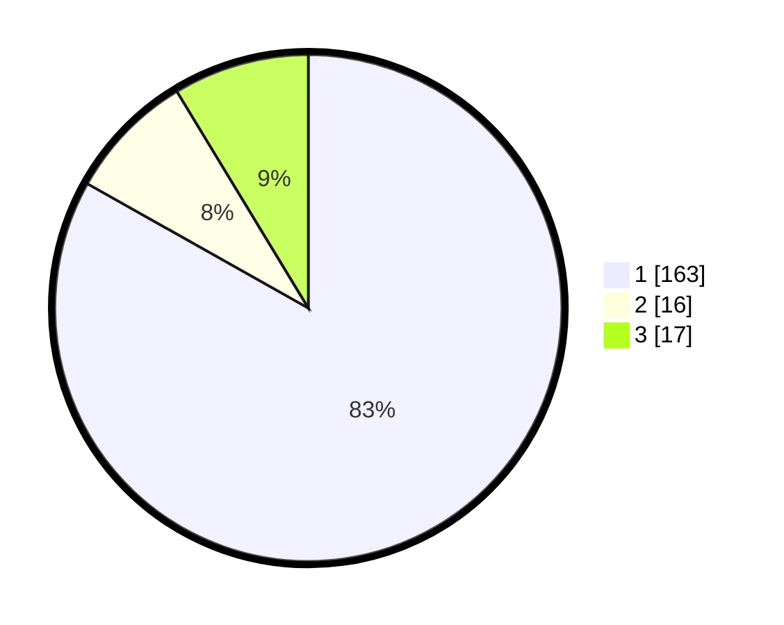

# Hasil

## Grafik

## Tabel

| No. | Nama Paslon    | Suara | Suara (raw) | Persentase |
|:--- |:-------------- | -----:| -----------:| ----------:|
| 1   | ANIES MUHAIMIN | 163   | [163][p-1]  | 83,16      |
| 2   | PRABOWO GIBRAN | 16    | [16][p-2]   | 8,16       |
| 3   | GANJAR MAHFUD  | 17    | [17][p-3]   | 8,67       |

[p-1]: https://github.com/gigit-pemilu/pemilu-2024/blob/main/pilpres/hitung-suara/sub/11-aceh/sub/11-bireuen/sub/05-peusangan/sub/2050-nicah/sub/001-tps/sub/paslon-1.txt
[p-2]: https://github.com/gigit-pemilu/pemilu-2024/blob/main/pilpres/hitung-suara/sub/11-aceh/sub/11-bireuen/sub/05-peusangan/sub/2050-nicah/sub/001-tps/sub/paslon-2.txt
[p-3]: https://github.com/gigit-pemilu/pemilu-2024/blob/main/pilpres/hitung-suara/sub/11-aceh/sub/11-bireuen/sub/05-peusangan/sub/2050-nicah/sub/001-tps/sub/paslon-3.txt

## Foto C Plano

https://sirekap-obj-formc.kpu.go.id/97bf/pemilu/ppwp/11/11/05/20/50/1111052050001-20240215-101817--33f7d1b0-883d-4ec4-9c2b-371638e79b94.jpg

https://sirekap-obj-formc.kpu.go.id/97bf/pemilu/ppwp/11/11/05/20/50/1111052050001-20240215-102027--9a19e641-21c9-46af-bcbf-31c0f0de0c42.jpg

https://sirekap-obj-formc.kpu.go.id/97bf/pemilu/ppwp/11/11/05/20/50/1111052050001-20240215-102132--e4346026-2168-4228-9ffc-9c1e5abc8606.jpg

## Metadata

| Key        | Value               |
| ---------- | ------------------- |
| Time Stamp | 2024-02-15 21:01:18 |

