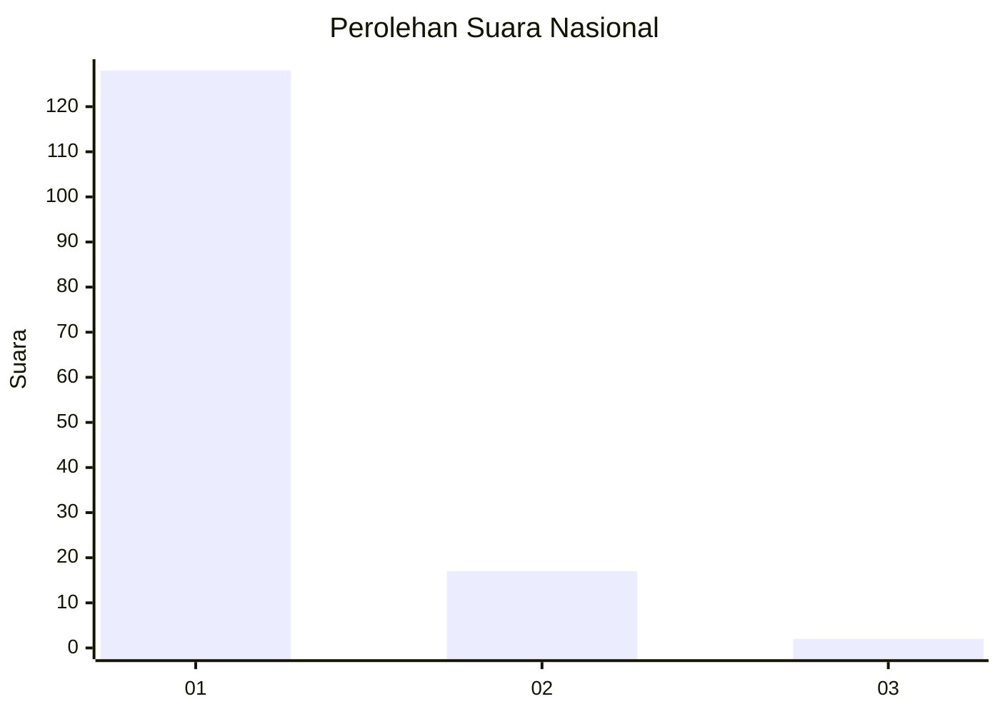
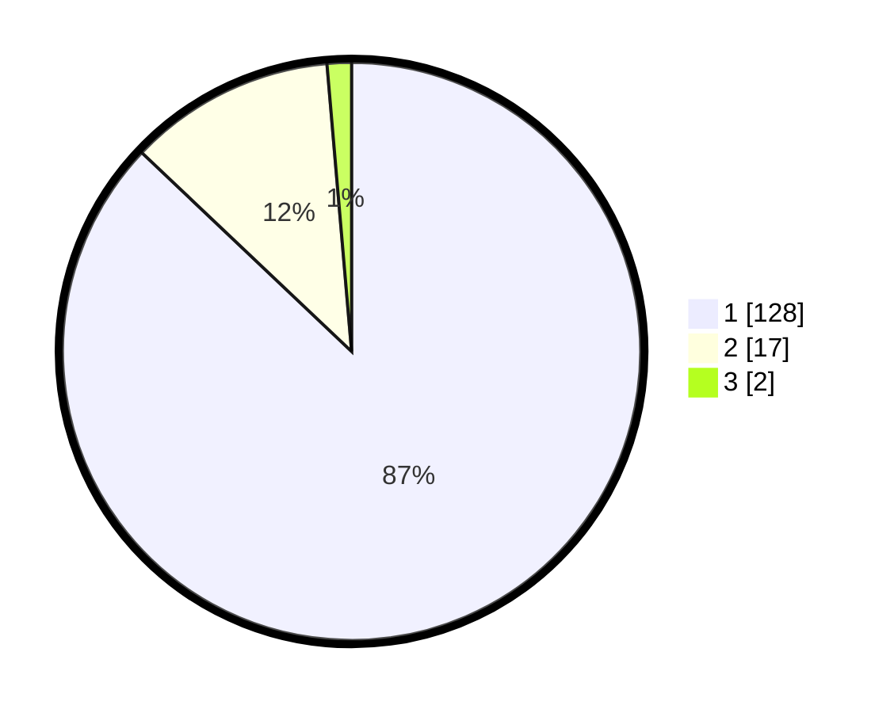

# Hasil

## Grafik

## Tabel

| No. | Nama Paslon    | Suara | Suara (raw) | Persentase |
|:--- |:-------------- | -----:| -----------:| ----------:|
| 1   | ANIES MUHAIMIN | 128   | [128][p-1]  | 87,07      |
| 2   | PRABOWO GIBRAN | 17    | [17][p-2]   | 11,56      |
| 3   | GANJAR MAHFUD  | 2     | [2][p-3]    | 1,36       |

[p-1]: https://github.com/gigit-pemilu/pemilu-2024/blob/main/pilpres/hitung-suara/sub/11-aceh/sub/11-bireuen/sub/05-peusangan/sub/2057-cot-keumude/sub/001-tps/sub/paslon-1.txt
[p-2]: https://github.com/gigit-pemilu/pemilu-2024/blob/main/pilpres/hitung-suara/sub/11-aceh/sub/11-bireuen/sub/05-peusangan/sub/2057-cot-keumude/sub/001-tps/sub/paslon-2.txt
[p-3]: https://github.com/gigit-pemilu/pemilu-2024/blob/main/pilpres/hitung-suara/sub/11-aceh/sub/11-bireuen/sub/05-peusangan/sub/2057-cot-keumude/sub/001-tps/sub/paslon-3.txt

## Foto C Plano

https://sirekap-obj-formc.kpu.go.id/53ca/pemilu/ppwp/11/11/05/20/57/1111052057001-20240215-031025--ba2ae1b2-2da0-4446-8167-ba37df7cbc1a.jpg

https://sirekap-obj-formc.kpu.go.id/53ca/pemilu/ppwp/11/11/05/20/57/1111052057001-20240214-213635--09252169-f3d6-4550-8e5e-5c596afe3b88.jpg

https://sirekap-obj-formc.kpu.go.id/53ca/pemilu/ppwp/11/11/05/20/57/1111052057001-20240214-213751--f9f20a49-be1b-4fbd-b89b-e1751a611844.jpg

## Metadata

| Key        | Value               |
| ---------- | ------------------- |
| Time Stamp | 2024-02-15 15:00:29 |

