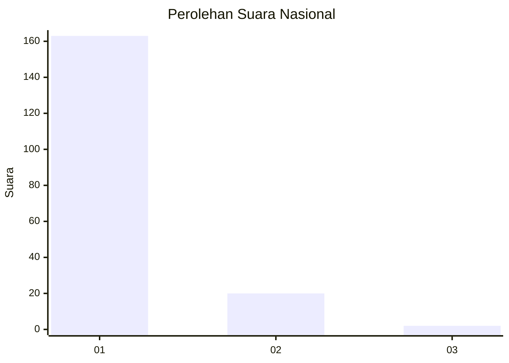
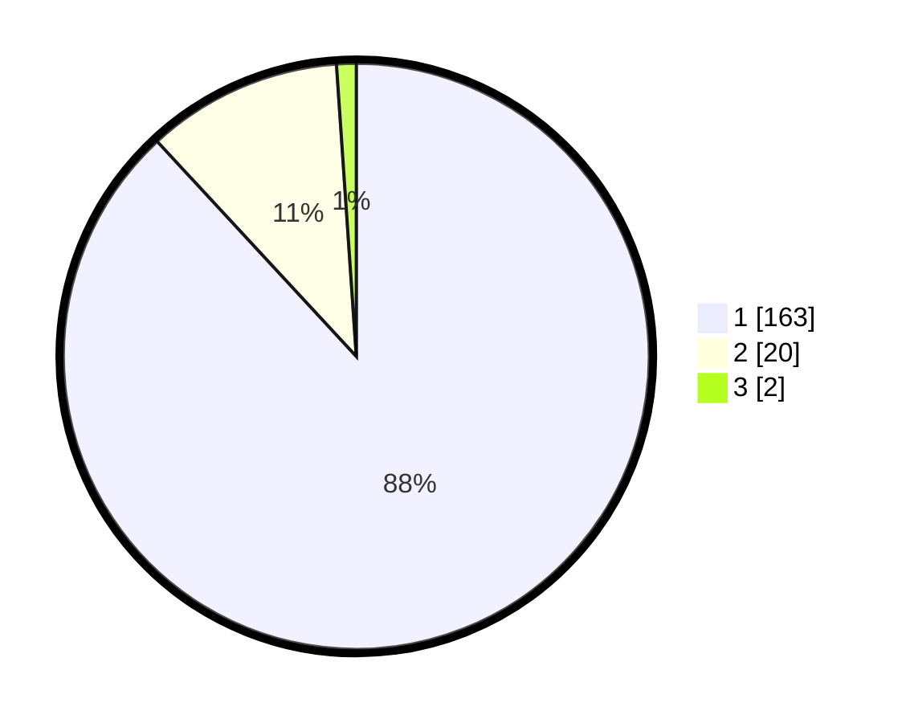

# Hasil

## Grafik

## Tabel

| No. | Nama Paslon    | Suara | Suara (raw) | Persentase |
|:--- |:-------------- | -----:| -----------:| ----------:|
| 1   | ANIES MUHAIMIN | 163   | [163][p-1]  | 88,11      |
| 2   | PRABOWO GIBRAN | 20    | [20][p-2]   | 10,81      |
| 3   | GANJAR MAHFUD  | 2     | [2][p-3]    | 1,08       |

[p-1]: https://github.com/gigit-pemilu/pemilu-2024/blob/main/pilpres/hitung-suara/sub/11-aceh/sub/11-bireuen/sub/06-makmur/sub/2010-lapehan-mesjid/sub/002-tps/sub/paslon-1.txt
[p-2]: https://github.com/gigit-pemilu/pemilu-2024/blob/main/pilpres/hitung-suara/sub/11-aceh/sub/11-bireuen/sub/06-makmur/sub/2010-lapehan-mesjid/sub/002-tps/sub/paslon-2.txt
[p-3]: https://github.com/gigit-pemilu/pemilu-2024/blob/main/pilpres/hitung-suara/sub/11-aceh/sub/11-bireuen/sub/06-makmur/sub/2010-lapehan-mesjid/sub/002-tps/sub/paslon-3.txt

## Foto C Plano

https://sirekap-obj-formc.kpu.go.id/640c/pemilu/ppwp/11/11/06/20/10/1111062010002-20240215-030915--dec3b3a3-60e8-48a9-a47c-6e7fa62b232b.jpg

https://sirekap-obj-formc.kpu.go.id/640c/pemilu/ppwp/11/11/06/20/10/1111062010002-20240218-173733--c1208a7d-ac0a-4e16-bd9b-2f4c59aab625.jpg

https://sirekap-obj-formc.kpu.go.id/640c/pemilu/ppwp/11/11/06/20/10/1111062010002-20240218-173814--545d0b86-f6a1-44ab-8288-09fe61773ab2.jpg

## Metadata

| Key        | Value               |
| ---------- | ------------------- |
| Time Stamp | 2024-02-24 22:31:28 |

## DATA PEMILIH TETAP

Jumlah pemilih dalam DPT: **247**.
 * L: **117**.
 * P: **177**.

## DATA PENGGUNA HAK PILIH

Jumlah pengguna hak pilih dalam DPT: **155**.
 * L: **83**.
 * P: **512**.

Jumlah pengguna hak pilih dalam DPTb: **530**.
 * L: **8**.
 * P: **8**.

Jumlah pengguna hak pilih dalam DPK: **4**.
 * L: **73**.
 * P: **81**.

Jumlah pengguna hak pilih: **577**.
 * L: **846**.
 * P: **115**.

## JUMLAH SUARA SAH DAN TIDAK SAH

JUMLAH SELURUH SUARA SAH: **185**.

JUMLAH SUARA TIDAK SAH: **14**.

JUMLAH SELURUH SUARA SAH DAN SUARA TIDAK SAH: **199**.

