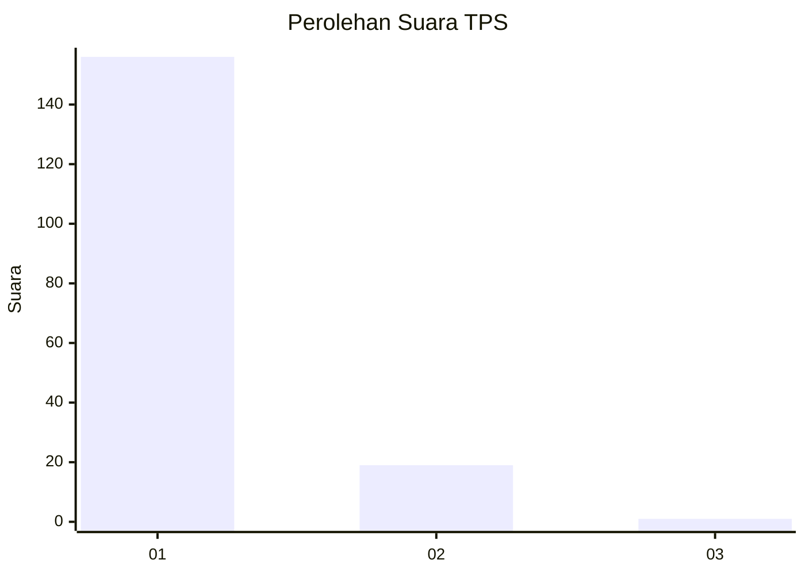
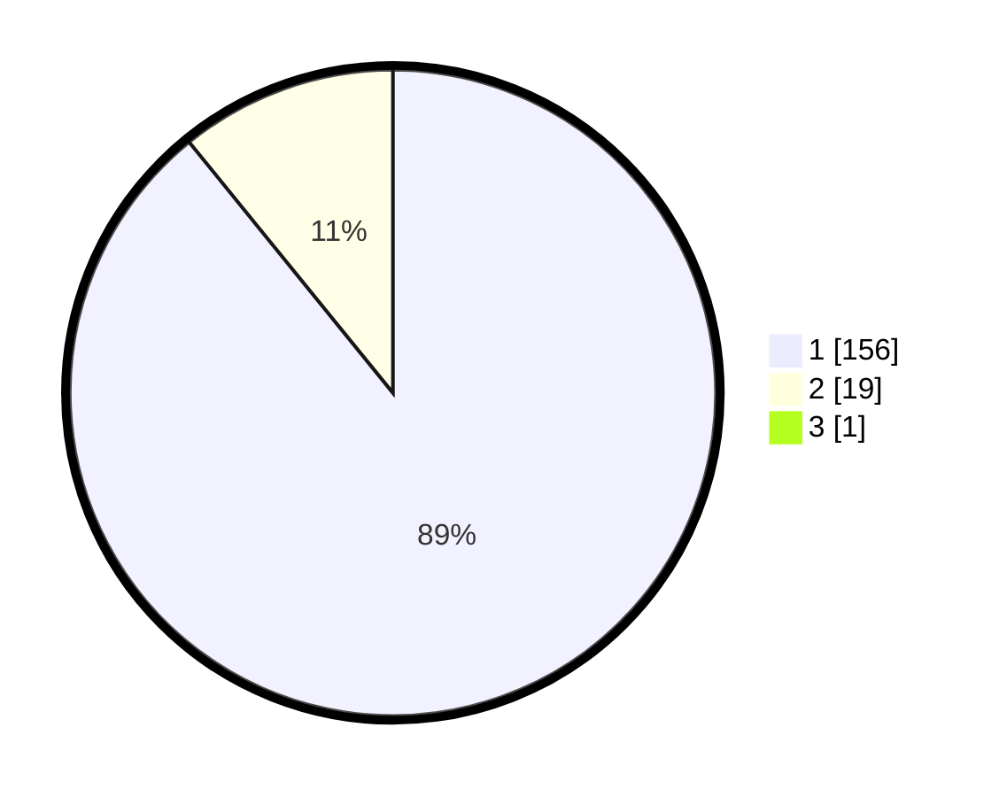

# Hasil

## Grafik

## Tabel

| No. | Nama Paslon    | Suara | Suara (raw) | Persentase |
|:--- |:-------------- | -----:| -----------:| ----------:|
| 1   | ANIES MUHAIMIN | 156   | [156][p-1]  | 88,64      |
| 2   | PRABOWO GIBRAN | 19    | [19][p-2]   | 10,80      |
| 3   | GANJAR MAHFUD  | 1     | [1][p-3]    | 0,57       |

[p-1]: https://github.com/gigit-pemilu/pemilu-2024-11-aceh/blob/main/pilpres/hitung-suara/sub/11-aceh/sub/11-bireuen/sub/06-makmur/sub/2010-lapehan-mesjid/sub/003-tps/sub/paslon-1.txt
[p-2]: https://github.com/gigit-pemilu/pemilu-2024-11-aceh/blob/main/pilpres/hitung-suara/sub/11-aceh/sub/11-bireuen/sub/06-makmur/sub/2010-lapehan-mesjid/sub/003-tps/sub/paslon-2.txt
[p-3]: https://github.com/gigit-pemilu/pemilu-2024-11-aceh/blob/main/pilpres/hitung-suara/sub/11-aceh/sub/11-bireuen/sub/06-makmur/sub/2010-lapehan-mesjid/sub/003-tps/sub/paslon-3.txt

## Foto C Plano

https://sirekap-obj-formc.kpu.go.id/45fe/pemilu/ppwp/11/11/06/20/10/1111062010003-20240218-174925--a8a68064-a51e-42a7-8e1d-5320e9f8f252.jpg

https://sirekap-obj-formc.kpu.go.id/45fe/pemilu/ppwp/11/11/06/20/10/1111062010003-20240218-175144--40fc318a-7696-4aa2-9843-dadbe194da06.jpg

https://sirekap-obj-formc.kpu.go.id/45fe/pemilu/ppwp/11/11/06/20/10/1111062010003-20240218-175325--d4dc88fd-fadf-42a7-91ed-4f957862bf53.jpg

## Metadata

| Key        | Value               |
| ---------- | ------------------- |
| Time Stamp | 2024-02-19 06:16:00 |

