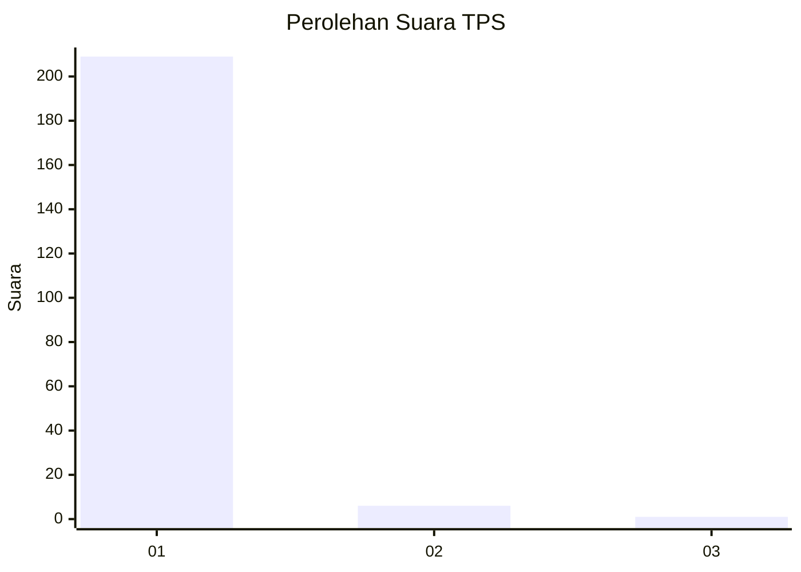
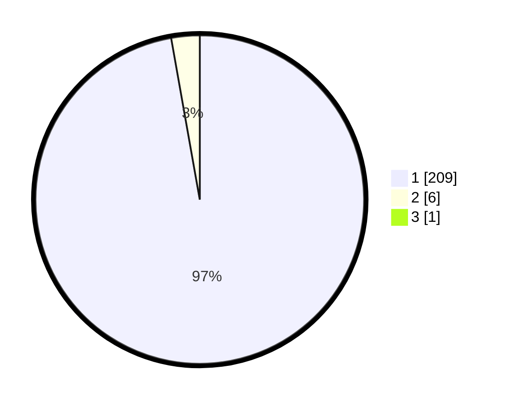

# Hasil

## Grafik

## Tabel

| No. | Nama Paslon    | Suara | Suara (raw) | Persentase |
|:--- |:-------------- | -----:| -----------:| ----------:|
| 1   | ANIES MUHAIMIN | 209   | [209][p-1]  | 96,76      |
| 2   | PRABOWO GIBRAN | 6     | [6][p-2]    | 2,78       |
| 3   | GANJAR MAHFUD  | 1     | [1][p-3]    | 0,46       |

[p-1]: https://github.com/gigit-pemilu/pemilu-2024-11-aceh/blob/main/pilpres/hitung-suara/sub/11-aceh/sub/11-bireuen/sub/06-makmur/sub/2012-mona-ara/sub/001-tps/sub/paslon-1.txt
[p-2]: https://github.com/gigit-pemilu/pemilu-2024-11-aceh/blob/main/pilpres/hitung-suara/sub/11-aceh/sub/11-bireuen/sub/06-makmur/sub/2012-mona-ara/sub/001-tps/sub/paslon-2.txt
[p-3]: https://github.com/gigit-pemilu/pemilu-2024-11-aceh/blob/main/pilpres/hitung-suara/sub/11-aceh/sub/11-bireuen/sub/06-makmur/sub/2012-mona-ara/sub/001-tps/sub/paslon-3.txt

## Foto C Plano

https://sirekap-obj-formc.kpu.go.id/4059/pemilu/ppwp/11/11/06/20/12/1111062012001-20240214-213531--37dbfea7-8e4b-4fc7-8cfd-9a4de6aa4ebc.jpg

https://sirekap-obj-formc.kpu.go.id/4059/pemilu/ppwp/11/11/06/20/12/1111062012001-20240214-213632--04021f31-a12b-43d6-8f0b-e43dfce4d77f.jpg

https://sirekap-obj-formc.kpu.go.id/4059/pemilu/ppwp/11/11/06/20/12/1111062012001-20240214-213651--8be262ee-dee4-4b6d-94d5-f83101cde9d1.jpg

## Metadata

| Key        | Value               |
| ---------- | ------------------- |
| Time Stamp | 2024-02-15 22:30:27 |

