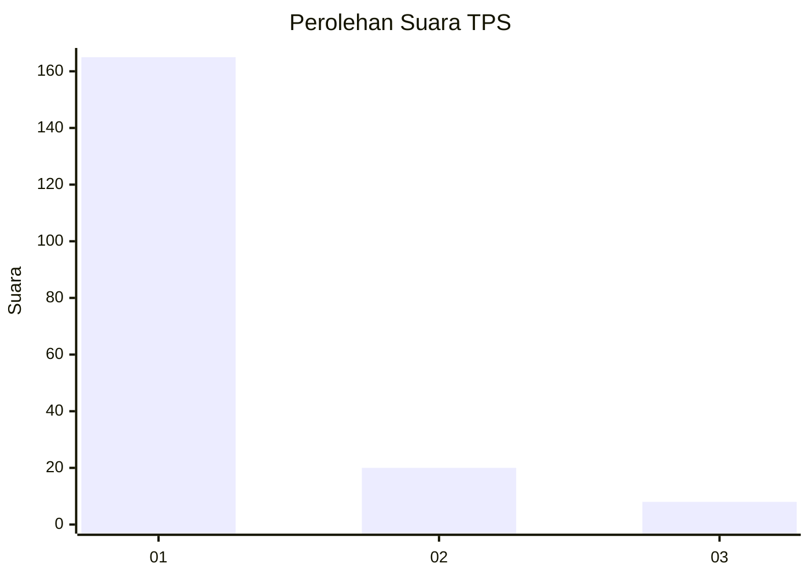
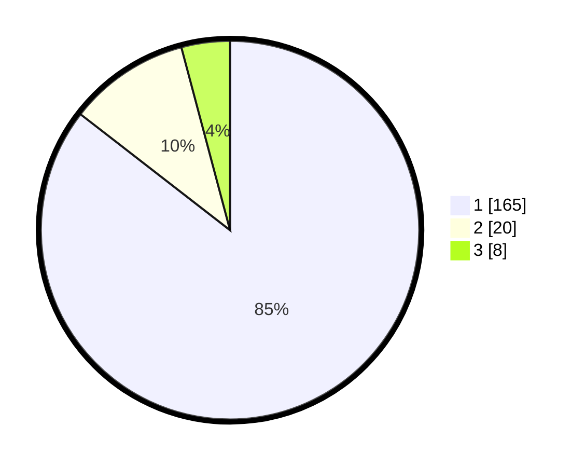

# Hasil

## Grafik

## Tabel

| No. | Nama Paslon    | Suara | Suara (raw) | Persentase |
|:--- |:-------------- | -----:| -----------:| ----------:|
| 1   | ANIES MUHAIMIN | 165   | [165][p-1]  | 85,49      |
| 2   | PRABOWO GIBRAN | 20    | [20][p-2]   | 10,36      |
| 3   | GANJAR MAHFUD  | 8     | [8][p-3]    | 4,15       |

[p-1]: https://github.com/gigit-pemilu/pemilu-2024-11-aceh/blob/main/pilpres/hitung-suara/sub/11-aceh/sub/11-bireuen/sub/06-makmur/sub/2015-alue-dua/sub/002-tps/sub/paslon-1.txt
[p-2]: https://github.com/gigit-pemilu/pemilu-2024-11-aceh/blob/main/pilpres/hitung-suara/sub/11-aceh/sub/11-bireuen/sub/06-makmur/sub/2015-alue-dua/sub/002-tps/sub/paslon-2.txt
[p-3]: https://github.com/gigit-pemilu/pemilu-2024-11-aceh/blob/main/pilpres/hitung-suara/sub/11-aceh/sub/11-bireuen/sub/06-makmur/sub/2015-alue-dua/sub/002-tps/sub/paslon-3.txt

## Foto C Plano

https://sirekap-obj-formc.kpu.go.id/cb4d/pemilu/ppwp/11/11/06/20/15/1111062015002-20240215-104415--096f540c-c8ed-4d6e-9438-a85e8d4b0d00.jpg

https://sirekap-obj-formc.kpu.go.id/cb4d/pemilu/ppwp/11/11/06/20/15/1111062015002-20240215-104505--c0d7c077-dc7b-407e-85c8-67b353cbd880.jpg

## Metadata

| Key        | Value               |
| ---------- | ------------------- |
| Time Stamp | 2024-02-15 15:30:25 |

