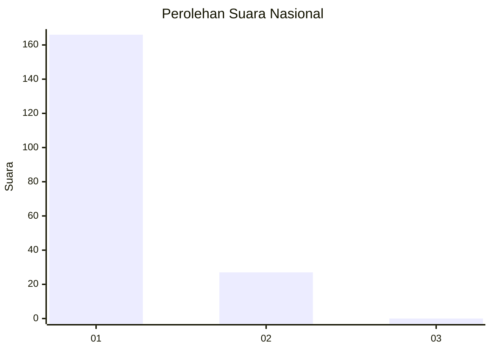
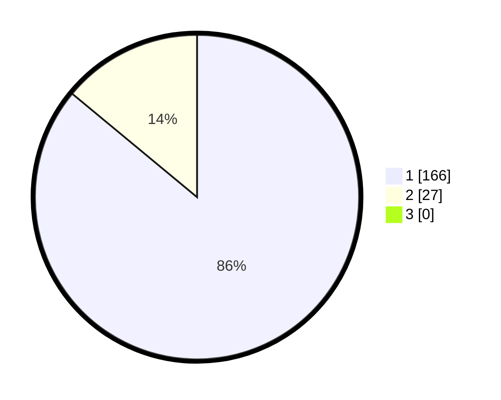

# Hasil

## Grafik

## Tabel

| No. | Nama Paslon    | Suara | Suara (raw) | Persentase |
|:--- |:-------------- | -----:| -----------:| ----------:|
| 1   | ANIES MUHAIMIN | 166   | [166][p-1]  | 86,01      |
| 2   | PRABOWO GIBRAN | 27    | [27][p-2]   | 13,99      |
| 3   | GANJAR MAHFUD  | 0     | [0][p-3]    | 0,00       |

[p-1]: https://github.com/gigit-pemilu/pemilu-2024/blob/main/pilpres/hitung-suara/sub/11-aceh/sub/11-bireuen/sub/07-gandapura/sub/2001-keude-lapang/sub/002-tps/sub/paslon-1.txt
[p-2]: https://github.com/gigit-pemilu/pemilu-2024/blob/main/pilpres/hitung-suara/sub/11-aceh/sub/11-bireuen/sub/07-gandapura/sub/2001-keude-lapang/sub/002-tps/sub/paslon-2.txt
[p-3]: https://github.com/gigit-pemilu/pemilu-2024/blob/main/pilpres/hitung-suara/sub/11-aceh/sub/11-bireuen/sub/07-gandapura/sub/2001-keude-lapang/sub/002-tps/sub/paslon-3.txt

## Foto C Plano

https://sirekap-obj-formc.kpu.go.id/5921/pemilu/ppwp/11/11/07/20/01/1111072001002-20240218-111337--b7a51565-06ea-4f23-b920-eee6a3abfc82.jpg

https://sirekap-obj-formc.kpu.go.id/5921/pemilu/ppwp/11/11/07/20/01/1111072001002-20240218-111722--16356f4d-9a39-4ec6-b6d5-2fdefb643799.jpg

https://sirekap-obj-formc.kpu.go.id/5921/pemilu/ppwp/11/11/07/20/01/1111072001002-20240218-111827--46d6afb2-ffd2-42ab-888f-91bc3c686052.jpg

## Metadata

| Key        | Value               |
| ---------- | ------------------- |
| Time Stamp | 2024-02-19 06:16:00 |

## DATA PEMILIH TETAP

Jumlah pemilih dalam DPT: **217**.
 * L: **95**.
 * P: **122**.

## DATA PENGGUNA HAK PILIH

Jumlah pengguna hak pilih dalam DPT: **181**.
 * L: **80**.
 * P: **101**.

Jumlah pengguna hak pilih dalam DPTb: **0**.
 * L: **0**.
 * P: **0**.

Jumlah pengguna hak pilih dalam DPK: **13**.
 * L: **9**.
 * P: **4**.

Jumlah pengguna hak pilih: **194**.
 * L: **89**.
 * P: **105**.

## JUMLAH SUARA SAH DAN TIDAK SAH

JUMLAH SELURUH SUARA SAH: **193**.

JUMLAH SUARA TIDAK SAH: **1**.

JUMLAH SELURUH SUARA SAH DAN SUARA TIDAK SAH: **194**.

