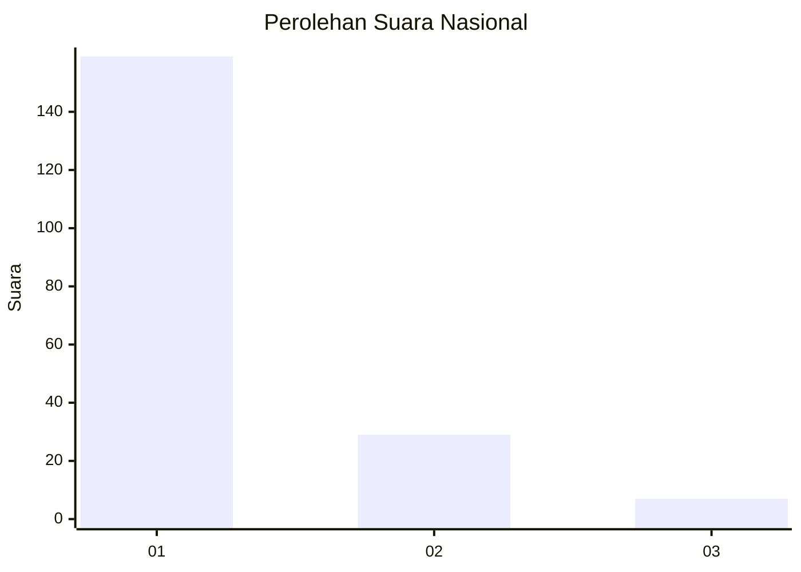
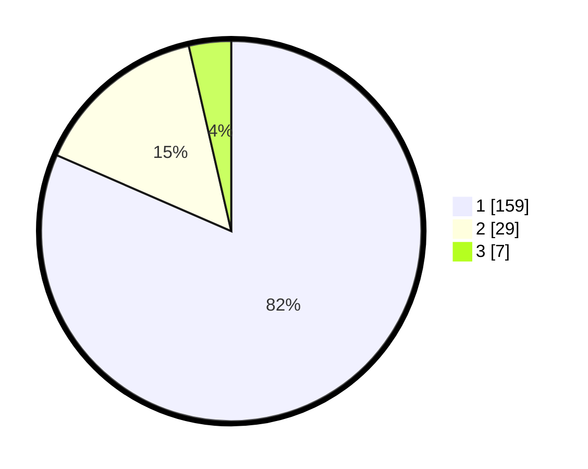

# Hasil

## Grafik

## Tabel

| No. | Nama Paslon    | Suara | Suara (raw) | Persentase |
|:--- |:-------------- | -----:| -----------:| ----------:|
| 1   | ANIES MUHAIMIN | 159   | [159][p-1]  | 81,54      |
| 2   | PRABOWO GIBRAN | 29    | [29][p-2]   | 14,87      |
| 3   | GANJAR MAHFUD  | 7     | [7][p-3]    | 3,59       |

[p-1]: https://github.com/gigit-pemilu/pemilu-2024/blob/main/pilpres/hitung-suara/sub/11-aceh/sub/11-bireuen/sub/07-gandapura/sub/2001-keude-lapang/sub/003-tps/sub/paslon-1.txt
[p-2]: https://github.com/gigit-pemilu/pemilu-2024/blob/main/pilpres/hitung-suara/sub/11-aceh/sub/11-bireuen/sub/07-gandapura/sub/2001-keude-lapang/sub/003-tps/sub/paslon-2.txt
[p-3]: https://github.com/gigit-pemilu/pemilu-2024/blob/main/pilpres/hitung-suara/sub/11-aceh/sub/11-bireuen/sub/07-gandapura/sub/2001-keude-lapang/sub/003-tps/sub/paslon-3.txt

## Foto C Plano

https://sirekap-obj-formc.kpu.go.id/93e5/pemilu/ppwp/11/11/07/20/01/1111072001003-20240218-121746--e0b2d728-4935-44f7-ad1f-6e033ef02131.jpg

https://sirekap-obj-formc.kpu.go.id/93e5/pemilu/ppwp/11/11/07/20/01/1111072001003-20240218-111940--e4b01c9c-3055-4025-a789-e968d5cc1659.jpg

https://sirekap-obj-formc.kpu.go.id/93e5/pemilu/ppwp/11/11/07/20/01/1111072001003-20240218-112226--9c7243d3-12ab-4e80-8c75-124d1e9e3a3d.jpg

## Metadata

| Key        | Value               |
| ---------- | ------------------- |
| Time Stamp | 2024-02-21 11:00:00 |

## DATA PEMILIH TETAP

Jumlah pemilih dalam DPT: **242**.
 * L: **117**.
 * P: **125**.

## DATA PENGGUNA HAK PILIH

Jumlah pengguna hak pilih dalam DPT: **196**.
 * L: **90**.
 * P: **106**.

Jumlah pengguna hak pilih dalam DPTb: **196**.
 * L: **90**.
 * P: **106**.

Jumlah pengguna hak pilih dalam DPK: **0**.
 * L: **0**.
 * P: **0**.

Jumlah pengguna hak pilih: **196**.
 * L: **90**.
 * P: **106**.

## JUMLAH SUARA SAH DAN TIDAK SAH

JUMLAH SELURUH SUARA SAH: **195**.

JUMLAH SUARA TIDAK SAH: **1**.

JUMLAH SELURUH SUARA SAH DAN SUARA TIDAK SAH: **196**.

