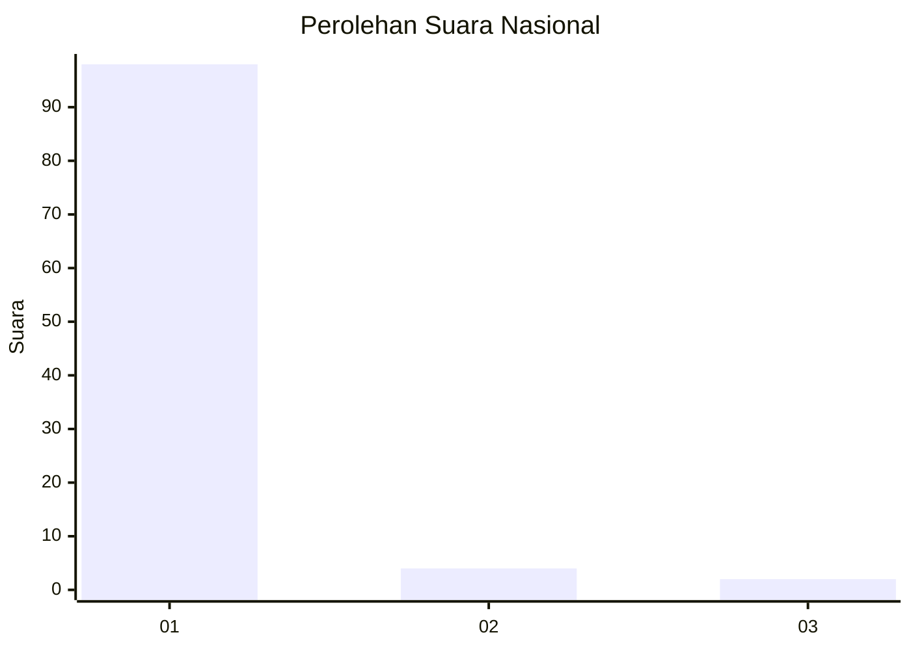
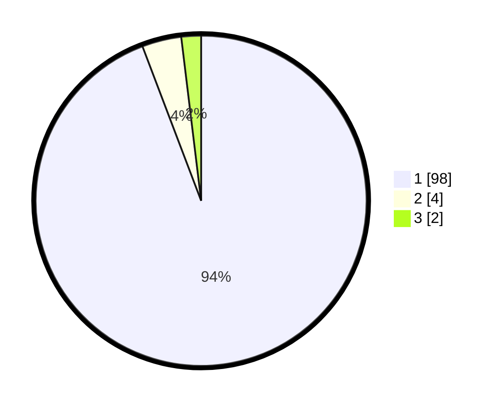

# Hasil

## Grafik

## Tabel

| No. | Nama Paslon    | Suara | Suara (raw) | Persentase |
|:--- |:-------------- | -----:| -----------:| ----------:|
| 1   | ANIES MUHAIMIN | 98    | [98][p-1]   | 94,23      |
| 2   | PRABOWO GIBRAN | 4     | [4][p-2]    | 3,85       |
| 3   | GANJAR MAHFUD  | 2     | [2][p-3]    | 1,92       |

[p-1]: https://github.com/gigit-pemilu/pemilu-2024/blob/main/pilpres/hitung-suara/sub/11-aceh/sub/11-bireuen/sub/07-gandapura/sub/2023-paloh-kaye-kunyet/sub/001-tps/sub/paslon-1.txt
[p-2]: https://github.com/gigit-pemilu/pemilu-2024/blob/main/pilpres/hitung-suara/sub/11-aceh/sub/11-bireuen/sub/07-gandapura/sub/2023-paloh-kaye-kunyet/sub/001-tps/sub/paslon-2.txt
[p-3]: https://github.com/gigit-pemilu/pemilu-2024/blob/main/pilpres/hitung-suara/sub/11-aceh/sub/11-bireuen/sub/07-gandapura/sub/2023-paloh-kaye-kunyet/sub/001-tps/sub/paslon-3.txt

## Foto C Plano

https://sirekap-obj-formc.kpu.go.id/e7f7/pemilu/ppwp/11/11/07/20/23/1111072023001-20240215-012817--e044f7b7-4ac1-49e4-9393-db96a7b0833f.jpg

https://sirekap-obj-formc.kpu.go.id/e7f7/pemilu/ppwp/11/11/07/20/23/1111072023001-20240215-012832--23f73ccf-8697-4f6e-bb45-a214e9957da7.jpg

https://sirekap-obj-formc.kpu.go.id/e7f7/pemilu/ppwp/11/11/07/20/23/1111072023001-20240215-012846--12a13ce4-6ce6-47d3-83f9-6dcff23c7d89.jpg

## Metadata

| Key        | Value               |
| ---------- | ------------------- |
| Time Stamp | 2024-02-15 12:00:28 |

## DATA PEMILIH TETAP

Jumlah pemilih dalam DPT: **126**.
 * L: **60**.
 * P: **66**.

## DATA PENGGUNA HAK PILIH

Jumlah pengguna hak pilih dalam DPT: **104**.
 * L: **47**.
 * P: **57**.

Jumlah pengguna hak pilih dalam DPTb: **1**.
 * L: **0**.
 * P: **1**.

Jumlah pengguna hak pilih dalam DPK: **1**.
 * L: **1**.
 * P: **0**.

Jumlah pengguna hak pilih: **106**.
 * L: **48**.
 * P: **58**.

## JUMLAH SUARA SAH DAN TIDAK SAH

JUMLAH SELURUH SUARA SAH: **104**.

JUMLAH SUARA TIDAK SAH: **2**.

JUMLAH SELURUH SUARA SAH DAN SUARA TIDAK SAH: **106**.

