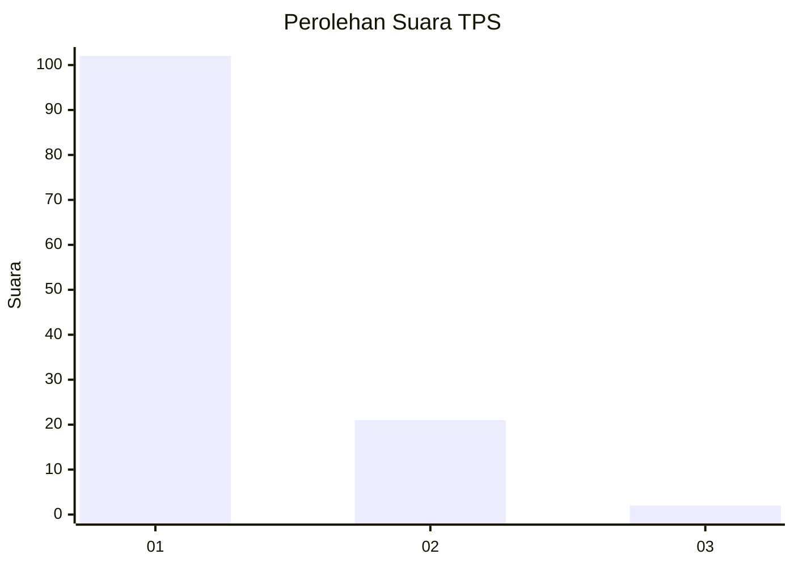
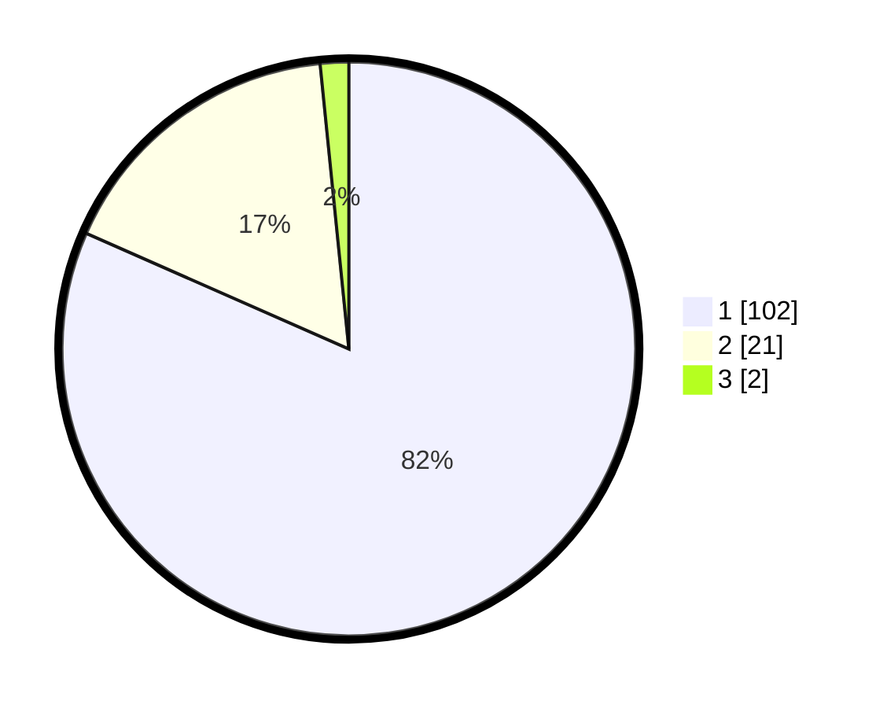

# Hasil

## Grafik

## Tabel

| No. | Nama Paslon    | Suara | Suara (raw) | Persentase |
|:--- |:-------------- | -----:| -----------:| ----------:|
| 1   | ANIES MUHAIMIN | 102   | [102][p-1]  | 81,60      |
| 2   | PRABOWO GIBRAN | 21    | [21][p-2]   | 16,80      |
| 3   | GANJAR MAHFUD  | 2     | [2][p-3]    | 1,60       |

[p-1]: https://github.com/gigit-pemilu/pemilu-2024-11-aceh/blob/main/pilpres/hitung-suara/sub/11-aceh/sub/11-bireuen/sub/07-gandapura/sub/2030-cot-rambat/sub/001-tps/sub/paslon-1.txt
[p-2]: https://github.com/gigit-pemilu/pemilu-2024-11-aceh/blob/main/pilpres/hitung-suara/sub/11-aceh/sub/11-bireuen/sub/07-gandapura/sub/2030-cot-rambat/sub/001-tps/sub/paslon-2.txt
[p-3]: https://github.com/gigit-pemilu/pemilu-2024-11-aceh/blob/main/pilpres/hitung-suara/sub/11-aceh/sub/11-bireuen/sub/07-gandapura/sub/2030-cot-rambat/sub/001-tps/sub/paslon-3.txt

## Foto C Plano

https://sirekap-obj-formc.kpu.go.id/54ba/pemilu/ppwp/11/11/07/20/30/1111072030001-20240218-213131--1d77136c-aa19-4445-9e99-40cf003b7415.jpg

https://sirekap-obj-formc.kpu.go.id/54ba/pemilu/ppwp/11/11/07/20/30/1111072030001-20240218-213812--769113d7-f4ae-4745-bad4-ad0c8aea01f0.jpg

https://sirekap-obj-formc.kpu.go.id/54ba/pemilu/ppwp/11/11/07/20/30/1111072030001-20240218-214031--b774cc4c-48ff-4ee1-bdee-2a0dc1e0ece4.jpg

## Metadata

| Key        | Value               |
| ---------- | ------------------- |
| Time Stamp | 2024-02-24 22:31:28 |

