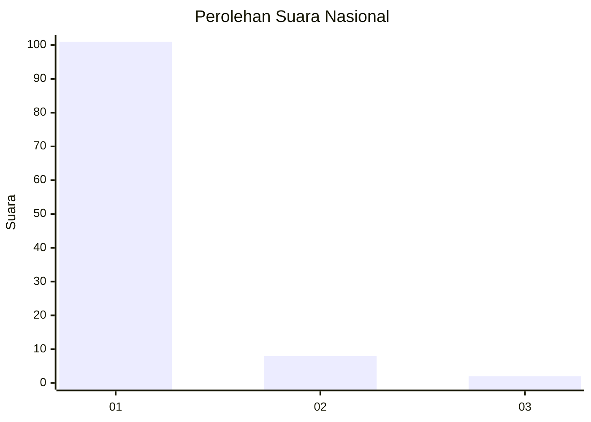
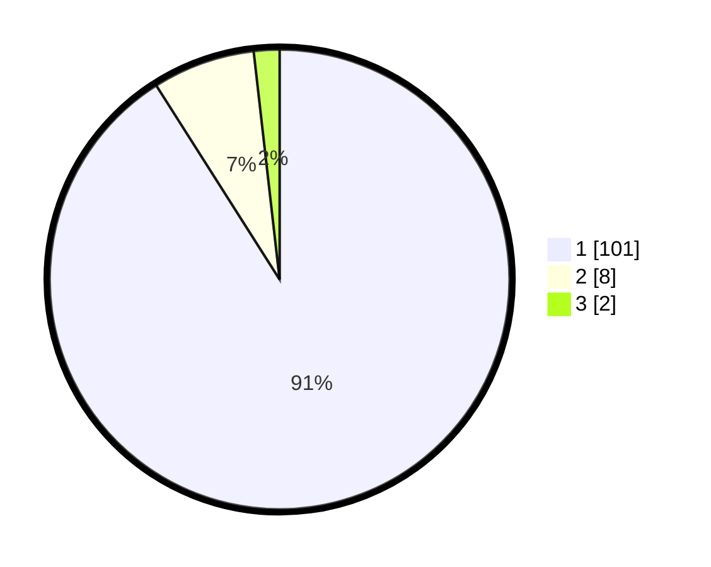

# Hasil

## Grafik

## Tabel

| No. | Nama Paslon    | Suara | Suara (raw) | Persentase |
|:--- |:-------------- | -----:| -----------:| ----------:|
| 1   | ANIES MUHAIMIN | 101   | [101][p-1]  | 90,99      |
| 2   | PRABOWO GIBRAN | 8     | [8][p-2]    | 7,21       |
| 3   | GANJAR MAHFUD  | 2     | [2][p-3]    | 1,80       |

[p-1]: https://github.com/gigit-pemilu/pemilu-2024/blob/main/pilpres/hitung-suara/sub/11-aceh/sub/11-bireuen/sub/08-pandrah/sub/2008-gampong-blang/sub/001-tps/sub/paslon-1.txt
[p-2]: https://github.com/gigit-pemilu/pemilu-2024/blob/main/pilpres/hitung-suara/sub/11-aceh/sub/11-bireuen/sub/08-pandrah/sub/2008-gampong-blang/sub/001-tps/sub/paslon-2.txt
[p-3]: https://github.com/gigit-pemilu/pemilu-2024/blob/main/pilpres/hitung-suara/sub/11-aceh/sub/11-bireuen/sub/08-pandrah/sub/2008-gampong-blang/sub/001-tps/sub/paslon-3.txt

## Foto C Plano

https://sirekap-obj-formc.kpu.go.id/48e1/pemilu/ppwp/11/11/08/20/08/1111082008001-20240215-014426--9d922058-3579-4ffb-897a-cc15c4a738ce.jpg

https://sirekap-obj-formc.kpu.go.id/48e1/pemilu/ppwp/11/11/08/20/08/1111082008001-20240215-022712--efbf26fc-908b-4c87-9736-f91a63f561d8.jpg

## Metadata

| Key        | Value               |
| ---------- | ------------------- |
| Time Stamp | 2024-02-15 07:00:44 |

