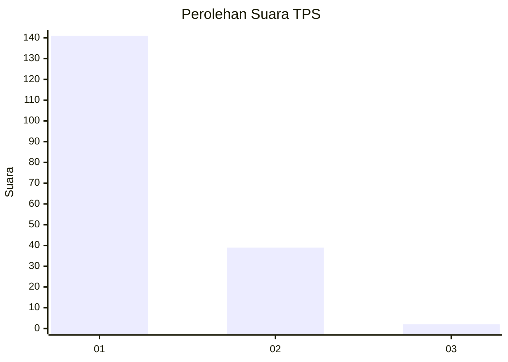
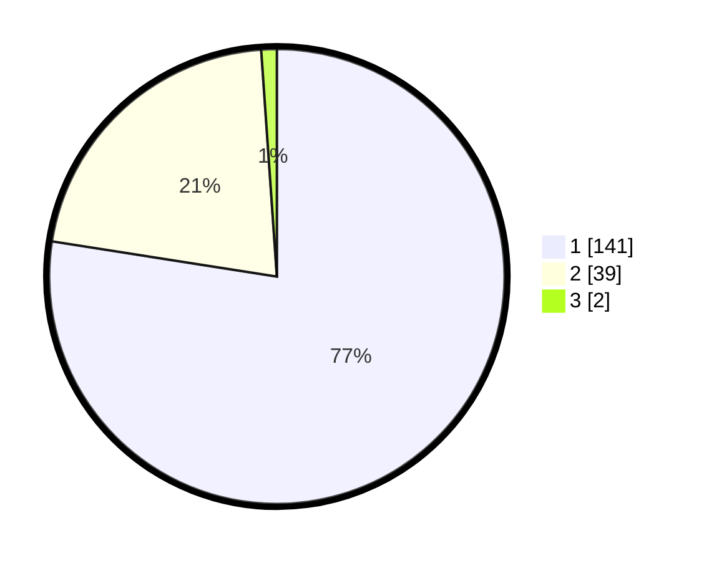

# Hasil

## Grafik

## Tabel

| No. | Nama Paslon    | Suara | Suara (raw) | Persentase |
|:--- |:-------------- | -----:| -----------:| ----------:|
| 1   | ANIES MUHAIMIN | 141   | [141][p-1]  | 77,47      |
| 2   | PRABOWO GIBRAN | 39    | [39][p-2]   | 21,43      |
| 3   | GANJAR MAHFUD  | 2     | [2][p-3]    | 1,10       |

[p-1]: https://github.com/gigit-pemilu/pemilu-2024-11-aceh/blob/main/pilpres/hitung-suara/sub/11-aceh/sub/11-bireuen/sub/09-juli/sub/2014-blang-ketumba/sub/005-tps/sub/paslon-1.txt
[p-2]: https://github.com/gigit-pemilu/pemilu-2024-11-aceh/blob/main/pilpres/hitung-suara/sub/11-aceh/sub/11-bireuen/sub/09-juli/sub/2014-blang-ketumba/sub/005-tps/sub/paslon-2.txt
[p-3]: https://github.com/gigit-pemilu/pemilu-2024-11-aceh/blob/main/pilpres/hitung-suara/sub/11-aceh/sub/11-bireuen/sub/09-juli/sub/2014-blang-ketumba/sub/005-tps/sub/paslon-3.txt

## Foto C Plano

https://sirekap-obj-formc.kpu.go.id/8982/pemilu/ppwp/11/11/09/20/14/1111092014005-20240216-154025--987b4913-1047-4dc2-b5a8-2e39c9f006c0.jpg

https://sirekap-obj-formc.kpu.go.id/8982/pemilu/ppwp/11/11/09/20/14/1111092014005-20240216-154026--d5c7057e-133e-428e-ae2c-dbf735206e58.jpg

https://sirekap-obj-formc.kpu.go.id/8982/pemilu/ppwp/11/11/09/20/14/1111092014005-20240216-154026--c4e35cf8-f1f1-484d-8240-85b38a41bd18.jpg

## Metadata

| Key        | Value               |
| ---------- | ------------------- |
| Time Stamp | 2024-02-19 06:16:00 |

## DATA PEMILIH TETAP

Jumlah pemilih dalam DPT: **229**.
 * L: **106**.
 * P: **123**.

## DATA PENGGUNA HAK PILIH

Jumlah pengguna hak pilih dalam DPT: **177**.
 * L: **71**.
 * P: **106**.

Jumlah pengguna hak pilih dalam DPTb: **8**.
 * L: **0**.
 * P: **8**.

Jumlah pengguna hak pilih dalam DPK: **6**.
 * L: **0**.
 * P: **6**.

Jumlah pengguna hak pilih: **191**.
 * L: **71**.
 * P: **120**.

## JUMLAH SUARA SAH DAN TIDAK SAH

JUMLAH SELURUH SUARA SAH: **181**.

JUMLAH SUARA TIDAK SAH: **9**.

JUMLAH SELURUH SUARA SAH DAN SUARA TIDAK SAH: **190**.

