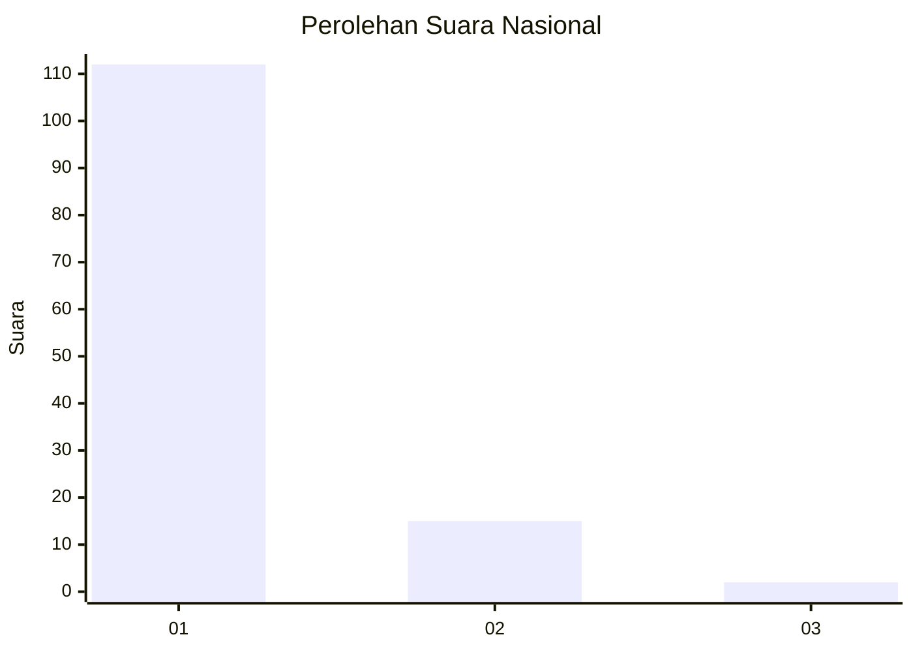
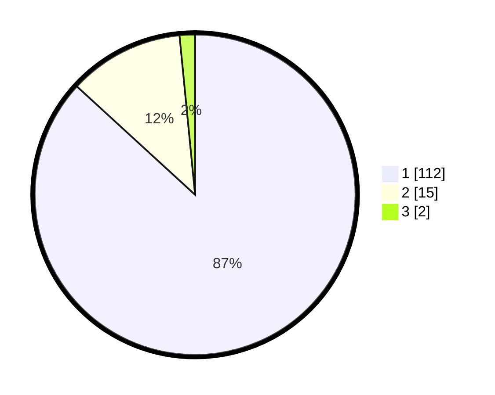

# Hasil

## Grafik

## Tabel

| No. | Nama Paslon    | Suara | Suara (raw) | Persentase |
|:--- |:-------------- | -----:| -----------:| ----------:|
| 1   | ANIES MUHAIMIN | 112   | [112][p-1]  | 86,82      |
| 2   | PRABOWO GIBRAN | 15    | [15][p-2]   | 11,63      |
| 3   | GANJAR MAHFUD  | 2     | [2][p-3]    | 1,55       |

[p-1]: https://github.com/gigit-pemilu/pemilu-2024/blob/main/pilpres/hitung-suara/sub/11-aceh/sub/11-bireuen/sub/09-juli/sub/2025-alue-rambong/sub/001-tps/sub/paslon-1.txt
[p-2]: https://github.com/gigit-pemilu/pemilu-2024/blob/main/pilpres/hitung-suara/sub/11-aceh/sub/11-bireuen/sub/09-juli/sub/2025-alue-rambong/sub/001-tps/sub/paslon-2.txt
[p-3]: https://github.com/gigit-pemilu/pemilu-2024/blob/main/pilpres/hitung-suara/sub/11-aceh/sub/11-bireuen/sub/09-juli/sub/2025-alue-rambong/sub/001-tps/sub/paslon-3.txt

## Foto C Plano

https://sirekap-obj-formc.kpu.go.id/9b71/pemilu/ppwp/11/11/09/20/25/1111092025001-20240215-044704--fcfdfaa0-353a-4216-a72b-02a5e3ce9f26.jpg

https://sirekap-obj-formc.kpu.go.id/9b71/pemilu/ppwp/11/11/09/20/25/1111092025001-20240215-051517--e8460f31-6867-450d-b50c-53cf2d04ab1e.jpg

## Metadata

| Key        | Value               |
| ---------- | ------------------- |
| Time Stamp | 2024-02-15 19:00:26 |

