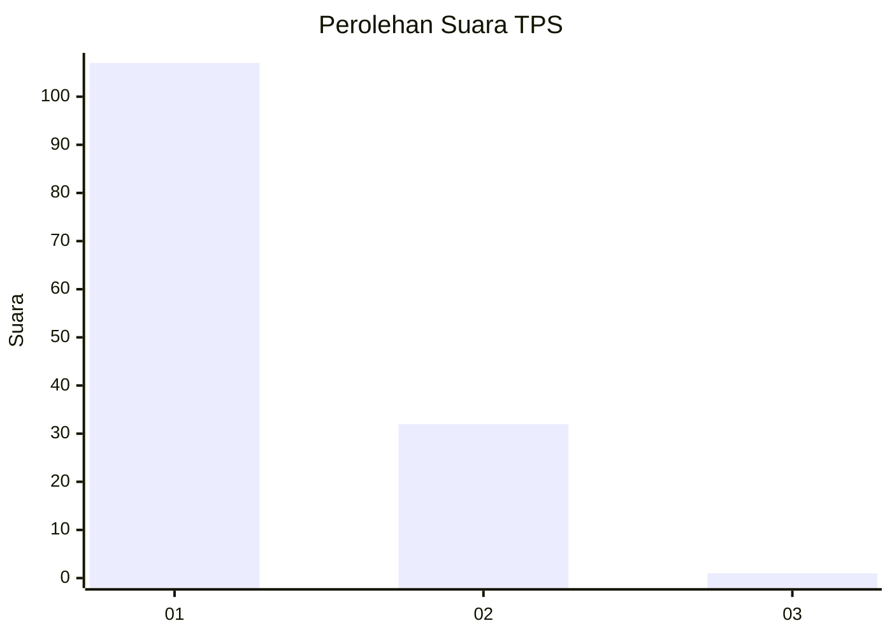
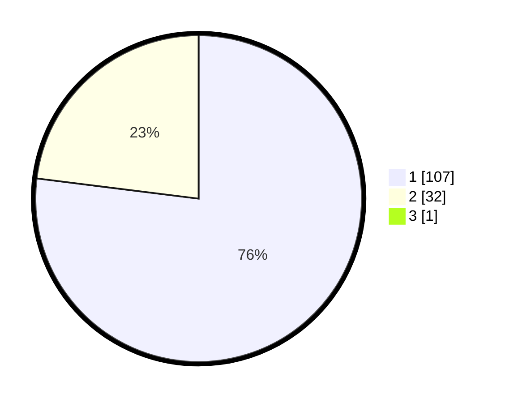

# Hasil

## Grafik

## Tabel

| No. | Nama Paslon    | Suara | Suara (raw) | Persentase |
|:--- |:-------------- | -----:| -----------:| ----------:|
| 1   | ANIES MUHAIMIN | 107   | [107][p-1]  | 76,43      |
| 2   | PRABOWO GIBRAN | 32    | [32][p-2]   | 22,86      |
| 3   | GANJAR MAHFUD  | 1     | [1][p-3]    | 0,71       |

[p-1]: https://github.com/gigit-pemilu/pemilu-2024-11-aceh/blob/main/pilpres/hitung-suara/sub/11-aceh/sub/11-bireuen/sub/09-juli/sub/2025-alue-rambong/sub/002-tps/sub/paslon-1.txt
[p-2]: https://github.com/gigit-pemilu/pemilu-2024-11-aceh/blob/main/pilpres/hitung-suara/sub/11-aceh/sub/11-bireuen/sub/09-juli/sub/2025-alue-rambong/sub/002-tps/sub/paslon-2.txt
[p-3]: https://github.com/gigit-pemilu/pemilu-2024-11-aceh/blob/main/pilpres/hitung-suara/sub/11-aceh/sub/11-bireuen/sub/09-juli/sub/2025-alue-rambong/sub/002-tps/sub/paslon-3.txt

## Foto C Plano

https://sirekap-obj-formc.kpu.go.id/bf15/pemilu/ppwp/11/11/09/20/25/1111092025002-20240215-065752--c2102799-fd9d-469b-897a-840868f02f28.jpg

https://sirekap-obj-formc.kpu.go.id/bf15/pemilu/ppwp/11/11/09/20/25/1111092025002-20240215-070634--5e9dfb63-1ede-4edf-9289-bbfdb1e282be.jpg

https://sirekap-obj-formc.kpu.go.id/bf15/pemilu/ppwp/11/11/09/20/25/1111092025002-20240215-071338--7fe2f545-4c96-4962-9001-653160b90c2b.jpg

## Metadata

| Key        | Value               |
| ---------- | ------------------- |
| Time Stamp | 2024-02-15 19:30:26 |

