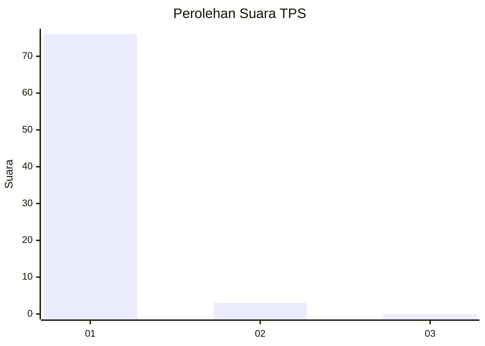
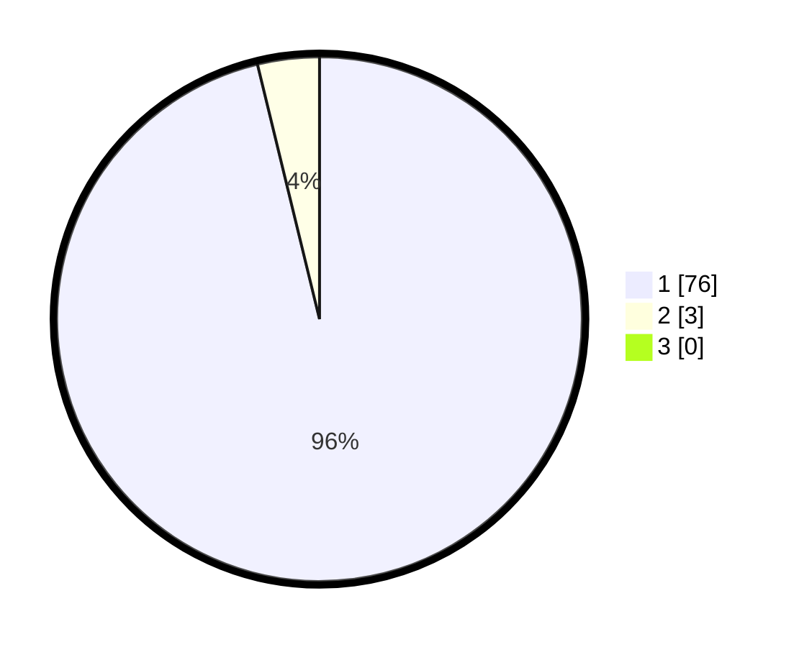

# Hasil

## Grafik

## Tabel

| No. | Nama Paslon    | Suara | Suara (raw) | Persentase |
|:--- |:-------------- | -----:| -----------:| ----------:|
| 1   | ANIES MUHAIMIN | 76    | [76][p-1]   | 96,20      |
| 2   | PRABOWO GIBRAN | 3     | [3][p-2]    | 3,80       |
| 3   | GANJAR MAHFUD  | 0     | [0][p-3]    | 0,00       |

[p-1]: https://github.com/gigit-pemilu/pemilu-2024-11-aceh/blob/main/pilpres/hitung-suara/sub/11-aceh/sub/11-bireuen/sub/09-juli/sub/2030-pante-peusangan/sub/001-tps/sub/paslon-1.txt
[p-2]: https://github.com/gigit-pemilu/pemilu-2024-11-aceh/blob/main/pilpres/hitung-suara/sub/11-aceh/sub/11-bireuen/sub/09-juli/sub/2030-pante-peusangan/sub/001-tps/sub/paslon-2.txt
[p-3]: https://github.com/gigit-pemilu/pemilu-2024-11-aceh/blob/main/pilpres/hitung-suara/sub/11-aceh/sub/11-bireuen/sub/09-juli/sub/2030-pante-peusangan/sub/001-tps/sub/paslon-3.txt

## Foto C Plano

https://sirekap-obj-formc.kpu.go.id/dd6b/pemilu/ppwp/11/11/09/20/30/1111092030001-20240216-094714--bf31ffc7-9ea5-4bf7-b1d8-597c2cc788f4.jpg

https://sirekap-obj-formc.kpu.go.id/dd6b/pemilu/ppwp/11/11/09/20/30/1111092030001-20240216-093319--64605806-bace-43dd-b278-1ce2d5ad84d2.jpg

https://sirekap-obj-formc.kpu.go.id/dd6b/pemilu/ppwp/11/11/09/20/30/1111092030001-20240216-093316--09f74804-16a3-4eff-bded-e5ef7ae99262.jpg

## Metadata

| Key        | Value               |
| ---------- | ------------------- |
| Time Stamp | 2024-02-16 12:51:22 |

## DATA PEMILIH TETAP

Jumlah pemilih dalam DPT: **79**.
 * L: **38**.
 * P: **41**.

## DATA PENGGUNA HAK PILIH

Jumlah pengguna hak pilih dalam DPT: **79**.
 * L: **38**.
 * P: **41**.

Jumlah pengguna hak pilih dalam DPTb: **0**.
 * L: **0**.
 * P: **0**.

Jumlah pengguna hak pilih dalam DPK: **0**.
 * L: **0**.
 * P: **0**.

Jumlah pengguna hak pilih: **79**.
 * L: **38**.
 * P: **41**.

## JUMLAH SUARA SAH DAN TIDAK SAH

JUMLAH SELURUH SUARA SAH: **79**.

JUMLAH SUARA TIDAK SAH: **0**.

JUMLAH SELURUH SUARA SAH DAN SUARA TIDAK SAH: **79**.

