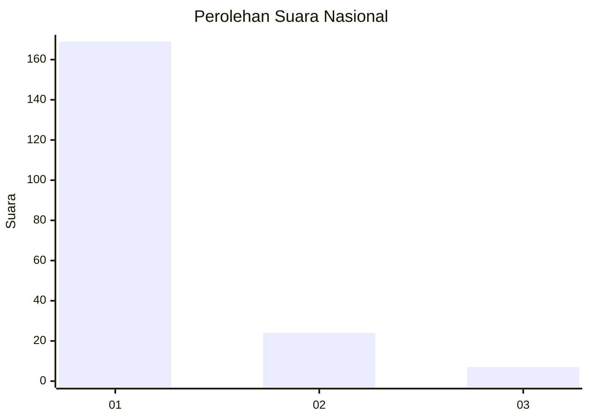
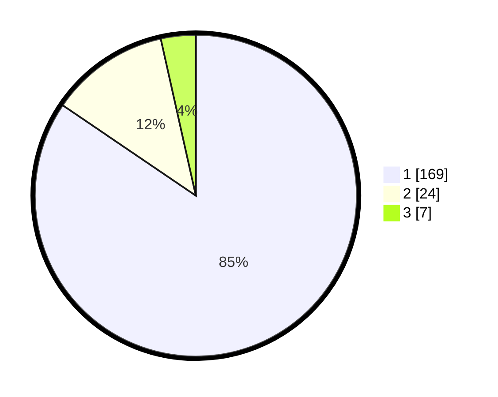

# Hasil

## Grafik

## Tabel

| No. | Nama Paslon    | Suara | Suara (raw) | Persentase |
|:--- |:-------------- | -----:| -----------:| ----------:|
| 1   | ANIES MUHAIMIN | 169   | [169][p-1]  | 84,50      |
| 2   | PRABOWO GIBRAN | 24    | [24][p-2]   | 12,00      |
| 3   | GANJAR MAHFUD  | 7     | [7][p-3]    | 3,50       |

[p-1]: https://github.com/gigit-pemilu/pemilu-2024/blob/main/pilpres/hitung-suara/sub/11-aceh/sub/11-bireuen/sub/09-juli/sub/2032-ranto-panyang/sub/001-tps/sub/paslon-1.txt
[p-2]: https://github.com/gigit-pemilu/pemilu-2024/blob/main/pilpres/hitung-suara/sub/11-aceh/sub/11-bireuen/sub/09-juli/sub/2032-ranto-panyang/sub/001-tps/sub/paslon-2.txt
[p-3]: https://github.com/gigit-pemilu/pemilu-2024/blob/main/pilpres/hitung-suara/sub/11-aceh/sub/11-bireuen/sub/09-juli/sub/2032-ranto-panyang/sub/001-tps/sub/paslon-3.txt

## Foto C Plano

https://sirekap-obj-formc.kpu.go.id/33b1/pemilu/ppwp/11/11/09/20/32/1111092032001-20240215-065912--234e83b5-b1c4-44db-bb88-0c33131152ed.jpg

https://sirekap-obj-formc.kpu.go.id/33b1/pemilu/ppwp/11/11/09/20/32/1111092032001-20240214-204853--c41c6afd-406b-4253-a83c-1d979c4bfdf6.jpg

https://sirekap-obj-formc.kpu.go.id/33b1/pemilu/ppwp/11/11/09/20/32/1111092032001-20240214-205716--835c467f-47de-414b-b275-0f913e7a5c30.jpg

## Metadata

| Key        | Value               |
| ---------- | ------------------- |
| Time Stamp | 2024-02-15 17:30:25 |

